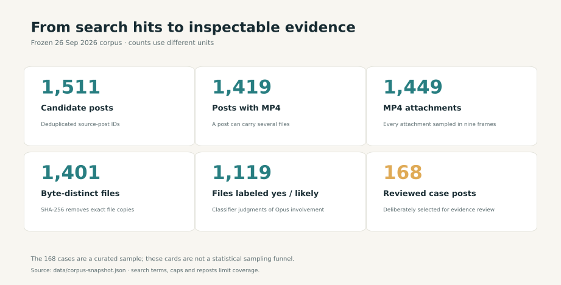
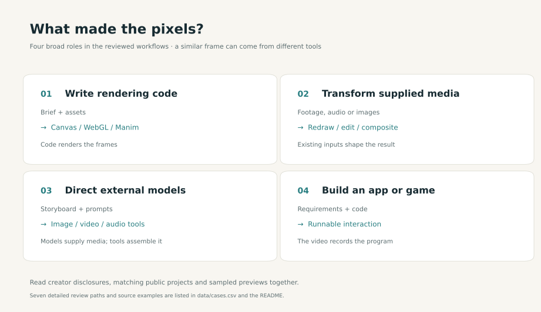
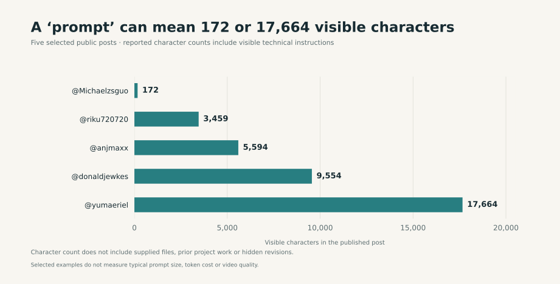

# Awesome Claude Opus 5.5 Videos 

[中文说明](README.zh-CN.md)

A curated, source-linked guide to videos people made **with** Claude Opus 5.5. We examine the model's role in writing rendering code, directing external models, editing supplied footage, or building an app that someone recorded. This is an independent project. Hypit inspects accessible X video previews; case notes distinguish creator disclosures, matching public projects, and our observations.

## Start here

- **Browse by picture:** the [168-case bilingual visual directory](docs/cases-index.zh-CN.md) has a sampled frame and original-post link for every reviewed case, with notes in the source language.
- **Choose and reuse a production route:** see the [production guide](docs/visual-effects-fit.md), [seven pictured paths](#seven-production-paths-with-frames), and [open-source systems](#reusable-open-source-production-systems).
- **Explore the evidence:** [14 paired cases](docs/evidence-examples.md) compare similar looks produced with different tools and inputs.
- **Explore the numbers:** this page summarizes the snapshot; the [domain × style atlas](docs/domain-style-atlas.md), [color study](docs/color-modes.md), and [statistical profile](docs/statistics.md) provide detailed tables and methods.
- **See later work:** [seven posts after the frozen cutoff](docs/new-cases-2026-09-27.md) have their own dated evidence page.

## Frozen snapshot: what each count means

The last successful X search was **September 26, 2026, 21:05 China Standard Time**; the file snapshot was reconciled at 21:53. Of 56 saved queries, 55 succeeded or used cache, while an earlier query was rate-limited. The [coverage notes](docs/search-coverage.zh-CN.md) record the search boundaries. Later additions are kept separate from these frozen counts.

| Count | Counted unit | Public source and boundary |
|---|---|---|
| 1,511 | Deduplicated candidate posts | [Snapshot](data/corpus-snapshot.json); includes reposts, comparisons, and search noise. |
| 1,419 | Candidate posts with MP4 | [Snapshot](data/corpus-snapshot.json); a post can contain several files. |
| 1,449 | Retrieved MP4 attachments | [Snapshot](data/corpus-snapshot.json); all probed and sampled into nine frames with Hypit 0.2.3. |
| 1,401 | Files reported as SHA-256 distinct | [Classifier CSV](data/domain-style.csv) has one row per file; source hashes and MP4s are private. |
| 1,119 | Files labeled `yes` or `likely` | [Classifier CSV](data/domain-style.csv); the denominator of the topic, style, and color analyses below. |
| 168 | Deliberately reviewed source-post cases | [Case CSV](data/cases.csv); chosen to examine production paths and evidence, rather than randomly sampled. |

The 48 byte-identical extra attachments account for **1,449 − 1,401**. Different encodings of the same work can still count as distinct files. These units cannot be read as independent creators, verified Opus runs, or all original videos on X. [Methods and reproducibility](docs/statistics.md#count-the-right-unit) explain which counts can be independently checked from public files.

## Topics and looks in the retrieved sample

Gemini 3.8 Flash classified the post text and nine sampled frames of each of the 1,401 files: **980 `yes`, 139 `likely`, and 282 `no`** for Opus involvement, with one primary domain and one primary style per file. These judgments organize the sample; they do not establish model calls or authorship. The domain, style and color charts in this section use the **1,119 `yes` / `likely` files**. [Data](data/domain-style.csv) · [classification limits](docs/statistics.md#the-classifier-threshold-changes-first-place).

### Leading domains depend on the threshold

Games / interactive (230), ads / launches (215), and AI about AI (201) account for **646 files, or 57.7%** of the included sample. The top two domains swap places when the inclusion threshold changes:

| Included labels | File denominator | Games / interactive | Ads / launches | First place |
|---|---:|---:|---:|---|
| `yes` | 980 | 187 (19.1%) | 191 (19.5%) | Ads / launches |
| `yes` + `likely` | 1,119 | 230 (20.6%) | 215 (19.2%) | Games / interactive |

The reversal reflects label inclusion, rather than a time trend. Neither threshold gives a bound on actual Opus use.

Motion graphics / UI (350) and 3D render (324) together account for **674 files, or 60.2%**. They also remain the two leading styles with `yes` alone (308 and 265). A video may mix styles; these charts count only its assigned primary style.

### Where domain and style meet

The largest cells are **games × 3D render: 161 (14.4%)**, and **ads × motion graphics / UI: 154 (13.8%)**. Together they contain 315 files, or **28.2%** of the sample. Each included file enters one cell; zero means no included `yes` / `likely` file falls in that cell. The [clickable atlas](docs/domain-style-atlas.md) connects populated cells to pictured cases and original posts; the [full statistical table](docs/statistics.md#domain--primary-style-ten-largest-cells) provides the next largest cells.

Case picks in that atlas use a [separate September 27 engagement refresh](data/case-engagement-refresh-2026-09-27.csv): **166 of 168 reviewed posts** yielded exact likes and exact post views. Readings span 11:50–12:32 UTC, so they represent different moments. Engagement measures visibility in a selected set of posts; it cannot verify authorship or finished-video quality.

### One category can contain several palettes

The median video-level share of **visibly colorful pixels** is **45.5% for music videos (77 files)** and **17.6% for ads / launches (215 files)**. The measure counts sampled pixels with HSV saturation ≥ 0.25 and value ≥ 0.15; it describes color area, rather than aesthetic quality. See the [per-video measurements](data/color-study/per-video-color-vectors.csv).

Within-category clustering finds two or three modes in **11 of 13 styles** and **10 of 11 domains**. Motion graphics / UI, for example, splits into **198 dark-neutral** and **152 light-neutral** files. Palette segment widths represent the share of sampled pixels in that mode, rather than its share of videos. The [color study](docs/color-modes.md) provides all 53 modes, full atlases, and measurement rules.

Likes were excluded from clustering. The dark and light motion/UI modes have same-day median likes of **50 and 104**, respectively, with only **22 posts in each mode**. Only **20 of 53 modes** have at least five exact September 27 like observations. Author reach, topic, post age, and distribution confound these comparisons; the study does not test a causal effect of color on likes. [Mode summaries](data/color-study/color-mode-summary.csv) · [engagement method](docs/color-modes.md#engagement-and-data).

### Preview length also reflects case selection

| Sample and unit | n | Median preview (s) | 25th–75th percentile (s) |
|---|---:|---:|---:|
| All classified files | 1,401 | 39.20 | 21.91–77.07 |
| Reviewed cases' main-post MP4s | 168 | 52.37 | 29.76–117.04 |

The reviewed set has longer previews, but the rows have different units and selection rules. Their difference cannot establish a production-route effect. These durations describe accessible X previews, which may differ from the uploaded masters. [Reproducible duration statistics](docs/statistics.md#preview-duration-distribution).

Educational explainers have the longest median among reviewed paths, **102.28 seconds**; the other six medians range from **24.76 to 51.79 seconds**. The dots mark medians and thick lines span the 25th–75th percentiles. Preview length cannot establish production time, model speed, cost, or path success.

## Seven production paths, with frames

Each picture links to the creator's original post. These are deliberately chosen examples, not the most common or highest-quality outcomes. The [14 paired evidence cases](docs/evidence-examples.md) show why a similar look can come from different inputs and tools; the [168-case visual directory](docs/cases-index.zh-CN.md) shows one sampled frame for every reviewed case.

| Production path | Watch an example | What to check |
|---|---|---|
| Code-drawn 2D |  [Ant colony and matching source](https://x.com/hanifproduktif/status/2102742924148830211) | Does the public code match the scenes, timing, and assets? |
| Educational explainer |  [Manim calculus lesson](https://x.com/LinearUncle/status/2103128559174971663) | Were the facts, formulas, narration, and supplied material checked? |
| 3D or real-time graphics |  [Clearwater and WebGL source](https://x.com/Aurelien_Gz/status/2102786378282987591) | Is this a program capture, a rendered scene, or video-model output? |
| Existing-source transformation |  [Talking-head line-art remake](https://x.com/AxtonLiu/status/2102827887732932956) | What did the supplied performance, audio, or product files contribute? |
| External video-model pipeline |  [Opus plus Seedance](https://x.com/abxxai/status/2102775755646337530) | Which tool supplied the moving pixels, and what did Opus direct? |
| App or game capture |  [Can-collection simulation](https://x.com/masaya_1980/status/2103115017755500561) | Is the deliverable a playable program, with video as its recording? |
| Mixed or not established |  [Two-model physics comparison](https://x.com/leogao25/status/2102544078927741369) | Are the inputs, budgets, and scoring procedure comparable? |

A frame alone cannot establish the production path. We distinguish creator disclosures, publicly matching projects or prompts, and direct observations of sampled X previews. The [production guide](docs/visual-effects-fit.md) explains suitable tasks and checks as engineering advice, rather than measured model success rates.

## What a public prompt reveals

Five selected public commissions range from **172 to 17,664 visible characters**. They include technical specifications and a reference-video storyboard, alongside open-ended briefs. Character count measures the text visible in those posts; it does not record all supplied assets, prior turns, revisions, or model cost. These five examples do not describe a prompt-length distribution. [Source-linked counts](data/visible-prompt-lengths.json) · [88-case prompt/workflow matrix](docs/prompt-matrix.zh-CN.md) · [reusable templates](docs/prompt-playbook.zh-CN.md).

When reusing a brief, carry over its required inputs, rendering route, and checks. Similar public wording also does not establish independent execution: one later music-video commission shares **87.0% of its unique five-word sequences** with an earlier one. The [token-overlap record](data/prompt-overlap.json) preserves the method and both posts; it cannot establish who read or copied which text.

## Reusable open-source production systems

| Preview and project | What can be reused and what the preview shows |
|---|---|
|  [Lemo-Opuscar](https://github.com/lemomo-ai/lemo-opuscar) · [original post](https://x.com/lemomo_ai/status/2103811634565415152) | The official cover previews a [gallery of 39 styles](https://lemomo-ai.github.io/lemo-opuscar/), each with sample films and `STYLE.md` links. The [director guide](https://github.com/lemomo-ai/lemo-opuscar/blob/main/DIRECTOR.md), [technique guide](https://github.com/lemomo-ai/lemo-opuscar/blob/main/TECHNIQUE.md), and [sample scene code](https://github.com/lemomo-ai/lemo-opuscar/blob/main/styles/crayon-book/demo/film.js) make the brief, storyboard, deterministic frame rendering, shared timing, and sound checks inspectable. The creator says Canvas/WebGL code draws the films without a video-generation model; the repository alone cannot audit every model call or finished film. Its [license](https://github.com/lemomo-ai/lemo-opuscar/blob/main/LICENSE) assigns MIT to code and CC BY 4.0 to guides, style files, and films, subject to third-party asset terms. |
|  [Papermotion](https://github.com/francozanardi/papermotion) | A reusable paper-cut animation engine with deterministic physics, character rigs, offline rendering, frame grabs, contact sheets, and sound checks. The still comes from its *snow* film, which the README labels Opus 5.5. The README also labels *demo*, *rooftops*, and *sea* Opus 5.5; *light* and *embers* are labeled GPT 6 Astra. Read each sample's model label separately. |
|  [ClaudeAnimationBase](https://github.com/JohnHeibel/ClaudeAnimationBase) · [creator example](https://x.com/servasyy/status/2104039075175182487) | A public p5.js and p5.brush animation starter with character expressions, storyboard and contact-sheet steps, and a render workflow. The preview shows @servasyy's personal-story film made with this base; the public starter is reusable input, not the exact source for every shot in the finished film. |
|  [Motion Graphics Music Video skill](https://github.com/makevoid/motion-graphics-music-video-skill) · [creator example](https://x.com/makevoid/status/2103869704955900023) | A Claude Code plugin and Ruby toolkit for planning and assembling music-video motion graphics from a supplied song and brief. Its p5.js workflow can call external Fal image, video, and audio models; the preview is a multi-tool creator example, not evidence that Opus supplied all moving pixels. |

These resources were checked on September 27, 2026. The two creator examples above are also described on the [new-case evidence page](docs/new-cases-2026-09-27.md). All four resources sit outside the September 26 frozen corpus and do **not** increase the 1,401-file or 168-case counts. Preview-image provenance and rights are recorded in [THIRD_PARTY.md](THIRD_PARTY.md).

## New since the frozen search cutoff

Seven creator posts published after **September 26, 21:05 China Standard Time** have a separate [dated evidence page](docs/new-cases-2026-09-27.md), each with a sampled-frame preview and a note on what remains unverified. They are **outside** the 1,401-file / 168-case snapshot. Three useful starting points:

| Frame and original post | Why this case matters |
|---|---|
|  [Handmade launch film versus code remake](https://x.com/JurgenPloeger/status/2104131805175844923) | The creator supplied the original film and Figma files, then revised the remake's pacing. The comparison makes those inputs visible. |
|  [Personal story using ClaudeAnimationBase](https://x.com/servasyy/status/2104039075175182487) | A reusable open-source animation base and autobiographical material are part of the production path. |
|  [Video with checked data slots](https://x.com/arambarnett/status/2104011150471917838) | The creator describes a guard that prevents the model from inventing on-screen figures; the guard's code is not public. |

The September 25–26 additions remain in the [visual case directory](docs/cases-index.zh-CN.md), with all 168 reviewed original posts and one frame each.

## Dataset and method

The [case index](data/cases.csv) and [field definitions](docs/case-index-guide.zh-CN.md) cover all 168 reviewed examples.

Read the [full Chinese research report](docs/report.zh-CN.md), [Article version](docs/x-article.zh-CN.md), [prompt/workflow matrix](docs/prompt-matrix.zh-CN.md), and [reusable prompt templates](docs/prompt-playbook.zh-CN.md).

The [search coverage](docs/search-coverage.zh-CN.md), [media profile](docs/media-profile.zh-CN.md), [methodology](docs/methodology.zh-CN.md), and [frozen counts](data/corpus-snapshot.json) explain the collection boundaries.

Charts are generated from the public data. Install dependencies with `python3 -m pip install -r requirements-charts.txt`, then run `scripts/generate_intro_charts.py`, `scripts/generate_stat_charts.py`, and `scripts/generate_color_charts.py` with Python. Each supports `--check` in CI. See [chart generation and verification](docs/chart-generation.md).

The original X MP4s, raw search results, private paths, and nine-frame contact sheets are **not** distributed here. Small single-frame previews link to the creators' posts and remain the creators' material; they are outside this repository's CC BY license. Case notes distinguish creator disclosures from what Hypit independently observed. Nine sampled frames cannot establish full-motion quality, audio quality, knowledge accuracy, hidden model calls, or the highest-resolution master.

## Contributing and license

See [CONTRIBUTING.md](CONTRIBUTING.md) to propose a new original post or reusable production project, improve a source link, or correct a workflow classification. The original annotations, writing, and diagrams in this repository are offered under [CC BY 4.0](LICENSE); the linked X posts, videos, music, creator prompts, and external projects remain with their respective rightsholders. See [THIRD_PARTY.md](THIRD_PARTY.md).
