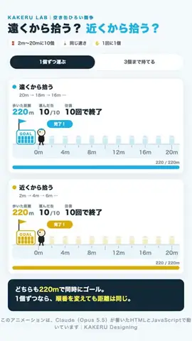
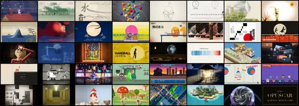
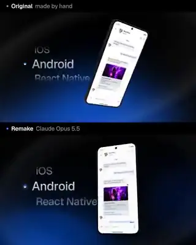
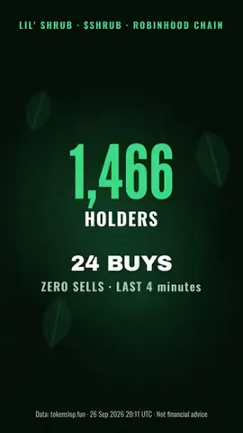

# Awesome Claude Opus 5.5 Videos

[English](README.md) · 独立维护的、带原帖来源的精选列表与研究档案。

这份仓库收录**使用 Claude Opus 5.5 参与制作**的视频，并追问模型究竟负责哪一步。它不把“Opus 做视频”一律理解成模型直接生成视频像素，也不以成片外观猜测渲染器。

## 从这里开始

- **按任务选制作方法：**[视觉效果制作适配指南](docs/visual-effects-fit.zh-CN.md)说明工具、素材、验收和常见边界。
- **看图找原帖：**[168 条带截图的案例目录](docs/cases-index.zh-CN.md)把公开原帖、片长与证据边界放在一起。
- **交叉看内容与画风：**[领域 × 画风二维图谱](docs/domain-style-atlas.zh-CN.md)列格子计数，附带截图案例和标明日期的互动量。
- **对照证据：**[14 条成对案例](docs/evidence-examples.zh-CN.md)与[可复算统计页](docs/statistics.zh-CN.md)分开呈现制作路径和样本数字。
- **看新增作品：**[冻结检索截点后的七条案例](docs/new-cases-2026-09-27.zh-CN.md)另行标注日期，不改写原统计。
- **复用现成工程：**查看[开源制作工程](#可复用的开源制作工程)，并核对许可和每个样片标注的模型。

**更新截点：X 最后一次成功检索为 2026 年 9 月 26 日 21:05（北京时间），文件快照整理于 21:53。**共保存 56 组查询回执，55 次成功，另有一次中文检索遇到限流。语料有 1,511 条去重候选帖，其中 1,419 条有 MP4、共 1,449 个附件；Hypit 0.2.3 已对全部附件做媒体探测和九帧取样，SHA-256 去重后有 1,401 个不同文件。人工回读并整理了 168 条来源案例。候选含比较、转载和检索噪音，因此这些数字都不是 X 全站原创影片数，也不是各制作路径的占比。[检索覆盖与失败记录](docs/search-coverage.zh-CN.md)和[冻结快照](data/corpus-snapshot.json)保留了边界。

## 大家做了什么、长什么样

> 9 月 26 日增量更新：视觉模型 Gemini 3.8 Flash 根据九帧和帖文，对 1,401 个不同 MP4 作了领域／画风分类；它把 980 条判为“yes”、139 条判为“likely”与 Opus 有关。1,119 是**分类器判断**，不是经过逐项验证的原创数。每个视频仅取一个主领域和主画风，分类器用于整理主题与外观，**没有预测爆款概率**。数据见 [`data/domain-style.csv`](data/domain-style.csv)。

上图只统计分类器判为 `yes` 或 `likely` 的 1,119 个文件，每个文件只进入一个主领域。主画风中，动态图形／界面 350 个、三维渲染 324 个。[领域 × 画风二维图谱](docs/domain-style-atlas.zh-CN.md)列出所有非空格子的文件数，并在已有人工深读案例的格子里附截图和原帖。格内互动量是标明日期的历史观测值，不能叫“最终热度”或作品质量。

**分类阈值敏感性：**仅计 `yes` 文件时，广告／发布片 191 个，略多于游戏／交互的 187 个；纳入 `likely` 后，游戏变成 230 个，广告为 215 个。头名随分类阈值变化，不能解释为作品流行趋势。[可复算统计页](docs/statistics.zh-CN.md)列明分母、片长和交叉表。

有条文明 Top 结果在采集时获 42,836 个赞，但 136.5 秒 MP4 与一条后来标注“Opus 5.5”的[转帖](https://x.com/_IamAlam/status/2103494816055345491)逐字节相同；较早的[原帖](https://x.com/IterIntellectus/status/2103212539895017864)只说“Claude”，没有给出版本。我们保留两条候选记录，但没有将该片列为已核实案例。互动量不能证明作者身份或模型版本。

## 七种制作路径，先看画面

每张小图都链接原作者帖子。这七例是有目的地选出的制作路径样本，不是质量排名或各路径的总体比例。[14 条成对证据案例](docs/evidence-examples.zh-CN.md)比较外观相近却输入、工具不同的作品；[168 条案例目录](docs/cases-index.zh-CN.md)则让每条深读案例都有一张可见截图。

| 路径 | 看一个案例 | 需要核对什么 |
|---|---|---|
| 程序二维逐帧绘图 |  [蚂蚁群落与对应源码](https://x.com/hanifproduktif/status/2102742924148830211) | 公开工程的场景、时序、素材是否与成片对应？ |
| 知识讲解 |  [Manim 导数课](https://x.com/LinearUncle/status/2103128559174971663) | 公式、事实、旁白与既有教材是否逐项核对？ |
| 三维与实时图形 |  [Clearwater 与 WebGL 工程](https://x.com/Aurelien_Gz/status/2102786378282987591) | 这是实时程序录屏、三维渲染还是外部视频模型？ |
| 现有素材改编 |  [真人口播线稿重制](https://x.com/AxtonLiu/status/2102827887732932956) | 原表演、音轨或产品文件提供了什么？ |
| 外部视频模型编排 |  [Opus＋Seedance](https://x.com/abxxai/status/2102775755646337530) | Opus 负责分镜调度，还是输出运动画面像素？ |
| 应用与游戏录屏 |  [捡罐模拟器](https://x.com/masaya_1980/status/2103115017755500561) | 交付物是否为可玩的程序，视频只是录屏？ |
| 混合或路径未确定 |  [双模型物理机关对比](https://x.com/leogao25/status/2102544078927741369) | 输入、预算与评价方法是否可比？ |

[Opus 5.5 模型说明](https://platform.claude.com/docs/en/models/opus-5-5/overview)列出文本／图像输入与文本输出。成片可能由它写的代码、它控制的程序、它剪辑的既有视频，或它调度的外部模型制作；只看截图无法判断制作链。我们区分作者披露、匹配的公开工程或提示词，以及对 X 预览片的独立取样观察。[制作适配指南](docs/visual-effects-fit.zh-CN.md)给出任务与验收建议，不把这些例子当成模型成功率实验。

## 可复用的开源制作工程

| 预览与工程 | 能复用什么，截图展示什么 |
|---|---|
|  [Lemo-Opuscar](https://github.com/lemomo-ai/lemo-opuscar) · [作者原帖](https://x.com/lemomo_ai/status/2103811634565415152) | 官方封面预览[39 种风格图鉴](https://lemomo-ai.github.io/lemo-opuscar/)；每种风格附样片与 `STYLE.md`。[导演指南](https://github.com/lemomo-ai/lemo-opuscar/blob/main/DIRECTOR.md)、[技术指南](https://github.com/lemomo-ai/lemo-opuscar/blob/main/TECHNIQUE.md)和[样片代码](https://github.com/lemomo-ai/lemo-opuscar/blob/main/styles/crayon-book/demo/film.js)公开需求确认、分镜、确定性逐帧渲染、共用时间线与音频检查。作者称用 Canvas／WebGL 绘帧，没有调用视频生成模型；仓库本身无法逐片审计模型调用和成片质量。[许可文件](https://github.com/lemomo-ai/lemo-opuscar/blob/main/LICENSE)将代码列为 MIT，指南、风格说明和影片列为 CC BY 4.0，第三方素材另按各自许可。 |
|  [Papermotion](https://github.com/francozanardi/papermotion) | 可复用的纸片风动画引擎，含确定性物理、角色 rig、离线渲染、帧抓取、contact sheet 和音频检查。截图取自 README 标为 Opus 5.5 的 *snow*；*demo*、*rooftops*、*sea* 也标为 Opus 5.5，*light*、*embers* 则标为 GPT 6 Astra。应按逐片标注理解来源。 |
|  [ClaudeAnimationBase](https://github.com/JohnHeibel/ClaudeAnimationBase) · [作者示例](https://x.com/servasyy/status/2104039075175182487) | 公开的 p5.js／p5.brush 动画底座，提供角色表情、分镜、contact sheet 和渲染流程。截图是 @servasyy 利用该底座制作的个人故事；开源底座是可复用输入，不能代表成片每个镜头的精确源码。 |
|  [Motion Graphics Music Video skill](https://github.com/makevoid/motion-graphics-music-video-skill) · [作者示例](https://x.com/makevoid/status/2103869704955900023) | Claude Code 插件与 Ruby 工具包，根据提供的歌曲和创意要求规划、组装音乐视频动态图形。其 p5.js 流程可调用外部 Fal 图像、视频和音频模型；截图来自多工具制作示例，不代表全部运动画面像素都由 Opus 生成。 |

四个资源于 2026-09-27 核查；后两个作者示例也收录在[新案例证据页](docs/new-cases-2026-09-27.zh-CN.md)。它们都在 9 月 26 日冻结语料之外，**不计入**上面的 1,401 个文件或 168 条深读案例。预览图来源和权利说明见 [THIRD_PARTY.md](THIRD_PARTY.md)。

## 冻结截点之后的新案例

9 月 26 日 21:05（北京时间）检索截止后，又出现七条有视频的原作者帖子；[单独的增量案例页](docs/new-cases-2026-09-27.zh-CN.md)给每条附一张取样截图和证据边界。它们**没有计入**上面的 1,401 个文件或 168 条案例。建议先看这三条：

| 截图与原帖 | 为什么值得看 |
|---|---|
|  [手工发布片与代码重建片](https://x.com/JurgenPloeger/status/2104131805175844923) | 作者提供旧片和 Figma 文件，再逐轮调整重建片节奏；对照让现有输入可见。 |
|  [复用 ClaudeAnimationBase 的个人故事](https://x.com/servasyy/status/2104039075175182487) | 已有开源动画底座和作者的人生素材，都是制作路径的重要输入。 |
|  [带数据槽校验的数字短片](https://x.com/arambarnett/status/2104011150471917838) | 作者描述禁止模型随意填写屏幕数字的约束；约束代码尚未公开。 |

9 月 25–26 日补入的旧案例都在[带图案例目录](docs/cases-index.zh-CN.md)，可按制作路径查看 168 条人工深读原帖。

## 研究材料

- [完整中文报告](docs/report.zh-CN.md)与[适合 X Article 的版本](docs/x-article.zh-CN.md)。
- [88 例提示词与制作条件矩阵](docs/prompt-matrix.zh-CN.md)、[七类可复用提示词模板](docs/prompt-playbook.zh-CN.md)。
- [方法和证据等级](docs/methodology.zh-CN.md)、[56 组查询回执](docs/search-coverage.zh-CN.md)、[MP4 文件属性](docs/media-profile.zh-CN.md)、[冻结计数](data/corpus-snapshot.json)。

本仓库不转载创作者的 MP4、音乐或完整第三方提示词，也不分发原始抓取记录与九帧总览图。页面只用单张低分辨率取样截图帮助辨认画风，每张都回链创作者原帖；截图仍属原权利人，不受本仓库 CC BY 许可覆盖。案例说明区分**创作者披露**、**公开工程佐证**和**Hypit 对预览 MP4 的独立观察**。九帧无法验收全片运动、音质、知识正确性或隐藏调用。

欢迎按 [CONTRIBUTING.md](CONTRIBUTING.md) 提交原作者帖子、可复用开源工程、提示词来源或更正。原创文字、标注和图示按 [CC BY 4.0](LICENSE) 开放；第三方内容权利仍归原权利人，详见 [THIRD_PARTY.md](THIRD_PARTY.md)。
