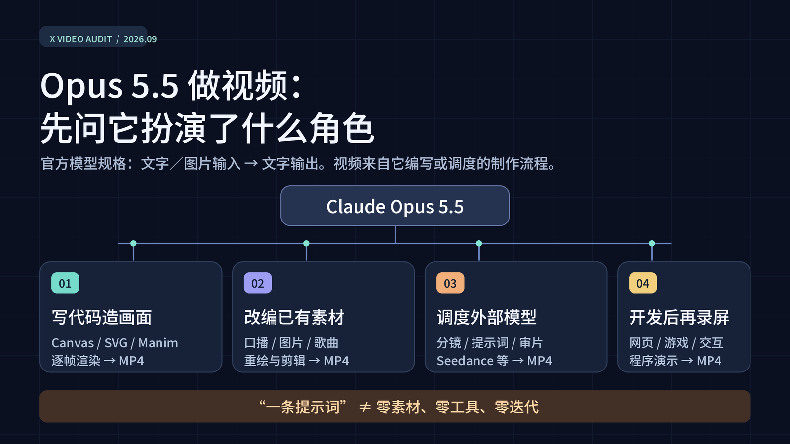
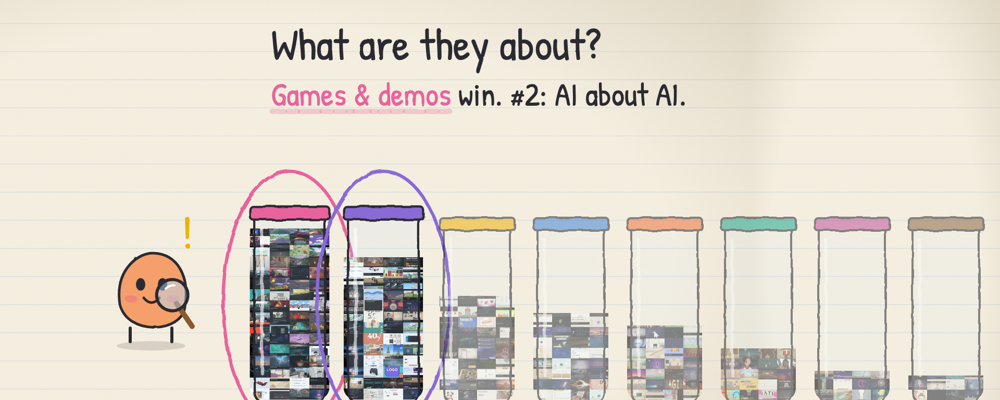

# Awesome Claude Opus 5.5 Videos

[English](README.md) · 独立维护的、带原帖来源的精选列表与研究档案。

这份仓库收录**使用 Claude Opus 5.5 参与制作**的视频，并追问模型究竟负责哪一步。它不把“Opus 做视频”一律理解成模型直接生成视频像素，也不以成片外观猜测渲染器。

**数据截点：2026 年 9 月 25 日 06:22（北京时间）。**43 组 X 检索保存 1,104 条去重候选帖；Hypit 0.2.3 对可取得的 1,044 个 MP4 附件全部完成媒体探测和九帧取样；152 条案例回读了原帖、回复、提示词或源码。候选帖包含比较、转载和检索噪音，因此这些数字都不是 X 全站原创影片数，也不是各制作路径的占比。

## 大家做了什么、长什么样

> 2026-09-25 更新：我们把去重后能取得的 1,008 个视频全部按领域和画风分了类。分类由视觉模型（Gemini 3.8 Flash）看每个视频的 9 帧抽样和帖文完成，并随机抽查；其中 786 个判断为发帖者用 Opus 5.5 做的。单条标签可能有误（已知漏判一例）。数据见 [`data/domain-style.csv`](data/domain-style.csv)。文章：[X 长文](https://x.com/WangYeruo/article/2103278277536485482)；[47 秒视频版](https://x.com/WangYeruo/status/2103279925960876265)。

| 领域 | 数量 | 例子 |
|---|---:|---|
| 游戏和交互 demo | 184 | [@MengTo 日式水乡泛舟](https://x.com/MengTo/status/2102760783344189761) |
| AI 讲 AI 自己 | 153 | [@kevin_t_ngo 小女孩问 Claude 爱什么](https://x.com/kevin_t_ngo/status/2102437977435893771) |
| 广告和发布片 | 119 | [@deedydas 创业公司发布片](https://x.com/deedydas/status/2102787937482252537) |
| 科普讲解 | 99 | [@RyanSael 相机对焦模拟](https://x.com/RyanSael/status/2102591147927654847) |
| 故事短片 | 85 | [@AndrewOnXYZ 火星车短片](https://x.com/AndrewOnXYZ/status/2102512879258009818) |
| MV | 59 | [@other__reality](https://x.com/other__reality/status/2102514581684052169) |
| 艺术 | 33 | [@majidmanzarpour 像素巫师](https://x.com/majidmanzarpour/status/2102476258948927543) |
| 历史人文 | 28 | [@paji_a 关原之战 3D 沙盘](https://x.com/paji_a/status/2102581158487945540) |
| 其他（梗、数据可视化等） | 26 | |

画风：3D 270、动态图形/界面 178、扁平卡通 131、像素 50、手绘 34、水墨沙画油彩 29、纸片拼贴 29、生成艺术 17、数学图解 14、写实 14、动漫 12。游戏几乎都是 3D；广告和科普偏动态图形；故事短片和 MV 最爱扁平卡通。

## 先看六种路径

| 路径 | 代表案例 | 读它时要问什么 |
|---|---|---|
| **程序逐帧绘图** | [蚂蚁群落片与匹配源码](https://x.com/hanifproduktif/status/2102742924148830211)、[纸雕夜景与制作工程](https://x.com/makwired/status/2103008945220567166) | 画面是 Canvas／SVG／浏览器程序输出的吗？音轨或素材是否另有来源？ |
| **知识讲解** | [Manim 导数课](https://x.com/LinearUncle/status/2103128559174971663)、[VAE 数学片](https://x.com/ng169onX/status/2103183904563998809) | 旁白谁生成？公式与知识有没有独立核对？ |
| **三维与实时图形** | [Clearwater 与 WebGL 源码](https://x.com/Aurelien_Gz/status/2102786378282987591)、[建筑爆炸图](https://x.com/zdkiel_labs/status/2102722754172850310) | 是实时程序录屏、Blender 渲染，还是外部视频模型？ |
| **现有素材改编** | [83 秒真人口播线稿重制](https://x.com/AxtonLiu/status/2102827887732932956)、[13 条 take 挑剪](https://x.com/gregpr07/status/2102984873351037161)、[长委托 MV](https://x.com/donaldjewkes/status/2102801274173587569) | 原视频、音乐、产品代码库与人工表演贡献了什么？ |
| **外部视频模型编排** | [Opus＋Seedance](https://x.com/abxxai/status/2102775755646337530)、[多模型无限放大拼贴](https://x.com/koldo2k/status/2103129343253778767) | Opus 是写分镜／调度，还是实际出画面像素？ |
| **应用或游戏录屏** | [捡罐模拟器与在线演示](https://x.com/masaya_1980/status/2103115017755500561)、[交互海岛](https://x.com/Acemation_/status/2103150350211354966) | 交付物是 MP4 电影，还是可玩的程序及其录屏？ |

首页英文版的[精选案例](README.md#code-drawn-2d-and-motion-graphics)只挑制作路径和证据有代表性的作品。想筛选全部深读案例，请看[152 条公开索引](data/cases.csv)及[字段说明](docs/case-index-guide.zh-CN.md)。

## 研究材料

- [完整中文报告](docs/report.zh-CN.md)与[适合 X Article 的版本](docs/x-article.zh-CN.md)。
- [88 例提示词与制作条件矩阵](docs/prompt-matrix.zh-CN.md)、[七类可复用提示词模板](docs/prompt-playbook.zh-CN.md)。
- [方法和证据等级](docs/methodology.zh-CN.md)、[43 组查询覆盖](docs/search-coverage.zh-CN.md)、[MP4 文件属性](docs/media-profile.zh-CN.md)、[冻结计数](data/corpus-snapshot.json)。

本仓库不转载创作者的 MP4、音乐或完整第三方提示词，也不分发原始抓取记录与本地九帧图。案例说明区分**创作者披露**、**公开工程佐证**和**Hypit 对预览 MP4 的独立观察**。九帧无法验收全片运动、音质、知识正确性或隐藏调用。

欢迎按 [CONTRIBUTING.md](CONTRIBUTING.md) 提交原作者帖子、提示词来源、工程链接或更正。原创文字、标注和图示按 [CC BY 4.0](LICENSE) 开放；第三方内容权利仍归原权利人，详见 [THIRD_PARTY.md](THIRD_PARTY.md)。
