# Case directory / 案例目录

<!-- Generated by scripts/generate_cases.py from data/cases.csv. Do not edit by hand. -->

This directory links to the original X posts for **168 reviewed cases**. It is a curated index, not a census or quality ranking. Durations are from accessible X preview MP4s, not necessarily the creators' masters. A few older observation notes give different durations; their cause has not been reconciled. The final column draws from the CSV's `hypit_observation` field, omitting a standalone opening duration clause when possible. It describes the sampled X preview; any production attribution in that field remains a creator report. Nine frames cannot verify full-motion or audio quality or hidden model calls. Read the [CSV](../data/cases.csv) for creator disclosures and detailed review limits.

Each small still is a single frame from the accessible X preview, selected to help identify the visible style. Click the adjacent case name or still to open the creator's original post. The frame is a commentary excerpt, not a licensed video, master-quality sample, or measure of animation quality; rights remain with its source creator.

本目录收录 **168 条人工深读案例**，标题直达 X 原帖。它不是全站作品数量或质量排名；时长来自可取得的 X 预览 MP4，不一定是作者母版；少数旧观察文字的片长另有差异，原因尚未逐项复核。末列取自 CSV 的 `hypit_observation`，只在开头片长构成独立短语时省去。它描述取样预览；其中的制作归因仍须按作者披露理解。九帧不能验收全片运动、声音或隐藏模型调用。作者披露及逐案审读边界见[原始 CSV](../data/cases.csv)。

每张小图仅截取可取得的 X 预览视频一帧，用来辨认画面风格；点击图片或案例标题可看作者原帖。它并非获授权的完整视频、母版画质样本或动画质量评分；原画面权利仍属于创作者。

## Browse by production path / 按制作路径浏览

- [程序逐帧绘图 · Code-drawn 2D and motion graphics (52)](#code-drawn-2d-and-motion-graphics-52)
- [知识讲解 · Educational explainers (27)](#educational-explainers-27)
- [三维与实时图形 · 3D and real-time graphics (19)](#3d-and-real-time-graphics-19)
- [现有素材改编 · Existing-source transformation (32)](#existing-source-transformation-32)
- [外部视频模型编排 · External video-model pipelines (10)](#external-video-model-pipelines-10)
- [应用与游戏录屏 · App and game capture (14)](#app-and-game-capture-14)
- [混合或流程未确定 · Mixed or unestablished pipeline (14)](#mixed-or-unestablished-pipeline-14)

## Code-drawn 2D and motion graphics (52)

程序逐帧绘图 · `primary_path=procedural_2d`

| Still / 截图 | Case / 原帖 | Preview (s) / 秒 | Nine-frame note / 九帧记录 |
|---|---|---:|---|
| <a href="https://x.com/Aadidev0/status/2102692569792835994">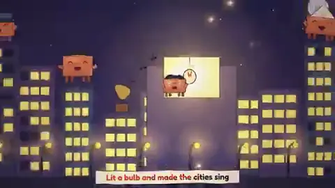</a> | [@Aadidev0 Clawd 年代歌曲](https://x.com/Aadidev0/status/2102692569792835994) | 164.049 | 九帧见 Clawd 角色、歌词、场景和转场，时长与作者所述 3,936 帧／24fps 一致，不能仅凭视频验证代码行数、声音合成或耗时。 |
|  | [@AxtonLiu 会呼吸的宣纸水墨画](https://x.com/AxtonLiu/status/2103288413969621231) | 39.189 | 九帧见宣纸上远山、主峰、皴染点苔、松树飞鸟动态展开的水墨画绘制过程。 |
|  | [@ExistentialEnso pre-existing song MV](https://x.com/ExistentialEnso/status/2102599211212554616) | 339.627 | 339.6 s illustrated story with repeated characters, lyric captions and late-stage aurora/night imagery in sampled frames. |
|  | [@Hesamation 2076 年机器人短片](https://x.com/Hesamation/status/2103457566978162901) | 87.632 | 九帧见机器人在空城、屋内与人类遗迹之间活动的平面动画叙事。 |
|  | [@JustinPerea](https://x.com/JustinPerea/status/2102893186330841502) | 43.051 | 43 s demoscene with abstract 3D-like forms, landscape, tunnel, black hole and title card. |
|  | [@KamStudioLabs 碰撞奏乐机](https://x.com/KamStudioLabs/status/2102899866762440893) | 47.061 | 九帧见深色横向机器、发光物体运动和不同轨道／接触点；抽帧不能确认每一声确与碰撞同步。 |
|  | [@KamStudioLabs 不想被修复的 bug](https://x.com/KamStudioLabs/status/2102903173161877996) | 90.048 | 九帧为代码行、虫形发光角色、巨大光标和最终暗场。 |
| <a href="https://x.com/KamStudioLabs/status/2102908742518100086">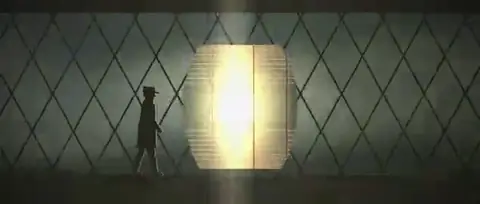</a> | [@KamStudioLabs 灯塔守夜人](https://x.com/KamStudioLabs/status/2102908742518100086) | 45.653 | 九帧见灯塔、室内钟表、手电、人物穿行与灯光点亮；抽帧不能判断声音是否承担半数叙事。 |
|  | [@LCSlates](https://x.com/LCSlates/status/2102503027340988559) | 80.043 | 80 s gold mosaic where tile flocks form birds/fish and transform into night/spiral states. |
|  | [@Lucas_IA_ skill-based ad](https://x.com/Lucas_IA_/status/2103152093733253544) | 71.657 | 71.7 s French vertical mushroom-coffee ad with recurrent character, subtitles, product images and more than 20 creator-claimed scenes. |
|  | [@Michaelzsguo](https://x.com/Michaelzsguo/status/2102592355165782312) | 120.043 | 120 s sepia silhouettes and historical title/vignette changes, including blank transitions. |
|  | [@NFT_Chen 中秋剪纸拼贴](https://x.com/NFT_Chen/status/2103380404791333144) | 39.335 | 九帧见上海夜景、月亮缺口、橘猫与逐渐填满的拼贴月面。 |
| <a href="https://x.com/NoFollowers2023/status/2102787420399825023">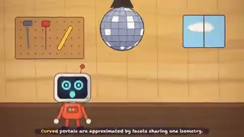</a> | [@NoFollowers2023 Bellard MV](https://x.com/NoFollowers2023/status/2102787420399825023) | 160.659 | 160.7 秒人物和科技意象交替的音乐视频，采样帧可见歌词／画面切换。 |
|  | [@Sarut0biSasuke 白俄罗斯鸡尾酒教程](https://x.com/Sarut0biSasuke/status/2103418429248069973) | 30 | 九帧依次展示空杯、伏特加、咖啡利口酒、奶油和搅拌步骤；预览分辨率不能确认作者母版。 |
|  | [@Voxyz_ai](https://x.com/Voxyz_ai/status/2102531681450119426) | 29.056 | 29 s typographic/graphic story around Claude motif and text on paper-like backgrounds. |
|  | [@YoshiKura535130](https://x.com/YoshiKura535130/status/2102910805721362875) | 43.05 | 39 s Japanese illustrated vignettes about lost phone, umbrella/weather and slow queues; consistent simplified characters. |
|  | [@aj_dev_smith No Samples](https://x.com/aj_dev_smith/status/2102803889183736141) | 190.891 | 190.9 s illustrated rap video with recurring pixel mascot, synchronized lyric cards, code/math motifs and end titles. The file has an audio track, whose musical quality was not independently judged. |
|  | [@ajith_io 15 秒 motion-design showreel](https://x.com/ajith_io/status/2103449416325890146) | 15.061 | 九帧见红色圆点与字标、抽象图形和片尾 Claude Motion Designer 字卡。 |
|  | [@bradmillscan monetary-history MV](https://x.com/bradmillscan/status/2103108967194833310) | 202.752 | 202.8 s vertical MV sampled across historical figures, money imagery, code texture and a globe; the nine frames establish varied scenes but not the claimed shot count. |
|  | [@cherry_mx_reds](https://x.com/cherry_mx_reds/status/2102472218269900876) | 30.059 | 30 s white-background Clawd candy story with springboard, hearts and end card. |
|  | [@cherry_mx_reds Oktoberfest](https://x.com/cherry_mx_reds/status/2102493303388475855) | 30.047 | 30 s Clawd beer-festival story, recurring character and consistent carnival background. |
| <a href="https://x.com/cromwellian/status/2103028027861152225">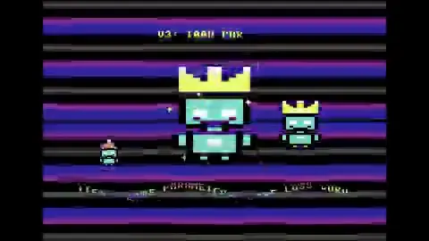</a> | [@cromwellian C64-style demoscene](https://x.com/cromwellian/status/2103028027861152225) | 164.331 | 164.3 s pixel-art/demoscene sequence with computer, mascot, scrolling text, game-like action and retro palette. |
| <a href="https://x.com/ctgptlb/status/2102726428991373480">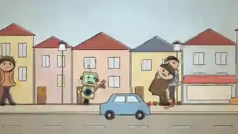</a> | [@ctgptlb 机器人一分短片](https://x.com/ctgptlb/status/2102726428991373480) | 64.043 | 九帧见小机器人与人类角色、城市和暗室；两个回复视频也各由 Hypit 单独探测取样。 |
|  | [@dfeinition mosaic](https://x.com/dfeinition/status/2102436001473786054) | 80.043 | 80 s fishbowl animation, with tiled fish, arch, night sky, reflections and many small fish emerging over time. |
|  | [@hanifproduktif 蚂蚁群落动画](https://x.com/hanifproduktif/status/2102742924148830211) | 32.043 | X MP4 32.043 秒／24fps／含音轨；九帧可见蚂蚁造型从草图到上色、草地搬叶、地下群落和代码片尾，与公开源文件分镜、画中文字、时长匹配。 |
|  | [@ianstig animation showreel](https://x.com/ianstig/status/2103169675928764486) | 130.56 | 130.6 s showreel: recurring yellow sprout character across flat cartoon, black-and-white rubber-hose, game, clay-like 3D, sea and chart styles. |
| <a href="https://x.com/imthatcarlos/status/2102849219388133592">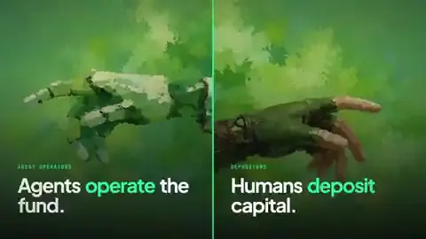</a> | [@imthatcarlos](https://x.com/imthatcarlos/status/2102849219388133592) | 59.133 | 59 s green/white branded motion graphics and app UI panels. |
|  | [@ishuagra02 动漫式模型对战预告](https://x.com/ishuagra02/status/2103247844542922825) | 100.843 | 九帧见对战场景、英文字幕、光束和卡通片尾，不能检验每帧是否都由 JavaScript 产生或整段音画是否稳定。 |
|  | [@jackfriks Lovelee](https://x.com/jackfriks/status/2103132260589338762) | 19.563 | 19 s vertical illustrated pig-and-mailbox story with subtitles and final app card. |
|  | [@johnknopf watercolor MV](https://x.com/johnknopf/status/2103170666187117006) | 206.293 | 206.3 s muted watercolor-style family/house story, recurring characters and lyric-like visual beats. |
|  | [@jurlycat](https://x.com/jurlycat/status/2102645793828036643) | 78.059 | 78 s framed landscape story shifting across rural, urban, night, sea and mountain scenes. |
|  | [@kevin_t_ngo](https://x.com/kevin_t_ngo/status/2102437977435893771) | 28.053 | 28 s hand-drawn-looking story about a girl and a flower-like Claude mascot, consistent color/paper texture. |
|  | [@ladprofit](https://x.com/ladprofit/status/2103148835270971419) | 55.488 | 55.5 s vertical flat illustrations, product pack and typography with a caffeine-crash narrative. |
|  | [@mablesjoseph 手绘感动画短片](https://x.com/mablesjoseph/status/2103465246014746943) | 45.696 | 九帧见人物、灯笼、城市与夜空，整体为柔和的二维动画配色。 |
|  | [@makwired Shaml 纸雕短片](https://x.com/makwired/status/2103008945220567166) | 20.457 | 有音轨；九帧见城市与清真寺夜景、金色图案逐步散合和阿英双语字幕，和仓库 Shaml 16:9 源资料相合。 |
|  | [@minosdevs Paris loop](https://x.com/minosdevs/status/2103112945341251920) | 6.101 | repeated Eiffel Tower/café/rain scene with small moving elements. |
|  | [@onofumi_AI 星星与猫短片](https://x.com/onofumi_AI/status/2102535945333657960) | 17.554 | 九帧见紫色夜空中星星与白猫的连续卡通情节；有音轨，无法由抽帧验证声音来源。 |
|  | [@other__reality](https://x.com/other__reality/status/2102514581684052169) | 156.629 | 156.6 s Clawd mascot music-video sequence with changing illustrated scenes. |
|  | [@pivi___](https://x.com/pivi___/status/2103024907965612250) | 32.554 | 30.7 s Dictus mobile dictation-app promo, from abstract soundwaves to phone UI and end card. |
|  | [@rexan_wong 专业动效工作流拆解](https://x.com/rexan_wong/status/2103707054108299437) | 11 | 九帧可见深色模式 SaaS 界面动效、排版与转场。 |
|  | [@riku720720](https://x.com/riku720720/status/2102515055116063144) | 18.8 | 18.8 s loop-like pixel runner on rainbow platform with meteors and beams. |
|  | [@ring_hyacinth 中秋拼贴短片](https://x.com/ring_hyacinth/status/2102986085328716066) | 40.375 | 40.4 秒上海夜景、月亮、猫角色与拼贴式节庆场景；九帧能见到纹理和构图变化。 |
| <a href="https://x.com/samspike_/status/2103171975220781332">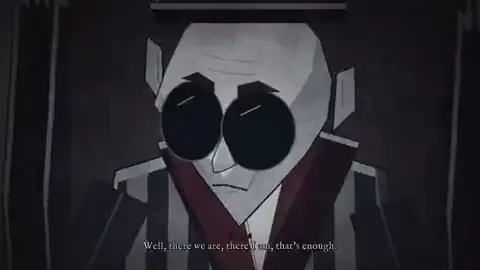</a> | [@samspike_ Endgame](https://x.com/samspike_/status/2103171975220781332) | 323.167 | 323.2 s dark theatrical animation with recurring stylized characters, room sets and subtitle/dialogue cards. |
|  | [@shfred0](https://x.com/shfred0/status/2102495989194236158) | 30.155 | 30 s monochrome brush/ink story using a recurring star/motif. |
|  | [@shushant_l motion-ad 技能商用动效广告](https://x.com/shushant_l/status/2103829449359966629) | 15 | 九帧见立体透视倾斜的产品 UI、动效色块、平滑字标与 CTA 引导卡片。 |
|  | [@so_ainsight 手绘风 Claude Code 解说](https://x.com/so_ainsight/status/2103117547776163845) | 15.061 | 九帧见纸张质感、人物、电脑、铅笔与日语字幕；未审原素材、修订日志和旁白质量。 |
|  | [@stephanlivera 15 秒 motion-design showreel](https://x.com/stephanlivera/status/2103315922098470926) | 15.061 | 九帧见高度动态的几何排版、色块穿梭与 Claude Motion Designer 字标。 |
|  | [@superalesha Claude-model history](https://x.com/superalesha/status/2102463796149440888) | 87.552 | 87.6 s visual chronology with a recurring flower mark, model labels, illustrated scenes and ending credit. |
| <a href="https://x.com/x4b47x/status/2103019799614034026">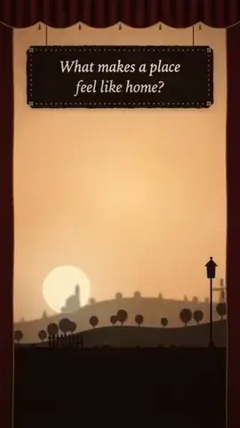</a> | [@x4b47x](https://x.com/x4b47x/status/2103019799614034026) | 57.045 | 54 s coherent silhouetted house/theatre scene transitioning from sunset to moonlit night with short textual lines. |
|  | [@xlcomplete 五分钟歌曲影像](https://x.com/xlcomplete/status/2103015953877647820) | 291.093 | 九帧见轨道、夜灯、纸扇与桥等连续镜头及歌词字幕；着色器实现与音乐来源不能由文件独立证明。 |
| <a href="https://x.com/yaakuups/status/2103082248320766456">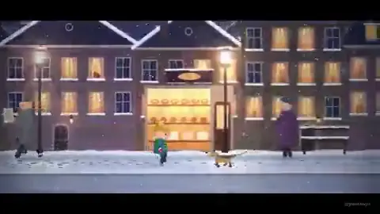</a> | [@yaakuups 红手套无声短片](https://x.com/yaakuups/status/2103082248320766456) | 138.048 | 九帧见雪夜孩子、红手套、列车人物与回到雪夜的首尾；声音、连续运动和执行日志未核。 |
| <a href="https://x.com/yumaeriel/status/2103053166006657284">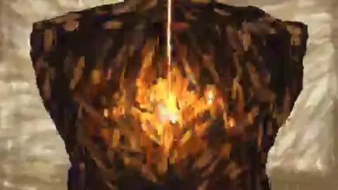</a> | [@yumaeriel painted short](https://x.com/yumaeriel/status/2103053166006657284) | 30 | nine frames show navy/brown environments, orange light/figures and visibly brushy marks following several planned scene changes. |

## Educational explainers (27)

知识讲解 · `primary_path=educational_explainer`

| Still / 截图 | Case / 原帖 | Preview (s) / 秒 | Nine-frame note / 九帧记录 |
|---|---|---:|---|
|  | [@0x0funky](https://x.com/0x0funky/status/2102736587708854585) | 394.261 | 6m12s English grammar lesson with recurring illustrated characters, example sentences and exercises. |
| <a href="https://x.com/0xpai_eth/status/2103166575071330778">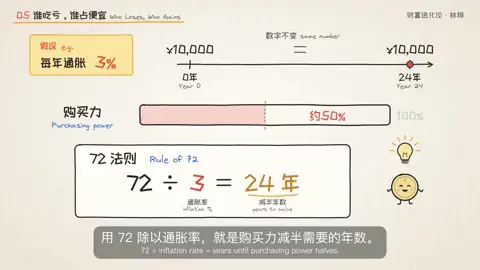</a> | [@0xpai_eth inflation explainer](https://x.com/0xpai_eth/status/2103166575071330778) | 263.595 | 263.6 s light-background inflation lesson with a recurring yellow character, island metaphors, charts, Chinese subtitles and repeated layout conventions. |
|  | [@Bishal_Ramdam1 赛艇教程](https://x.com/Bishal_Ramdam1/status/2103192634395361596) | 60.053 | 九帧见赛艇训练图解与进度；无法仅凭抽帧验运动动作正确性或声音生成来源。 |
| <a href="https://x.com/DotCSV/status/2102737776219168939">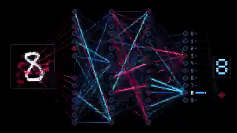</a> | [@DotCSV](https://x.com/DotCSV/status/2102737776219168939) | 56.043 | 56 s with digit inputs, labeled neural network and changing predictions. |
| <a href="https://x.com/Hectoryu/status/2103130115177898208">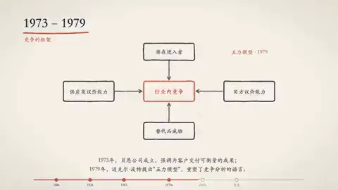</a> | [@Hectoryu consulting history](https://x.com/Hectoryu/status/2103130115177898208) | 60.053 | 60.1 s Chinese minimalist business/strategy-consulting history timeline with icons, dates and diagrams. |
| <a href="https://x.com/JuancaGlez7/status/2102890107200229817">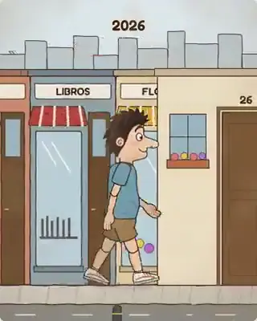</a> | [@JuancaGlez7 地球到人类历史](https://x.com/JuancaGlez7/status/2102890107200229817) | 78.135 | 九帧可见西语字幕、鱼类、陆地动物、古文明、登月和 2026 年 AI 场景。 |
|  | [@LinearUncle](https://x.com/LinearUncle/status/2103128559174971663) | 457 | 457 s dark-background graphs, slope/limit equations, speed examples and closing reflection. |
|  | [@RetropunkAI Sphere 发展史动效](https://x.com/RetropunkAI/status/2103237989065277590) | 60.032 | 九帧见从施工到球幕、演出时间线、排版和照片；原三图、背景资料准确性及 GSAP 运行日志未审。 |
|  | [@Ror_Fly Negroni recipe](https://x.com/Ror_Fly/status/2102853258582880547) | 30 | 30 s white-background recipe animation with ingredient icons, pouring and a six-step timeline. |
|  | [@Tz_2022 passkeys](https://x.com/Tz_2022/status/2102838830285898214) | 249.48 | 4m10s white slide-style timeline, login/keys diagrams and subtitles. |
|  | [@addyosmani browser explainer](https://x.com/addyosmani/status/2103009037164110327) | 40.043 | 40.0 s diagrammatic sequence moving from DNS/HTTP to DOM, page painting and layout, with legible visual transitions in the nine samples. |
|  | [@akokoi1 history](https://x.com/akokoi1/status/2102583898865873225) | 157.64 | 158 s minimalist line art and dynasty labels through several eras. |
|  | [@akokoi1 geography](https://x.com/akokoi1/status/2102606609574941028) | 288.133 | 288 s diagrams of thermal circulation, pressure cells and seasons with subtitles. |
|  | [@deedydas IKEA instructions](https://x.com/deedydas/status/2103174501345493197) | 102.281 | 102.3 s instructional animation with numbered furniture steps, parts labels, warnings, simple 3D panels and a small image of manual pages; the sampled portion reaches step 5 of 48. |
|  | [@dotey Transformer 教学讲解片](https://x.com/dotey/status/2103683057689522564) | 732.331 | Hypit 预览 732.331 秒（12.2 分钟）；九帧含密集的神经网络图示、注意力权重矩阵计算过程、Token 序列与动效演示。 |
| <a href="https://x.com/eztati/status/2103202431224119500">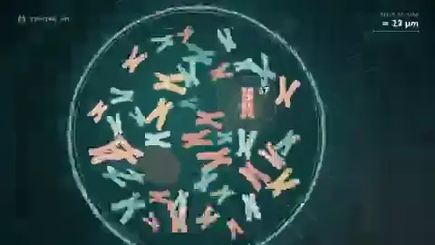</a> | [@eztati MED13 疾病解说](https://x.com/eztati/status/2103202431224119500) | 162.048 | 九帧见基因、神经元和文字说明；抽帧不能验证疾病知识和字幕的医学准确性。 |
| <a href="https://x.com/goodside/status/2103171088637419631">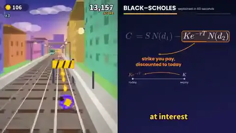</a> | [@goodside Black-Scholes](https://x.com/goodside/status/2103171088637419631) | 60.053 | 60.1 s split layout: changing option-pricing formula/graphs on the right, continuous runner HUD on the left. |
|  | [@hanifproduktif Indonesian-history comparison](https://x.com/hanifproduktif/status/2102695622042411419) | 59.051 | 59.1 s split-screen comparison explicitly labeled “Opus 5.5” above and “Opus 5.5 + Tesseract” below, moving through dates from 1945 to 2026. The lower row uses more colored figures/graphs in sampled frames. |
| <a href="https://x.com/hooyall0113/status/2103022039854657902">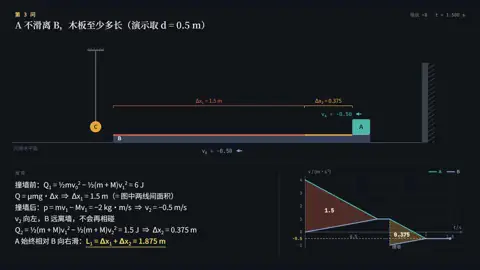</a> | [@hooyall0113 physics problem](https://x.com/hooyall0113/status/2103022039854657902) | 116.033 | 116 s dark interactive-style diagram of a ball/track, equations, force/velocity charts and Chinese explanatory text. |
|  | [@imShiWen 密码／Passkey 科普](https://x.com/imShiWen/status/2102954743442399395) | 375.3 | 九帧可见密码历史、风险、FIDO／Passkey、优缺点比较等中文卡片。与[@Tz_2022 另一段同题片](https://x.com/Tz_2022/status/2102838830285898214)的画面、长度和文件哈希不同。 |
| <a href="https://x.com/jisaku_net/status/2103095131536764940">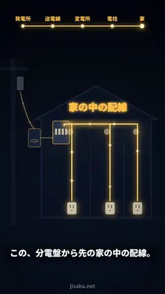</a> | [@jisaku_net 电力输送科普](https://x.com/jisaku_net/status/2103095131536764940) | 77.433 | 九帧见发电、输电、变电、家中配线的日语图解与电压数字；准确性与配音未独立核对。 |
|  | [@joaoli13 context window](https://x.com/joaoli13/status/2102805376466891137) | 101.133 | 101.1 s dense Portuguese diagram: colored token slots, input/output context areas and a moving reply panel across the nine sampled frames. |
| <a href="https://x.com/kimmonismus/status/2102844654169575547">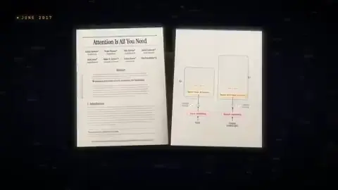</a> | [@kimmonismus](https://x.com/kimmonismus/status/2102844654169575547) | 180.096 | 180 s history of AI with code-style infographics. |
|  | [@ng169onX VAE 数学讲解](https://x.com/ng169onX/status/2103183904563998809) | 334.507 | 九帧见数字、编码器/解码器示意、损失函数、β-VAE/VQ-VAE 段落和英文字幕；能确认画面覆盖多个技术概念，不能确认模型训练真实发生或公式讲解正确。 |
|  | [@oscarmartin 西语 SEO/GEO 解说](https://x.com/oscarmartin/status/2102731669853573582) | 32.725 | 九帧见西语搜索结果、AI 回答示意、对比图和字幕，技术解释是否准确未核。 |
|  | [@rainwishyt photosynthesis lesson](https://x.com/rainwishyt/status/2102605736002150408) | 101.547 | 101.5 s child-oriented visual sequence of sun, water, leaf, sugar/oxygen and a human/tree, with handwritten-style captions. |
|  | [@sundyme GitHub 入门](https://x.com/sundyme/status/2102751132502446549) | 225.941 | 九帧可见文件、Git/GitHub、暂存、提交、push、分支、回滚等章节，字幕与配音正确性未独立验。 |

## 3D and real-time graphics (19)

三维与实时图形 · `primary_path=3d_or_realtime_graphics`

| Still / 截图 | Case / 原帖 | Preview (s) / 秒 | Nine-frame note / 九帧记录 |
|---|---|---:|---|
|  | [@Aurelien_Gz Clearwater](https://x.com/Aurelien_Gz/status/2102786378282987591) | 26.88 | 27 s capture of real-time shallow water with changing camera/ripples, shown by Hypit samples. |
|  | [@AxtonLiu 鹈鹕骑车剧场版](https://x.com/AxtonLiu/status/2103119648271290566) | 38.059 | X MP4 实测 38.059 秒、30 fps、480×270 预览，时长与 1140/30 相符；九帧可见写实感较强的夕阳栈桥、骑车鹈鹕、轮胎与海面。不能由预览确认渲染器源码、每帧采样数或母版画质。 |
|  | [@ForwardEditor stickman labyrinth](https://x.com/ForwardEditor/status/2102558320695402885) | 106.928 | 106.9 s with recurring green/red figures, desert/temple environments, sword clashes and chase/fight shots. |
|  | [@Govindaiii brand film](https://x.com/Govindaiii/status/2102815918049132792) | 52.059 | 52.1 s dark brand sequence with abstract rings, typography, logo and a red/blue/white palette. |
|  | [@MengTo scored ship scene](https://x.com/MengTo/status/2103122947133309311) | 68.288 | 68.3 s ship-on-water environment recording across day, sunset and night/fireworks, with a pointer visible in several samples. |
|  | [@SidMenonTM night-post owl](https://x.com/SidMenonTM/status/2103169764244017396) | 23.568 | 23.6 s owl at a post counter, holding letters through close and wide shots with a dark ending card. |
|  | [@Stefan_3D_AI Blender 双模型对照](https://x.com/Stefan_3D_AI/status/2102471841046786153) | 46.347 | 先分屏展示两版夜景城堡与弧形光迹，然后分别给建造灰模／成片的缩时段落；它不是单一 46 秒生成动画。 |
|  | [@akokoi1 fight](https://x.com/akokoi1/status/2103149275945517546) | 60.053 | 60 s stylized 3D fight with different arenas, bright particle effects and two character forms. |
| <a href="https://x.com/alexalbert__/status/2102458348511879448">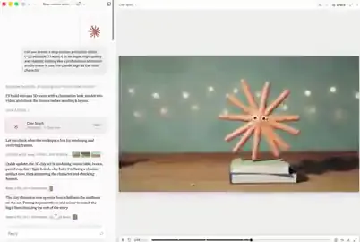</a> | [@alexalbert__ Blender clay animation](https://x.com/alexalbert__/status/2102458348511879448) | 22.468 | 22.5 s screen recording of a Claude-like interface next to a clay-looking orange character expanding into a starburst and moving on a desk. |
|  | [@gandamu_ml 90 年代风 demoscene](https://x.com/gandamu_ml/status/2102919394775220530) | 382.758 | 九帧见 3D 图形、粒子、光栅／文字和长段场景变化；容器有音轨但未核对曲目与画面同步。 |
|  | [@hayashimon1 river](https://x.com/hayashimon1/status/2102576886182453454) | 14.95 | 14 s rendered stream with rocks, forest and moving camera over water. |
| <a href="https://x.com/ish_creative/status/2102966807376334856">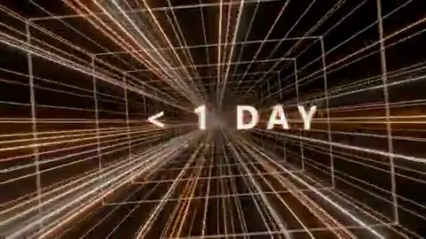</a> | [@ish_creative Opus 发布片](https://x.com/ish_creative/status/2102966807376334856) | 30.059 | 九帧可见金黑色粒子空间、数值标题、节奏性切换和 Opus 5.5 片尾；X 预览不能验证渲染时长、母版分辨率或宣传数字准确性。 |
|  | [@manaimovie Tripo/Blender character](https://x.com/manaimovie/status/2103138089790996843) | 4.598 | 4.6 s 3D anime character turnaround and facial/hand pose changes on a plain background. |
|  | [@pradeepXkapoor 未完成水墨武士片](https://x.com/pradeepXkapoor/status/2102782449478668290) | 90.048 | 九帧见水墨风山水、武士、竹林与交战场景，部分人物和背景细节显得稀疏；九帧不能验证整段音画质量。 |
|  | [@superalesha LHC](https://x.com/superalesha/status/2102779758408774104) | 34.176 | 34 s 3D traversal of collider tunnel and particle event. |
|  | [@tetumemo](https://x.com/tetumemo/status/2102652072252584046) | 73.707 | 69.6 s 3D historical battle visualization with arrows, gauges, ship formations and terrain. |
| <a href="https://x.com/varga_bee/status/2102744321355067761">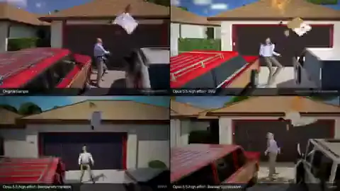</a> | [@varga_bee](https://x.com/varga_bee/status/2102744321355067761) | 5 | 5 s multi-panel side-by-side source/reconstruction comparison with garage and car scene. |
| <a href="https://x.com/wizardbrainz/status/2102755328161116223">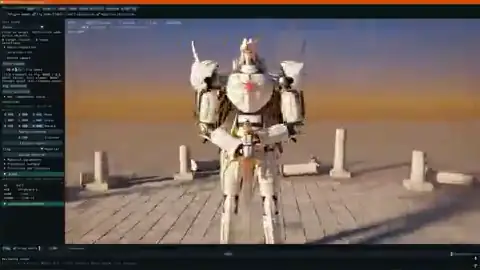</a> | [@wizardbrainz 机甲 3D 应用](https://x.com/wizardbrainz/status/2102755328161116223) | 23.659 | 九帧见 3D 编辑界面中的机甲旋转、移动与镜头变化。 |
|  | [@zdkiel_labs 单图建筑爆炸图](https://x.com/zdkiel_labs/status/2102722754172850310) | 14.5 | 九帧可见建筑从完整到逐层爆开、标注材料、再合拢；画面不能核对 272 个可编辑对象、相机误差或碰撞检查。 |

## Existing-source transformation (32)

现有素材改编 · `primary_path=existing_source_transformation`

| Still / 截图 | Case / 原帖 | Preview (s) / 秒 | Nine-frame note / 九帧记录 |
|---|---|---:|---|
| <a href="https://x.com/Akash_Bang/status/2103108964821107104">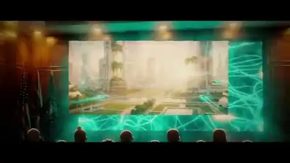</a> | [@Akash_Bang AI 2027 长篇解说](https://x.com/Akash_Bang/status/2103108964821107104) | 547.989 | 九帧和每 30 秒的加密抽样可见插画人物、时间轴、新闻画面和动态图解；抽样无法核对论文事实、旁白或所有素材来源。 |
|  | [@AxtonLiu](https://x.com/AxtonLiu/status/2102827887732932956) | 83.712 | 83 s recurring circular speaker inset and hand-drawn diagrams synchronized to captions. |
|  | [@Fujin_Metaverse podcast edit](https://x.com/Fujin_Metaverse/status/2102897123037761640) | 53.013 | 53 s vertical Japanese promo/excerpt with kinetic text, presenter images and composited graphics. |
|  | [@Luchigatica La Redonda 竖版推荐](https://x.com/Luchigatica/status/2102853289259729328) | 39.2 | 九帧见真人球员照片、队徽、统计和推荐卡片；无法证明转写／数据库对应正确。 |
|  | [@Miguel07Code Shotbase launch](https://x.com/Miguel07Code/status/2102441708395041170) | 58.304 | 58.3 s branded UI and typography sequence with app screenshots, controls and a final product mark. |
|  | [@N8Programs Gorm Fluid 文本改编](https://x.com/N8Programs/status/2103154189064876406) | 608.683 | 九帧可见重复的手绘人物、眼睛、黑板和关于 GPT 的文字，贯穿较长叙事。 |
|  | [@Oscar_sanmillan article-to-video](https://x.com/Oscar_sanmillan/status/2103114698610683964) | 46.357 | 46.4 s Spanish product explainer with paper background, UI mockups and recurring red asterisk mascot. |
|  | [@WangYeruo 页读／Thusfar 四主题双语广告](https://x.com/WangYeruo/status/2103108551799632050) | 44.395 | 已取得同一帖串四条双视频帖的八个 X MP4，每个通过 Hypit 探测和九帧抽样；可见书页、人物卡、关系图、应用界面和竖版预告，中文／英文字幕与画幅随版本变化。 |
|  | [@aicreataro After Effects](https://x.com/aicreataro/status/2102656273112326609) | 15.061 | 15.1 s split-screen source versus processed footage with different effects over a pink character. |
|  | [@araminta_k After Effects 线稿合成草稿](https://x.com/araminta_k/status/2103244081388503196) | 24.667 | 九帧见景物底画、未上色角色线稿、蓝色分层参考线和一段动作，明显是进行中的制作预览。 |
|  | [@azhar_builds Helpin 发布广告](https://x.com/azhar_builds/status/2103075805098070315) | 42.048 | 九帧可见深绿色品牌画面、Helpin 标志、产品界面与文字镜头；预览分辨率不能验证声称的 1080p 母版。 |
|  | [@bridgemindai 卫衣发布广告](https://x.com/bridgemindai/status/2102462889160286423) | 30.101 | 30.1 秒广告，带品牌标志、卫衣静物、价格与网页购物界面。 |
|  | [@coolbat1999 child's drawing](https://x.com/coolbat1999/status/2103127192591065595) | 226.859 | 226.9 s childlike drawings of people, house and shapes repeated through music-video scenes, with Chinese lyric text. |
| <a href="https://x.com/deweytn/status/2102787822855893072">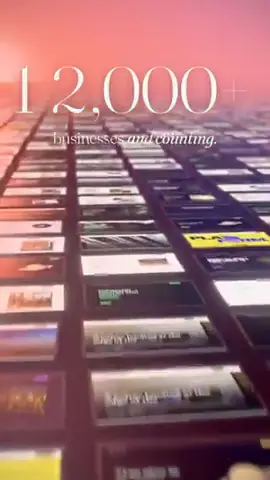</a> | [@deweytn Quick Elements 竖版广告](https://x.com/deweytn/status/2102787822855893072) | 25.557 | 九帧见模板网站、品牌字样及动态排版；是否调用素材库、如何渲染，无法从成片判断。 |
|  | [@dhruvalgolakiya](https://x.com/dhruvalgolakiya/status/2102733714845491558) | 123.648 | 123.6 s painterly human-history/cosmos sequence. |
|  | [@dhruvalgolakiya UnifiedChat 完整广告](https://x.com/dhruvalgolakiya/status/2103037586663235713) | 40.043 | 九帧见多应用收件箱、白色界面、UI 切换与收尾品牌画面；工程、声音效果与费用未独立审核。 |
|  | [@elianiva_ 黑白动效续作](https://x.com/elianiva_/status/2103003425915195750) | 26.099 | 九帧见黑白日文文字、漫画式排版、拉伸和转场；不能从样张划出哪一帧由人或模型写。 |
|  | [@gregpr07 口播多条 take 自动挑剪](https://x.com/gregpr07/status/2102984873351037161) | 17.984 | 九帧可见真人口播、类似多条 take 的网格、编辑指令与 video-use 片尾，不能从成片独立计数输入 take 或审计费用。 |
| <a href="https://x.com/haidaulau/status/2103015561076564319">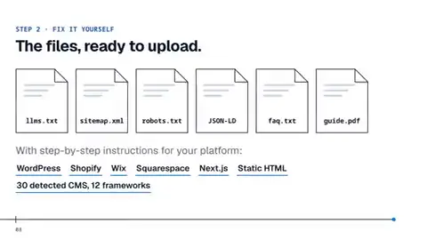</a> | [@haidaulau Visibilitycheck 产品解说](https://x.com/haidaulau/status/2103015561076564319) | 149.077 | 九帧见网址输入、AI 可见度指标、PDF 报告和产品结尾；页面/数值真实性、音轨内容和授权未核。 |
|  | [@jake11moran NotchBrowser 预告](https://x.com/jake11moran/status/2103237884564414633) | 27.051 | 九帧见窗体堆叠、桌面缩放、顶部缺口变面板和产品结尾，与逐镜要求的大体结构相符。文件虽然有 AAC 轨，ffmpeg 的整段音量测得均值 -79.5 dB／最大 -61.4 dB，基本接近静音；不能仅用“有音轨”推断违反无音频要求。 |
|  | [@jake11moran 会话历史动画 skill](https://x.com/jake11moran/status/2103247490237825416) | 52.672 | 九帧见桌面卡通角色、聊天纸条、显示器与白天到夜晚的转场，不能倒推所读对话内容或验证数据处理。 |
|  | [@leo_xiaolei 参考片程序动画](https://x.com/leo_xiaolei/status/2102724347446305104) | 28.181 | 九帧可见该叙事序列和橙色角色首尾回归；与另一则[早期橙色角色短片](https://x.com/devteamdrew/status/2102436464323661880)有相近意象，但不能证明它就是所给参考片。 |
|  | [@leodev Social SDK 发布片](https://x.com/leodev/status/2102781872107659270) | 56.363 | 56.4 秒深色产品宣传片，九帧可见聊天界面、文档、应用画面与 Social SDK 品牌收尾。 |
| <a href="https://x.com/reg_andr/status/2103117698863390805">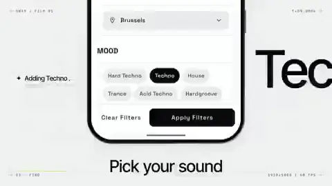</a> | [@reg_andr ADB product film](https://x.com/reg_andr/status/2103117698863390805) | 54.379 | 46.4 s light product film with phone UI capture, typography and musical editing. |
|  | [@sab8a 真人口播改剪](https://x.com/sab8a/status/2103144778481475686) | 37.287 | 九帧显示同一位真人讲话者，搭配不同字幕、彩色背景、贴图、分屏与结尾投票卡。 |
|  | [@shribuilds Wrapscribe 广告](https://x.com/shribuilds/status/2102827288190689364) | 41.045 | 九帧见会议记录、语音编辑、翻译和品牌收尾。 |
| <a href="https://x.com/throughiris_/status/2102911234526048706">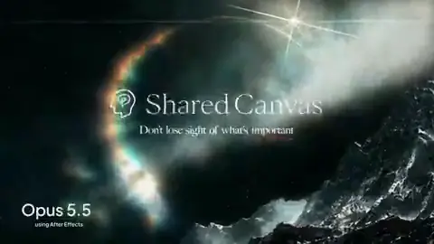</a> | [@throughiris_ three-way production comparison, Opus cut](https://x.com/throughiris_/status/2102911234526048706) | 12 | Hypit sampled the three separately posted cuts: H3 10.2 s, GPT+AE 12.0 s, Opus+AE 12.0 s. All share mountain/cloud/type motifs; the Opus sample has a bright lens-like ring near the end. |
|  | [@trq212 personal-site trailer](https://x.com/trq212/status/2102477340920152162) | 95.475 | 95.5 s sequence of typography and website-screen compositions sampled across the trailer. |
|  | [@twoclipping Hooklab 广告](https://x.com/twoclipping/status/2102554209166000267) | 20.062 | 九帧见真实人物视频墙、产品界面、数字卡和 Hooklab 收尾。 |
| <a href="https://x.com/vikktorrrre/status/2103104303808348305">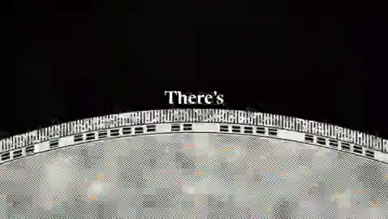</a> | [@vikktorrrre 发布片复刻](https://x.com/vikktorrrre/status/2103104303808348305) | 20.203 | 20.2 秒短片，九帧可见地平线、草地、物体近景、打字和 Claude/Opus 片尾。 |
|  | [@yangfei33113 街景雨夜](https://x.com/yangfei33113/status/2102611841122017632) | 37.547 | 九帧可见同一街景透视、伞下人物、积水反射、光源和代码式字幕。 |
|  | [@yrzhe_top 三模型网站宣传比较](https://x.com/yrzhe_top/status/2102752585371226241) | 40.043 | 40.0 秒上二下一的三路剪辑合辑，展示同一产品网站的文案与界面；九帧可辨多个版式，不能完整审计每路独立工程。 |

## External video-model pipelines (10)

外部视频模型编排 · `primary_path=external_video_model`

| Still / 截图 | Case / 原帖 | Preview (s) / 秒 | Nine-frame note / 九帧记录 |
|---|---|---:|---|
|  | [@AnduArtist spinning-cup overlay](https://x.com/AnduArtist/status/2102548178646016377) | 15.139 | 15.1 s photoreal rotating takeaway cup with changing line-art cat/café/figures registered to the cup surface. |
|  | [@KanaWorks_AI siege-game promo](https://x.com/KanaWorks_AI/status/2102684116525437206) | 60.395 | 60.4 s Japanese game launch-style sequence with UI, battlefield action, title cards and a call-to-play ending. |
|  | [@Medeo_AI](https://x.com/Medeo_AI/status/2102463091959288264) | 30.093 | 31 s split-screen ink-warrior scenes. |
|  | [@OriSilver Blender 草模到 Seedance](https://x.com/OriSilver/status/2102817977812824335) | 27.605 | 公开 X MP4 是 27.6 秒方形上下分屏：上方近写实真人群像，下方对应的低模／卡通 Blender 草模，九帧可见人物和场景构图配对。 |
|  | [@abxxai](https://x.com/abxxai/status/2102775755646337530) | 19.087 | 19 s photoreal car/coastal shots with people. |
|  | [@gavinpurcell Runway MCP 纪录片](https://x.com/gavinpurcell/status/2103304514329854102) | 315.435 | Hypit 预览 315.435 秒（超 5 分钟）；九帧呈现写实风格画面、访谈镜头、旁白字幕与纪实过场。 |
|  | [@jantijssen](https://x.com/jantijssen/status/2102861462461124755) | 208.043 | 196 s collage/retro-TV music video with live-action-looking performers, pop typography and recurring “SLOP-TV” overlays. |
|  | [@koldo2k 无限放大拼贴](https://x.com/koldo2k/status/2103129343253778767) | 20.062 | 九帧能看到景物穿越道具的连续构图；另有[40 秒制作过程演示](https://x.com/koldo2k/status/2103129345392832700)，展示深度图、三层视差、绿幕对象与拼接步骤。演示本身不是执行日志；X 预览也不验证所要求的 1080p、逐帧接缝、无缝循环或费用。 |
|  | [@razeden0](https://x.com/razeden0/status/2103153899431432535) | 21.909 | 21 s photoreal woman/car/coastal road sequence, with cuts to a moving car interior. |
|  | [@sankakuten91256 四工具多模态舞蹈动效](https://x.com/sankakuten91256/status/2103483923783373039) | 15.061 | 九帧可见人物与多层动态图形背景叠合；样张不能核定各层的生成工具。 |

## App and game capture (14)

应用与游戏录屏 · `primary_path=app_or_game_capture`

| Still / 截图 | Case / 原帖 | Preview (s) / 秒 | Nine-frame note / 九帧记录 |
|---|---|---:|---|
|  | [@JaydenDavisNC Splatoon 游戏录屏](https://x.com/JaydenDavisNC/status/2103357848961036304) | 147.797 | 九帧可见第三人称射击视角、喷墨效果、UI 计分与地图。 |
|  | [@MengTo Japanese boat environment](https://x.com/MengTo/status/2102760783344189761) | 59.733 | 59.7 s moving boat/environment recording with rain/night, temples, bridges, reflections and visible pointer/UI in some frames. |
|  | [@NicksonTan 单图到 Three.js 场景](https://x.com/NicksonTan/status/2102798578427265368) | 72.283 | 九帧是河流、树木、荡秋千与可操作界面的场景录屏；无法由视频核验每个 GLB 的数量或场景实际交互。 |
|  | [@NiloTechInc](https://x.com/NiloTechInc/status/2102741813719138661) | 7.531 | 7.5 s screen capture of Roblox-style 3D character scene in editor with Nilo/Opus overlay. |
|  | [@RyanSael interactive lens lab](https://x.com/RyanSael/status/2102591147927654847) | 32 | 32.0 s recording of a lens assembly, glass elements, focus plane and scene-preview controls changing in a UI. |
|  | [@RyanSael data-center simulator](https://x.com/RyanSael/status/2102740041621762166) | 34.2 | 34.2 s recording of a cutaway data center with racks, ducts, heat/airflow overlays, status UI and camera movement. |
| <a href="https://x.com/RyanSael/status/2103021886045348073">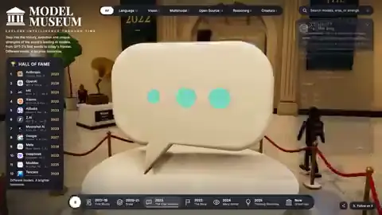</a> | [@RyanSael AI museum](https://x.com/RyanSael/status/2103021886045348073) | 44 | 44 s screen recording walking through rooms and exhibits in a game-like museum UI. |
|  | [@TheViableEdge JEV＋Opus 实时视觉器](https://x.com/TheViableEdge/status/2103494684374900862) | 56.512 | 九帧可见作者讲解、图表 UI 与实时可视化效果切换。 |
| <a href="https://x.com/The_Alex/status/2102440678282412195">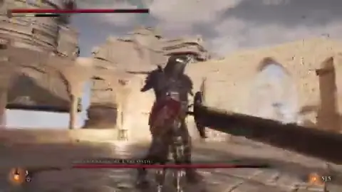</a> | [@The_Alex](https://x.com/The_Alex/status/2102440678282412195) | 130.752 | 130 s game traversal and combat HUD. |
| <a href="https://x.com/Voxyz_ai/status/2103117246860345550">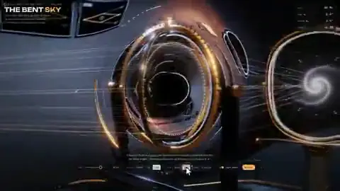</a> | [@Voxyz_ai black-hole lab](https://x.com/Voxyz_ai/status/2103117246860345550) | 21.888 | 21.9 s recording of a black-hole/lens simulator with controls, camera changes and a final bright Einstein-ring-like view. |
|  | [@higgsfield_ai](https://x.com/higgsfield_ai/status/2102533401110802552) | 44.083 | 44 s split-screen underwater game footage. |
| <a href="https://x.com/iannuttall/status/2102685186919932404">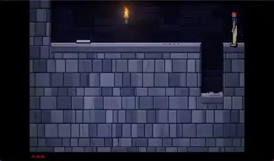</a> | [@iannuttall Prince of Persia-like game](https://x.com/iannuttall/status/2102685186919932404) | 145.28 | 60.4 s recording of a playable-looking side-scrolling game with HUD, combat, gate puzzles and menus. |
|  | [@masaya_1980 远近捡罐实验](https://x.com/masaya_1980/status/2103115017755500561) | 32.133 | 九帧见两名角色在赛道上拾取物品并显示规则／结果；与可交互网页不同，MP4 本身不可操作。 |
|  | [@ring_hyacinth](https://x.com/ring_hyacinth/status/2102865595675050010) | 178.88 | 179 s dialogue/UI capture of a playable pixel-style Shanghai memory game. |

## Mixed or unestablished pipeline (14)

混合或流程未确定 · `primary_path=mixed_or_not_established`

| Still / 截图 | Case / 原帖 | Preview (s) / 秒 | Nine-frame note / 九帧记录 |
|---|---|---:|---|
|  | [@Tariq_at 本地 ComfyUI 短片](https://x.com/Tariq_at/status/2102561072624410878) | 20.053 | 九帧见棕色小角色跨几个质感不同的星球／地貌，出现“think／plan／build”字样。 |
|  | [@anjmaxx 20 s MV](https://x.com/anjmaxx/status/2103173729656459455) | 20.053 | 20.1 s vertical collage/paper video with two recurring pixel characters, math/AI memes, kinetic lyric text and a strong pink/black palette. |
|  | [@cube__lol Tool 音乐长片](https://x.com/cube__lol/status/2102879729594343605) | 833.088 | 另用 Hypit 每 30 秒抽样 28 帧，见星点、光束、反复出现的蓝色面孔、机械形体和抽象纹样；仍不能证明每帧工具、音频来源或全长连续质量。 |
|  | [@deedydas](https://x.com/deedydas/status/2102787937482252537) | 26.053 | 26.1 s clean kinetic typography, charts, logo and UI cards for Muda. |
|  | [@devteamdrew](https://x.com/devteamdrew/status/2102436464323661880) | 31.979 | 32 s with a mascot moving through neural branches, DNA, black hole and space. Cohesive scene-to-scene visual motifs. |
|  | [@donaldjewkes](https://x.com/donaldjewkes/status/2102801274173587569) | 141.568 | 141.6 s illustrated/anime music-video treatment with new protagonist and p(doom) references. |
|  | [@gandamu_ml Nightcall 像素短片](https://x.com/gandamu_ml/status/2103116003689550013) | 256.917 | 九帧见夜景公路、车、地铁／电话亭、像素都市与角色，跨多个镜头维持深色调；无法从九帧核验与歌曲节拍的同步。 |
|  | [@leogao25 Rube Goldberg 双模型对照](https://x.com/leogao25/status/2102544078927741369) | 16.858 | 九帧为两种木制／绿色机关的分屏与费用表；可见是比较视频，不是两段原始成片完整验收。 |
|  | [@marcthecreatorr Opus 5.5 发布片](https://x.com/marcthecreatorr/status/2103133462798483752) | 31.951 | 可见品牌发布片剪辑、图形与结束卡；九帧不能核对数据、字体许可或制作耗时。 |
|  | [@pleometric Donald-workflow follow-up](https://x.com/pleometric/status/2103082510607610023) | 156.693 | 156.7 s game/anime-styled p(doom) MV with a recurring red-haired character, faux UI, lyrics, rapid scene changes and retro game references in sampled frames. |
|  | [@ruinolab character MV](https://x.com/ruinolab/status/2103120880796873091) | 49.963 | 50.3 s bright anime fight/song clip with two recurring characters, rapid cuts and lyric typography. |
|  | [@sbalhatlani 阿拉伯语配音动漫试播集](https://x.com/sbalhatlani/status/2103475507471806929) | 513.324 | 九帧见连续动漫场景和阿拉伯语画面字幕，能看到片头、城镇、角色对话与后段冲突。 |
| <a href="https://x.com/shneural/status/2103472385563459833">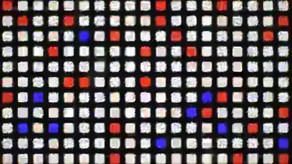</a> | [@shneural Claude Code 会话回顾片](https://x.com/shneural/status/2103472385563459833) | 56.299 | 九帧以代码编辑器、图表／点阵和动效字标呈现制作会话。 |
|  | [@somasoma_blue BAUNAUS 宠物短片](https://x.com/somasoma_blue/status/2103039084944138621) | 53.611 | 九帧见毛绒／黏土质感狗猫、客厅、壁炉、宝箱和真人角色。 |
