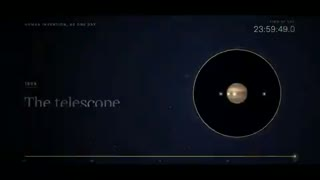
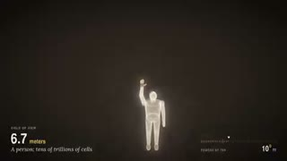
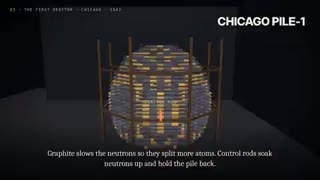
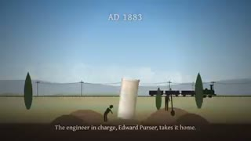
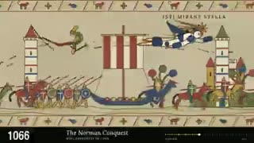
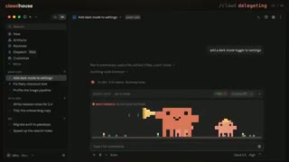

# 10 月 3 日：人类史、艺术史及更多 Claude 视频

[English](claude55-update-2026-10-03.md) · [首页](../README.zh-CN.md) · [October 2](claude55-update-2026-10-02.zh-CN.md)

本轮补入 **157 条带制作说明的来源帖**，包括 Fable 新作品、Opus／Sonnet 作品、对照与版本变体。每条链接发布者原帖；这不是独立影片或已验证模型运行总数。另保存 [602 个候选、引用与线程来源的处理记录](../data/claude55-candidate-audit-2026-10-03.csv)。

入口来自[王也弱的转引](https://x.com/WangYeruo/status/2106212447870947409)，经 [Tz](https://x.com/Tz_2022/status/2106129476513878112) 追到 [@imjustnewatai 的人类进步史](https://x.com/imjustnewatai/status/2106081142143168580)。这条传播链只列一件作品。

**先看作品。** 人类史用“一天”时钟组织漫长历史；艺术史保留画家与猫并持续换画风；宇宙缩放把微观结构、人物和星系连成一个主题。这是取样画面的设计观察，不是模型排名。

本轮以 ffprobe／ffmpeg 探测并各取九帧，人工查看 **15 段预览**；其中 14 段对应下方来源条目，一段为不采纳的 MV 主张。仅检查取样帧与音轨存在，未完整连续播放或独立鉴定配乐。其余条目只核对来源。Fable 5.5 统一保留作者归属、后台未核实。

## 七个有画面的入口

| 作品与原帖 | 实测预览时长 | 看什么 |
|---|---:|---|
|  [把人类进步压缩成一天](https://x.com/imjustnewatai/status/2106081142143168580) · @imjustnewatai | 189.056 s | 作者称单条提示制作三分钟人类进步史，延伸未来三十年，并原创配乐，无素材视频或库存音乐。取样可见一天时钟与未来章节。 |
|  [四万年艺术史与猫的支线](https://x.com/cherry_mx_reds/status/2106095190285144331) · @cherry_mx_reds | 15.061 s | 作者称十五秒呈现四万年艺术史，并加入猫的支线。取样可见画家与猫穿过洞穴、埃及、马赛克、文艺复兴及现代风格。 |
|  [从夸克到宇宙的连续缩放](https://x.com/imjustnewatai/status/2106190594775097663) · @imjustnewatai | 94.059 s | 作者让模型自选惊艳主题，称九十四秒连续缩放四十二个数量级，画面与音乐都由代码制作。取样跨越微观结构、人物、行星与星系。 |
|  [核技术与原子弹的历史短片](https://x.com/imjustnewatai/status/2106238699872956427) · @imjustnewatai | 180.048 s | 作者称三分钟三维历史片，无可用三维库而自写渲染器，绘制五千四百帧并合成配乐。取样可见历史时间线、标注的三维示意与地图。 |
|  [塞基洛斯墓志铭](https://x.com/YanqingCheng/status/2106158746938269728) · @YanqingCheng | 200.352 s | 作者要求表现人类令人鼓舞的事，模型选择塞基洛斯墓志铭。作者称美术与音乐均在一个二百 KB 的 HTML／JavaScript 文件内；取样可见石碑历程与乐谱。 |
|  [钢铁侠与蜘蛛侠穿越历史](https://x.com/imjustnewatai/status/2106162924331180510) · @imjustnewatai | 98.233 s | 作者要求两位英雄飞越历史。取样可见角色穿过洞穴、埃及、罗马、水墨、文艺复兴与现代城市风格。 |
|  [Clawdhouse 产品发布片](https://x.com/ishuagra02/status/2106138602073641241) · @ishuagra02 | 36.595 s | 作者发布含四十种情绪的 Claude Code 吉祥物模组，并将发布视频归于 Fable。取样可见像素角色在产品界面中响应编码任务。 |

## 作者回复改变了哪些判断

- [三体模拟作者的澄清](https://x.com/zAdrielsan/status/2105867394296250790)：最初四个形式证明只覆盖控制逻辑。作者[随后请 Opus 补物理检查](https://x.com/zAdrielsan/status/2105872131250958368)，并[另报后续证明](https://x.com/zAdrielsan/status/2105884574303535565)。不能写成“一次生成并证明三体通解”。
- [月球漫步公开任务](https://x.com/noclipepe/status/2106154090556199006)是含图像参考、角色、动作与环境要求的长任务，不是无上下文单句；本轮取得的是 33.62 秒录屏。
- [音乐字幕作者](https://x.com/atomtanstudio/status/2106135196483608745)提供歌曲与歌词。不能把现有歌曲标为 Fable 原创配乐。
- [“12 小时 Fable MV”](https://x.com/synthshareai/status/2106195060140446028)的取样显示吉祥物覆盖在现有真人音乐视频上。这不能支持原创 Fable MV 的主张，本轮未将其列入新作品目录。

## 按用途浏览全部新增来源

表中制作说明均按作者／发布者主张记录；只有标为“九帧”的条目另经过本轮媒体取样。成本、一次生成、纯代码与原创音乐等主张均不视为已审计。完整的逐条限制见[双语来源账本](../data/claude55-source-review-2026-10-03.csv)。游戏、网站与模拟录屏作为独立类型保留。

### 历史与文化时间线 (9)

| 原帖 | 模型归属（作者／发布者主张） | 制作说明 | 本轮检查 |
|---|---|---|---|
| [把人类进步压缩成一天](https://x.com/imjustnewatai/status/2106081142143168580) @imjustnewatai | Fable 5.5 (creator report) | 作者称单条提示制作三分钟人类进步史，延伸未来三十年，并原创配乐，无素材视频或库存音乐。取样可见一天时钟与未来章节。 | 九帧 |
| [四万年艺术史与猫的支线](https://x.com/cherry_mx_reds/status/2106095190285144331) @cherry_mx_reds | Fable 5.5 (creator report) | 作者称十五秒呈现四万年艺术史，并加入猫的支线。取样可见画家与猫穿过洞穴、埃及、马赛克、文艺复兴及现代风格。 | 九帧 |
| [塞基洛斯墓志铭](https://x.com/YanqingCheng/status/2106158746938269728) @YanqingCheng | Fable 5.5 (creator report) | 作者要求表现人类令人鼓舞的事，模型选择塞基洛斯墓志铭。作者称美术与音乐均在一个二百 KB 的 HTML／JavaScript 文件内；取样可见石碑历程与乐谱。 | 九帧 |
| [Altman 与 Amodei 争议解说](https://x.com/imjustnewatai/status/2106204392588276065) @imjustnewatai | Fable 5.5 (creator report) | 作者要求解释两位 AI 公司负责人的争议。 | 仅来源 |
| [霍尔木兹海峡辩论片](https://x.com/chetaslua/status/2106060047805792415) @chetaslua | Fable 5.5 (creator report) | 作者展示归于 Fable 的辩论主题动画。 | 仅来源 |
| [从古代到今天的人类史](https://x.com/blueemi99/status/2106041578204655748) @blueemi99 | Fable 5.5 (creator report) | 作者称约一小时，用代码制作动画与模型，表现人类历史。 | 仅来源 |
| [单 HTML 文件中的泰坦尼克号](https://x.com/TheDigitalRep/status/2106140032859799993) @TheDigitalRep | Fable 5.1 selected; creator suspects 5.5 | 作者选择 Fable 5.1，要求至少三分钟的单 HTML 泰坦尼克号动画和配乐，允许外部素材，称使用 Three.js。 | 仅来源 |
| [游戏简史](https://x.com/craigmiller1973/status/2106241923036164535) @craigmiller1973 | Sonnet 5.5 (creator report) | 作者将游戏史视频归于 Sonnet。 | 仅来源 |
| [复用影片 skill 制作郑和下西洋](https://x.com/bangbuilds/status/2105914831887102064) @bangbuilds | Opus 5.5 (creator report) | 作者复用长征影片 skill，要求郑和下西洋三维片并确认稿子，称五十五分钟、输出二十二万 token、片长两分五秒。 | 仅来源 |

### 科普与解说 (16)

| 原帖 | 模型归属（作者／发布者主张） | 制作说明 | 本轮检查 |
|---|---|---|---|
| [从夸克到宇宙的连续缩放](https://x.com/imjustnewatai/status/2106190594775097663) @imjustnewatai | Fable 5.5 (creator report) | 作者让模型自选惊艳主题，称九十四秒连续缩放四十二个数量级，画面与音乐都由代码制作。取样跨越微观结构、人物、行星与星系。 | 九帧 |
| [核技术与原子弹的历史短片](https://x.com/imjustnewatai/status/2106238699872956427) @imjustnewatai | Fable 5.5 (creator report) | 作者称三分钟三维历史片，无可用三维库而自写渲染器，绘制五千四百帧并合成配乐。取样可见历史时间线、标注的三维示意与地图。 | 九帧 |
| [全民高收入解说片](https://x.com/markbraincell/status/2106234118514323515) @markbraincell | Fable 5.5 (creator says probably) | 作者将全民高收入解说片标为疑似 Fable 5.5。 | 仅来源 |
| [2076 年的世界](https://x.com/Layton_Gott/status/2106190496075035096) @Layton_Gott | Fable 5.5 (creator report) | 作者要求二十五秒展示 2076 年世界，并认为风格与 Opus 5.5 很相似。 | 仅来源 |
| [黑板风 for 循环课程](https://x.com/kenyondigital/status/2106108583570034984) @kenyondigital | Opus 5.5 (creator report) | 作者使用 alexgreensh 的 anidoodle skill，提供克隆声音，称脚本经过测试、粉笔动画与口述同步并输出 4K。 | 仅来源 |
| [Claude 介绍 Claude 中文版](https://x.com/ai_hkblack/status/2106221041446248835) @ai_hkblack | Opus 5.5 (creator report) | 作者要求七分半的 Anthropic／Claude 历史解说，延伸到 2026 年九月，明确为独立非官方制作。 | 仅来源 |
| [Claude 介绍 Claude 英文版](https://x.com/ai_hkblack/status/2106222414732624277) @ai_hkblack | Opus 5.5 (creator report) | 作者发布同一七分半解说项目的英文版。 · [补充 1](https://x.com/ai_hkblack/status/2106221041446248835) | 仅来源 |
| [把 Karpathy 帖子做成视频](https://x.com/fun000001/status/2106220406382432518) @fun000001 | Opus 5.5 (creator report) | 作者用视频解释输入的 Karpathy 帖子。 | 仅来源 |
| [Remotion 加图像工具的科普视频](https://x.com/minosdevs/status/2104959910903464200) @minosdevs | Opus 5.5 (creator report) | 作者在科普视频流程中披露 Remotion、Three.js 和 GPT-image-2。 | 仅来源 |
| [Copernicus 报告转品牌动画](https://x.com/simonicard/status/2106121436192817272) @simonicard | Sonnet 5.5 medium (creator report) | 作者提供角度、品牌样式与 Copernicus 报告 PDF，称五轮修改，代码制作画面与声音。 | 仅来源 |
| [《何为引导》课程宣传](https://x.com/HenrygSing/status/2106206696146382891) @HenrygSing | Opus 5.5 (creator report) | 作者提供原稿与要求，称 Remotion／React 代码绘图、微软 TTS、逐场截图检查及排版修订。 | 仅来源 |
| [FZ 1073 航空事件解说](https://x.com/cgnot996/status/2106033768096272555) @cgnot996 | Sonnet 5.5 high (creator report) | 作者披露 Sonnet 导演、GPT-Image-2.5 美术、Ming-Image 拆层，并指出分镜错位。 | 仅来源 |
| [自主新闻短片实验](https://x.com/Acai_murmur/status/2105869306625982594) @Acai_murmur | Opus 5.5 (creator report) | 作者称四分九秒 AI 新闻片，用 Python 绘图、授权档案片段、系统配音与合成音频，并复用此前渲染配乐代码。 | 仅来源 |
| [教程：大语言模型怎样做视频](https://x.com/xRog3r/status/2105863471434981768) @xRog3r | Opus 5.5 (creator report) | 作者描述确定性浏览器逐帧渲染、配音驱动时长和代码合成音乐音效，含人工反馈及开源流程。 | 仅来源 |
| [TRON 与 USDT 解说](https://x.com/ai_hkblack/status/2105843299613573590) @ai_hkblack | Sonnet 5.5 (creator report) | 作者描述七分钟区块链解说，含章节对比和实际转账。 | 仅来源 |
| [宇宙凝视自己](https://x.com/l_mejiaC/status/2105988529671360673) @l_mejiaC | Fable 5.5 (creator report) | 作者描述从大爆炸到人类眼睛的连续镜头，跨一百三十八亿年，画面与音乐均由代码制作。 | 九帧 |

### 角色与叙事动画 (18)

| 原帖 | 模型归属（作者／发布者主张） | 制作说明 | 本轮检查 |
|---|---|---|---|
| [钢铁侠与蜘蛛侠穿越历史](https://x.com/imjustnewatai/status/2106162924331180510) @imjustnewatai | Fable 5.5 (creator report) | 作者要求两位英雄飞越历史。取样可见角色穿过洞穴、埃及、罗马、水墨、文艺复兴与现代城市风格。 | 九帧 |
| [当愤怒老板的 Opus](https://x.com/rohit3a/status/2106138910648914094) @rohit3a | Fable 5.5 xHigh (creator report) | 作者将愤怒老板的一天动画归于 Fable xHigh。 | 仅来源 |
| [2010—2026 网络梗编年史](https://x.com/chetaslua/status/2106076940558082297) @chetaslua | Fable 5.5 (creator report) | 作者称逐年网络梗场景由纯代码完成，并变化画风与音乐。 | 仅来源 |
| [漫威与 DC 英雄交互](https://x.com/chetaslua/status/2105792187200147541) @chetaslua | Fable 5.5 (creator report) | 作者称纯 JavaScript 实现，模型自选各角色细节，并辅助编辑视频。 | 仅来源 |
| [迈克尔·杰克逊月球漫步穿越历史](https://x.com/noclipepe/status/2106105810812112937) @noclipepe | Fable 5.5 (creator report) | 作者展示穿越历史的月球漫步。后续公开长提示含图像参考、角色、舞步、环境及九个时代要求。取样录屏最终抵达月球。 · [补充 1](https://x.com/noclipepe/status/2106154090556199006) / [补充 2](https://x.com/noclipepe/status/2106106337939656749) | 九帧 |
| [鸣人穿越九种动漫世界](https://x.com/noclipepe/status/2105993107628073198) @noclipepe | Opus 5.5 (creator report) | 作者称角色比例与画风变化，耗时七十五分二十五秒，约五千四百五十万 token、23.45 美元，评论附演示和提示。 | 仅来源 |
| [从甲骨文开始的动画](https://x.com/MinLiBuilds/status/2106180691344118202) @MinLiBuilds | Fable 5.5 (creator says uncertain) | 作者展示从甲骨文开始的动画，并对模型版本打问号。 | 仅来源 |
| [证明你有意识的预告片](https://x.com/hive_echo/status/2106246677141266850) @hive_echo | Opus 5.5 / Grok (creator report) | 作者将预告短片归于 Opus 与 Grok，称 Opus 负责剧本与导演。 | 仅来源 |
| [Like A Rising Sun 旁白版](https://x.com/222TT222/status/2106235383638061233) @222TT222 | Opus 5.5 (creator report) | 作者将三部曲变体标为 Opus，并注明四国玫叹旁白。 · [补充 1](https://x.com/222TT222/status/2106216567055036513) / [补充 2](https://x.com/222TT222/status/2106224781284831454) | 仅来源 |
| [Like A Rising Sun 三部曲版](https://x.com/222TT222/status/2106224781284831454) @222TT222 | Opus 5.5 (creator report) | 作者发布归于 Opus 的三部曲版本。 | 仅来源 |
| [Like A Rising Sun](https://x.com/222TT222/status/2106216567055036513) @222TT222 | Opus 5.5 (creator report) | 作者发布 Like A Rising Sun，后续有三部曲及旁白变体。 | 仅来源 |
| [四分钟短片《我们见过吗》](https://x.com/UnderleveledDev/status/2106211651833987580) @UnderleveledDev | Opus 5.5 (creator report) | 作者称剧本分镜、Three.js／WebGL 画面、七个场景子任务、合成音乐音效与自动成片，人类逐关拍板。 | 九帧 |
| [用国际象棋表现 Claude 推理档位](https://x.com/devteamdrew/status/2105353836638744578) @devteamdrew | Opus 5.5 / Sonnet 5.5 (creator report) | 作者将各推理档位的动画表现归于两款 Claude 模型。 | 仅来源 |
| [交互 JavaScript 角色动画](https://x.com/doerstokyo342/status/2105195592989434141) @doerstokyo342 | Opus 5.5 (creator report) | 作者描述代码动画与眼睛追随鼠标，音频来自 Lyria 3.5 和 Eleven V4。 | 仅来源 |
| [Sonnet 自画像](https://x.com/Spectromachina/status/2106196931911545096) @Spectromachina | Sonnet 5.5 (creator report) | 作者让 Sonnet 表现自己眼中的自己，并附预览。 | 仅来源 |
| [鸸鹋 Fluffy](https://x.com/CDB_Dave/status/2106175538020893028) @CDB_Dave | Sonnet 5.5 (creator report) | 作者提供自创角色，称动画由 Sonnet 代码完成，并另测 Opus。 | 仅来源 |
| [《早发白帝城》动画朗诵](https://x.com/bangbuilds/status/2106204481642021333) @bangbuilds | Opus 5.5 (creator report) | 作者称二十五秒代码绘制诗歌动画朗诵，耗时五十五分钟、输出三十万 token。 | 仅来源 |
| [人类行走](https://x.com/l_mejiaC/status/2105801379956850793) @l_mejiaC | Fable 5.5 (creator report) | 作者称一个人物行走穿过三万年艺术、二十个画板、七十四秒，画面与音乐由代码制作。 | 九帧 |

### 动态图形与特效 (20)

| 原帖 | 模型归属（作者／发布者主张） | 制作说明 | 本轮检查 |
|---|---|---|---|
| [光明会恐怖风短片](https://x.com/badboyfoxy/status/2106241189976387799) @badboyfoxy | Fable 5.5 (creator report) | 作者要求关于光明会的恐怖视频，并展示结果。 | 仅来源 |
| [详细提示驱动的动态图形](https://x.com/devswha/status/2106100273509007802) @devswha | Fable 5.5 (creator report) | 作者称使用一条详细提示，无素材、参考视频或源码输入。 | 仅来源 |
| [短促动态图形演示](https://x.com/blueemi99/status/2106031355922387163) @blueemi99 | Fable 5.5 (creator report) | 作者认为动效和声音优于此前 Opus 体验；另一作者发布 Opus 回应作品。 | 仅来源 |
| [节拍动态图形测试](https://x.com/xodud_rkd/status/2106008546248950161) @xodud_rkd | Fable 5.5 max (creator report) | 作者强调节拍同步与部分改善的声音表现。 | 仅来源 |
| [纯 JavaScript 可播放动画](https://x.com/Scrappy__4/status/2105866966988661167) @Scrappy__4 | Fable 5.5 (creator report) | 作者披露简短要求：用纯 JavaScript 制作十五秒可播放动画。 | 仅来源 |
| [早期疑似 Fable 动画](https://x.com/blueemi99/status/2105782154387189771) @blueemi99 | Fable 5.5 (creator says maybe) | 作者在网页端选择 xHigh，并根据社区知识问答推测版本。 | 仅来源 |
| [彩色玻璃图像动画](https://x.com/rws1st/status/2106245625067282560) @rws1st | Opus 5.5 (creator report) | 作者提供 Midjourney v3 图像，制作彩色玻璃场景。 | 仅来源 |
| [无外部工具的动态图形尝试](https://x.com/tokiha_sasakure/status/2106244912115269942) @tokiha_sasakure | Opus 5.5 (creator report) | 作者称无外部工具直接生成动态图形，并认为质量仍不完美。 | 仅来源 |
| [Unreal 雷电特效四轮修改](https://x.com/OGKAIM/status/2106219817682530350) @OGKAIM | Opus 5.5 (creator report) | 作者披露四版：无声初版、写实配音、参考驱动打击、闪电与雷声。 | 仅来源 |
| [低多边形水果与 PS2 纹理](https://x.com/blak3shao/status/2105674103109914755) @blak3shao | Opus 5.5 (creator report) | 作者描述由创作方向、参考和可调滑块引导的动效探索。 | 仅来源 |
| [直而温书法动画](https://x.com/feigaobox/status/2106042539744862690) @feigaobox | Opus 5.5 (creator report) | 作者披露开源毛笔字体、代码模拟墨纸印泥、五六轮修改及模型编写音乐。 | 仅来源 |
| [免费方案 Sonnet 动画尝试](https://x.com/bigbropatchwork/status/2106133129538801747) @bigbropatchwork | Sonnet 5.5 (creator report) | 作者明确展示在免费方案尝试的未完善动画。 | 仅来源 |
| [纸折弹出城市](https://x.com/claudeai/status/2106125477710901276) @claudeai | Sonnet 5.5 (official account attribution) | Claude 官方账号描述平面画布上的纸折建筑城市。 | 仅来源 |
| [程序化沙漠与符文传送门](https://x.com/antbit/status/2106121421189730411) @antbit | Sonnet 5.5 (creator report) | 作者要求电影感场景，称程序化沙漠、带环行星、自定义 shader 与合成配乐，无外部素材。 | 仅来源 |
| [加拿大国家电视塔动效](https://x.com/Plenty_ful/status/2106115296213737870) @Plenty_ful | Sonnet 5.5 (creator report) | 作者描述关于加拿大国家电视塔的快速动效作品。 | 仅来源 |
| [太阳呼吸](https://x.com/BimbaCrypto/status/2106097890326450525) @BimbaCrypto | Sonnet 5.5 / Jev (post attribution) | 帖子描述十六秒太阳轨道动画，并区分轨道逻辑与模型指导的视觉变化。 | 仅来源 |
| [分层三维视差 IP 卡片](https://x.com/cgnot996/status/2106029787609465269) @cgnot996 | Sonnet 5.5 (creator report) | 作者提供角色卡，用 Ming-Image／OpenRouter 拆九层，由 Sonnet 制作卡点揭层与换皮。 | 仅来源 |
| [任天堂 Switch SVG 动画](https://x.com/ishuagra02/status/2105779174921359470) @ishuagra02 | Fable 5.5 high (creator report) | 作者要求 SVG 手柄合拢与屏幕启动，称耗时一分三十九秒、1.34 美元。 | 仅来源 |
| [代码制作的视听作品](https://x.com/__gsk__/status/2104832372164444162) @__gsk__ | Opus 5.5 (creator report) | 作者称画面与声音均由代码制作。 | 仅来源 |
| [Opus 粒子画面与 Fable 文字](https://x.com/mszzz0011/status/2106040056616239235) @mszzz0011 | Opus 5.5 visuals / Fable 5.5 text (post attribution) | 帖子明确区分 Opus 粒子动画与 Fable 文字。 | 仅来源 |

### 产品发布与介绍 (9)

| 原帖 | 模型归属（作者／发布者主张） | 制作说明 | 本轮检查 |
|---|---|---|---|
| [Clawdhouse 产品发布片](https://x.com/ishuagra02/status/2106138602073641241) @ishuagra02 | Fable 5.5 (creator report) | 作者发布含四十种情绪的 Claude Code 吉祥物模组，并将发布视频归于 Fable。取样可见像素角色在产品界面中响应编码任务。 · [补充 1](https://x.com/ishuagra02/status/2106138733796081907) | 九帧 |
| [界面动效片段](https://x.com/iancarscadden/status/2106018048792789360) @iancarscadden | Fable 5.5 (creator report) | 作者称一次生成界面动效片段，耗时六到七分钟。 | 仅来源 |
| [Fable 自我介绍片](https://x.com/devteamdrew/status/2106155815707021549) @devteamdrew | Fable 5.5 (creator report) | 作者称单条提示，画面与音乐无后续指令完成。 | 仅来源 |
| [Expressive 交互演示](https://x.com/pham_blnh/status/2106247720570962081) @pham_blnh | Opus 5.5 (creator report) | 作者展示用 Expressive 工具制作交互演示的过程。 | 仅来源 |
| [用蜘蛛解释代理编辑器](https://x.com/minicut_ai/status/2106228800606573028) @minicut_ai | Opus 5.5 (creator report) | 作者让 Opus 用蜘蛛形象表现脚本编辑器。 | 仅来源 |
| [十分钟内的产品动效宣传](https://x.com/galangaulia_/status/2106223957506658698) @galangaulia_ | Opus 5.5 (creator report) | 作者称简短提示、参考另一作者，整合图形、动效与声音制作产品宣传。 | 仅来源 |
| [蜘蛛侠同人游戏预告](https://x.com/KalraIshaan11/status/2105065901972173054) @KalraIshaan11 | Opus 5.5 (creator report) | 作者将同人游戏及其预告归于 Opus，使用漫画与蜘蛛宇宙风格。 | 仅来源 |
| [编程语言介绍片](https://x.com/VictorTaelin/status/2104568082169749982) @VictorTaelin | Opus 5.5 (creator report) | 作者让 Opus 为自己的编程语言制作介绍。 | 仅来源 |
| [使用周额度百分之二的发布片](https://x.com/evander2021/status/2105945330336596393) @evander2021 | Opus 5.5 (creator report) | 作者称简短要求制作发布片，使用周额度百分之二。 | 仅来源 |

### 音乐视频 (12)

| 原帖 | 模型归属（作者／发布者主张） | 制作说明 | 本轮检查 |
|---|---|---|---|
| [Songs for the Deaf 动态歌词](https://x.com/atomtanstudio/status/2106135196483608745) @atomtanstudio | Fable 5.5 max reasoning (creator report) | 作者提供歌曲与歌词，要求动态图形作品集，并在后续帖子用同题比较其他模型。 · [补充 1](https://x.com/atomtanstudio/status/2106163912874013029) / [补充 2](https://x.com/atomtanstudio/status/2106158743524352339) / [补充 3](https://x.com/atomtanstudio/status/2106151155814555981) | 仅来源 |
| [I AM AGI 音乐动画](https://x.com/AndrewOnXYZ/status/2106097745098395712) @AndrewOnXYZ | Fable 5.5 (creator report) | 作者称沿用固定提示，得到 AI 自我描述的歌曲视频。 | 仅来源 |
| [Just Predicting 音乐视频](https://x.com/HarbingerDan/status/2106041581119971749) @HarbingerDan | Fable 5.5 assistance (creator report) | 作者将音乐视频的辅助制作归于 Fable。 | 仅来源 |
| [装甲核心风 Blender 音乐视频](https://x.com/RedragonX/status/2106243570445476270) @RedragonX | Opus 5.5 (creator report) | 作者用 Blender 制作装甲核心风音乐视频，称完整版仍在渲染。 | 仅来源 |
| [Heat Waves 动效动画](https://x.com/kagniea/status/2106240012593635647) @kagniea | Opus 5.5 xHigh (creator report) | 作者称受另一作者启发，使用 xHigh 一次生成动画，并注明现有 Heat Waves 翻唱。 | 仅来源 |
| [Pilot Model 音乐视频](https://x.com/jdpeterson/status/2106241737983463512) @jdpeterson | Opus 5.5 (creator report) | 作者将时事主题音乐视频归于 Opus。 | 仅来源 |
| [日本舞音乐视频](https://x.com/shibaben/status/2106223669429293279) @shibaben | Opus 5.5 planning (creator report) | 作者提供原案，ChatGPT 做角色图，Opus 做结构与剧本，MiniMax H3 加自定义流程生成视频。 | 仅来源 |
| [不接额外应用的歌曲视频尝试](https://x.com/AronestyErik/status/2106223615499005966) @AronestyErik | Opus 5.5 (creator report) | 作者明确尝试简化的 Opus 歌曲视频流程，不接他人的情绪板与 MCP 服务。 | 仅来源 |
| [代码绘制的音乐动画](https://x.com/transitive_bs/status/2106223134978498623) @transitive_bs | Opus 5.5 (creator report) | 作者称每帧由 Opus 编写的代码生成。 | 仅来源 |
| [SaWaDiKa 动态歌词 MV](https://x.com/TaNapoL1/status/2106218137683362057) @TaNapoL1 | Opus 5.5 (creator report) | 作者提供 LISA 歌曲，称两分钟四十一段画面，代码绘图结合公共领域档案，结尾循环。 | 仅来源 |
| [小机器人音乐视频](https://x.com/park_danie36173/status/2106174811282264329) @park_danie36173 | Sonnet 5.5 motion (creator report) | 作者提供 Midjourney 机器人与 Suno 歌曲，由 Sonnet 添加卡点图形与歌词。 | 仅来源 |
| [来自我们的警告](https://x.com/AndrewOnXYZ/status/2105440970992963944) @AndrewOnXYZ | Fable 5.5 (creator suspects version) | 作者要求带节拍的《来自我们的警告》动画。 | 仅来源 |

### 已有素材与外部模型流程 (7)

| 原帖 | 模型归属（作者／发布者主张） | 制作说明 | 本轮检查 |
|---|---|---|---|
| [剪掉停顿与口头填充词](https://x.com/karakhanyanS/status/2106242909431366034) @karakhanyanS | Opus 5.5 (creator report) | 作者要求删停顿和口头填充词，展示原片与剪辑并排，并保留部分影响语意的片段。 | 仅来源 |
| [外部模型制作的游戏角色视频](https://x.com/joshgoldman/status/2106239138634830233) @joshgoldman | Opus 5.5 orchestration (creator report) | 作者披露 Seedance 2.5 基础画面、ElevenLabs 克隆声音、VEED 对口型，由 Opus 配合 open edit／Fal 组合。 | 仅来源 |
| [点阵战斗改编](https://x.com/aicreataro/status/2106236856979607569) @aicreataro | Opus 5.5 (creator report) | 作者提供 Seedance 2.0 战斗视频与音频，用 Blender、Python 和 After Effects 改编成点阵特效。 | 仅来源 |
| [双语吃瓜新闻视频流程](https://x.com/dotey/status/2106144184449085474) @dotey | Opus 5.5 orchestration (creator report) | 作者披露四到六分钟双语素材视频的详细要求，含来源片段、Gemini TTS、字幕及交付前回听抽帧。 | 仅来源 |
| [把奔跑动画改成漫画跨页](https://x.com/aicreataro/status/2104831519294640146) @aicreataro | Opus 5.5 (creator report) | 作者用 Python 绘图，After Effects 做分格、拟声字和镜头，将十五秒奔跑动画改成漫画效果。 | 仅来源 |
| [ChatCut 剪辑拆除四十八张电影海报](https://x.com/FeiFeiJin_Y/status/2105959718581567531) @FeiFeiJin_Y | Opus 5.5 (creator report) | 作者提供四十六点七分钟素材，通过 MCP 驱动 ChatCut，称制作四版、双语字幕片名、图形与音乐。 | 仅来源 |
| [Opus 加 Seedance 演示](https://x.com/EHuanglu/status/2106232859786928321) @EHuanglu | Opus 5.5 / Seedance 2.5 (post attribution) | 作者将演示归于 Opus 与 Seedance。 | 仅来源 |

### 交互世界、游戏与建模录屏 (41)

| 原帖 | 模型归属（作者／发布者主张） | 制作说明 | 本轮检查 |
|---|---|---|---|
| [下曼哈顿建筑时间线](https://x.com/nroze22/status/2106183281293381661) @nroze22 | Fable 5.5 (creator report) | 作者称交互建筑图按建造年份展示现存建筑，并包含占地、高度及可点击故事。 | 仅来源 |
| [Three.js 中喝 token 的 Fable](https://x.com/Noreply134882/status/2106116572389478746) @Noreply134882 | Fable 5.5 (creator report) | 作者将三维角色场景标为 Fable 制作的 Three.js 演示。 | 仅来源 |
| [骑自行车的鹈鹕](https://x.com/slimcat0101/status/2105988654636380444) @slimcat0101 | Fable 5.5 (creator says unconfirmed routing) | 作者明确说明是浏览器运行 HTML 的录屏，展示骑车鹈鹕。 | 仅来源 |
| [末日风炉石类游戏](https://x.com/maciejkrupowies/status/2106153578029338850) @maciejkrupowies | Fable 5.5 (creator report) | 作者称一次生成末日风卡牌游戏，并明确指出小瑕疵。 | 仅来源 |
| [水手少女三维建模](https://x.com/ckmichael8/status/2106223791877878248) @ckmichael8 | Fable 5.5 (creator report) | 作者称约七千四百行代码制作水手角色模型。 | 仅来源 |
| [Bend2 三体模拟](https://x.com/zAdrielsan/status/2105822678519001360) @zAdrielsan | Reported Fable 5.5 initial / Opus 5.5 follow-up | 作者称一次制作 Bend2 模拟。回复澄清最初四个证明仅覆盖控制逻辑，随后要求 Opus 补物理检查。取样可见多种轨道情景。 · [补充 1](https://x.com/zAdrielsan/status/2105867394296250790) / [补充 2](https://x.com/zAdrielsan/status/2105872131250958368) / [补充 3](https://x.com/zAdrielsan/status/2105884574303535565) | 九帧 |
| [Forza 风浏览器赛车](https://x.com/Henry_Fan_lh/status/2106235239043629241) @Henry_Fan_lh | Opus 5.5 (creator report) | 作者称浏览器赛车包含乡村、山路、城市与赛道，并有小地图和积分。 | 仅来源 |
| [Three.js 宇宙](https://x.com/themanoman67/status/2106235220106342708) @themanoman67 | Opus 5.5 (creator report) | 作者将 Three.js 宇宙归于 Opus，附链接与预览。 | 仅来源 |
| [滚动驱动 SVG 汉堡店](https://x.com/itsfazley/status/2106232777607913976) @itsfazley | Opus 5.5 assistance (creator report) | 作者描述纯 SVG 汉堡、滚动拆解配料、包装、筛选与模拟结账。 | 仅来源 |
| [多轮 Three.js 场景](https://x.com/cg_ftLab/status/2106218323503689932) @cg_ftLab | Opus 5.5 (creator report) | 作者称多轮指令制作 Three.js 场景，使用约五十美元云端额度。 | 仅来源 |
| [十二小时混合素材三维世界](https://x.com/maxt3chno/status/2105216139647127750) @maxt3chno | Opus 5.5 / Sonnet 5.5 (creator report) | 作者区分 Opus 环境与机制、Sonnet 代码汽车与篝火、Meshy 道具，称十二小时及周额度的百分之九十三。 | 仅来源 |
| [二十四种程序化 Three.js 动物](https://x.com/majidmanzarpour/status/2105723245722812598) @majidmanzarpour | Opus 5.5 (creator report) | 作者发布二十四种代码动物，含运行时网格、骨骼、皮肤、毛发和 IK，并附源码及演示链接。 | 仅来源 |
| [Opus 设计的 MOBA 英雄 Vessa](https://x.com/Izkimar/status/2105533696296333544) @Izkimar | Opus 5.5 (creator report) | 作者让 Opus 在现有第三人称 MOBA 中设计自己偏好的英雄。 | 仅来源 |
| [第三人称 MOBA 混合游戏](https://x.com/Izkimar/status/2104675408222536122) @Izkimar | Opus 5.5 (creator report) | 作者称游戏混合多个 MOBA 英雄，具动作移动机制，并附可玩链接。 | 仅来源 |
| [太空卡丁车竞速](https://x.com/Rubzem/status/2105346334069063963) @Rubzem | Opus 5.5 / Three.js (creator report) | 作者在 Tesana 构建浏览器赛车，场景包含小行星与土星环，称支持四人联机。 | 仅来源 |
| [奇点游戏加速预览](https://x.com/SimonasLTU1/status/2105413186979561804) @SimonasLTU1 | Opus 5.5 high (creator report) | 作者称五小时、周额度的百分之十六，并明确预览加速三点七五倍。 | 仅来源 |
| [含 Tripo 素材的产品三维世界](https://x.com/Dstudio_ai/status/2105858848380907985) @Dstudio_ai | Opus 5.5 (creator report) | 作者称 Opus 制作服务的三维世界，并操作 Tripo 网页生成素材与背景。 | 仅来源 |
| [Blender 素材的幽灵丧尸 FPS](https://x.com/majidmanzarpour/status/2106065896448065943) @majidmanzarpour | Opus 5.5 / Blender (creator report) | 作者展示 Spawn 上的早期游戏，素材归于 Opus／Blender。 | 仅来源 |
| [两天制作的多人游戏](https://x.com/TAbrodi/status/2104742631964315688) @TAbrodi | Opus 5.5 (creator report) | 作者称用 Opus 两天制作可玩游戏。 | 仅来源 |
| [交互式喷气发动机解说](https://x.com/techartist_/status/2106064200535859685) @techartist_ | Opus 5.5 / Three.js (creator report) | 作者描述 Three.js 制作的三维发动机，可交互观察从进气到排气。 | 仅来源 |
| [Inkrunner 游戏](https://x.com/ZryMiller/status/2105730942753190165) @ZryMiller | Opus 5.5 (creator report) | 作者将涂画到终点的游戏归于 Opus。 | 仅来源 |
| [行星到太空无缝游戏更新](https://x.com/Rubzem/status/2104702878183313424) @Rubzem | Opus 5.5 / Three.js (creator report) | 作者在已有 Tesana 游戏上用第二条提示加入太空战及无缝返回行星。 | 仅来源 |
| [第四款 Opus 游戏](https://x.com/AugustCastilIo/status/2105350465001029697) @AugustCastilIo | Opus 5.5 (creator report) | 作者展示发布后制作的第四款游戏，并提供可玩链接。 | 仅来源 |
| [三维轨道六要素](https://x.com/getBack_1969_/status/2105200070446751750) @getBack_1969_ | Opus 5.5 (creator report) | 作者制作可旋转的轨道六要素三维教学工具。 | 仅来源 |
| [中国象棋游戏及宣传片](https://x.com/CoderRw11326/status/2106242032893411721) @CoderRw11326 | Sonnet 5.5 (creator report) | 作者将游戏与视频均归于 Sonnet，并指出仍在修画风问题。 | 仅来源 |
| [热带箱庭](https://x.com/sonia_code/status/2106218179978785001) @sonia_code | Sonnet 5.5 (creator report) | 作者让 Sonnet 制作热带箱庭，并展示结果。 | 仅来源 |
| [前沿实验室大亨](https://x.com/sheherenow_/status/2106175194171891922) @sheherenow_ | Opus 5.5 / Sonnet 5.5 (creator report) | 作者展示 AI 实验室模拟游戏，归于两款 Claude 与 Effect，并附可玩链接。 | 仅来源 |
| [空客飞行模拟移植](https://x.com/Spectromachina/status/2106171553884889156) @Spectromachina | Sonnet 5.5 medium (creator report) | 作者称数小时将 Flight Simulator 2020 的空客模型移植到 DCS。 | 仅来源 |
| [单提示 Three.js 场景](https://x.com/TimJayas/status/2106151100214825288) @TimJayas | Sonnet 5.5 (creator report) | 作者称单提示制作 Three.js 场景。 | 仅来源 |
| [HermesWorld Realms](https://x.com/HermesWorldAI/status/2106147215899348993) @HermesWorldAI | Opus 5.5 / Sonnet 5.5 (creator report) | 作者将世界场景预览归于两款 Claude。 | 仅来源 |
| [鲁布·戈德堡连锁机械](https://x.com/imjustnewatai/status/2105889407056109991) @imjustnewatai | Fable 5.5 (creator report) | 作者先要求复杂三维连锁机械与物理，再要求一分钟视频。 | 仅来源 |
| [Shipmail 动画落地页改版](https://x.com/JulienCoulaud/status/2104567143136424379) @JulienCoulaud | Opus 5.5 (creator report) | 作者将产品落地页改版中的动画归于 Opus。 | 仅来源 |
| [建筑师考试三维教学模型](https://x.com/hinoki_kai_/status/2105614101254922291) @hinoki_kai_ | Opus 5.5 (creator report) | 作者用 Opus 制作建筑师考试三维可视化，并明确指出 OCR 较弱。 | 仅来源 |
| [SCP Universe 十分钟玩法展示](https://x.com/imjustnewatai/status/2106132504394506712) @imjustnewatai | Opus 5.5 max (creator report) | 作者发布较长玩法版本，称有五十八个 SCP 和五种结局。 · [补充 1](https://x.com/imjustnewatai/status/2105926914368311674) | 仅来源 |
| [Godot 中的 SCP Universe](https://x.com/imjustnewatai/status/2105926914368311674) @imjustnewatai | Opus 5.5 max (creator report) | 作者将三天进程及分支结局的 Godot 游戏归于 Opus。 | 仅来源 |
| [SCP-096 恐怖游戏](https://x.com/imjustnewatai/status/2105596869720322429) @imjustnewatai | Opus 5.5 max (creator report) | 作者称给 Opus 电脑控制权，三小时后得到可玩的 Godot 第一人称游戏。 | 仅来源 |
| [单 HTML 的 Dig Dug 游戏](https://x.com/imjustnewatai/status/2105831117677084841) @imjustnewatai | Fable 5.5 (creator report) | 作者使用引用的游戏复刻任务，称单提示制作单 HTML 结果。 | 仅来源 |
| [设想中的公共服务界面](https://x.com/jgarcelan/status/2105198801623409043) @jgarcelan | Opus 5.5 (creator report) | 作者展示公共管理应用设想，明确为实验。 | 仅来源 |
| [概念图驱动三维模型](https://x.com/Shabbir3320/status/2106160159626289237) @Shabbir3320 | Opus 5.5 medium (creator report) | 作者提供概念图，与此前 Fable 5.1 工作比较，称后续分析费用。 | 仅来源 |
| [VRM 角色与舞蹈流程](https://x.com/nanase_oikawa/status/2106201247397392718) @nanase_oikawa | Opus 5.5 / GPT Sol (creator report) | 作者披露 Hi3D 素材、Blender MCP 修改、VRM 导出及 3tene 舞蹈播放。 | 仅来源 |
| [Databallr ISO 篮球](https://x.com/databallr/status/2103592504386101512) @databallr | Opus 5.5 / Three.js (creator report) | 作者发布一对一篮球游戏，并描述排行和比赛功能。 | 仅来源 |

### 对照与回应作品 (18)

| 原帖 | 模型归属（作者／发布者主张） | 制作说明 | 本轮检查 |
|---|---|---|---|
| [Opus 回应 Fable 动效](https://x.com/SadAlbert10/status/2106123044569890823) @SadAlbert10 | Opus 5.5 (creator report) | 作者让 Opus 挑战 blueemi99 的 Fable 动效，并展示其认为不逊色的输出。 | 仅来源 |
| [GPT 对 Claude 三维对照的回应](https://x.com/marcthecreatorr/status/2106091945047032207) @marcthecreatorr | GPT-6 Astra / GPT-6.1 Sol outputs; Claude reference | 作者称对引用的 Fable／Opus 三维场景，用同题测试两款 GPT，并披露单次耗时和费用。 | 仅来源 |
| [Fable／Opus 同题三维场景](https://x.com/vikktorrrre/status/2105955048018588084) @vikktorrrre | Fable 5.1 selected, suspected 5.5 / Opus 5.5 | 作者称 Claude Code 中用相同提示和 max 推理比较，关注清晰度、细节，并主张路由变化。 | 仅来源 |
| [Opus 与 Sol 设计英雄对战](https://x.com/Izkimar/status/2105377751846809800) @Izkimar | Opus 5.5 / GPT-6.1 Sol (creator report) | 作者让两模型在现有 MOBA 中设计不同英雄，并展示对战。 | 仅来源 |
| [Sol 改版 Opus 科幻游戏](https://x.com/aniketjart/status/2105793038048182737) @aniketjart | Earlier Opus 5.5 project; GPT-6.1 Sol revision | 作者称早期工程来自 Opus，Sol 用一天及 Crayon／Three.js 改版画面。 | 仅来源 |
| [曼妥思与可乐物理对照](https://x.com/ivanainai/status/2105363571785789546) @ivanainai | Opus 5.5 / GPT-6.1 Sol (creator report) | 作者称用同题比较曼妥思与可乐动画。 | 仅来源 |
| [夜间列车场景对照](https://x.com/EnvolDev/status/2105331703145443681) @EnvolDev | Sonnet 5.5 / Opus 5.5 (creator report) | 作者按同一场景主题比较列车、灯光与山体细节。 | 仅来源 |
| [鹈鹕骑车对照](https://x.com/xmglab/status/2106205092852687321) @xmglab | Opus 5.5 / Sonnet 5.5 xHigh (creator report) | 作者比较两段骑车动画，强调暂停时缓慢减速。 | 仅来源 |
| [四模型三维玫瑰对照](https://x.com/ekcheungAI/status/2106202706939363647) @ekcheungAI | Sonnet 5.5 with GPT-6.1 Sol / Kimi K3 / Grok 4.7 | 作者称同题、每次两美元上限，比较四个三维玫瑰。 | 仅来源 |
| [橘子树对照](https://x.com/vib3coded/status/2106177143612862725) @vib3coded | Sonnet 5.5 / GPT-6.1 Sol (creator report) | 作者比较颜色、果实与弹性晃动，并给估计 API 费用。 | 仅来源 |
| [今天星期几动效对照](https://x.com/RenaRoze_doll/status/2106166560889114792) @RenaRoze_doll | Sonnet 5.5 / GPT-6.1 Sol (creator report) | 作者要求三十秒星期主题动效，标明上方为含音乐 Sonnet 版本。 | 仅来源 |
| [海绵宝宝对照](https://x.com/bonsaixbt/status/2106165997820420254) @bonsaixbt | Sonnet 5.5 / GPT-6.1 Sol (post attribution) | 帖子比较归于 Sonnet 与 Sol 的角色表现。 | 仅来源 |
| [五模型纸剪落叶模拟](https://x.com/wikiwayne/status/2106127929734267172) @wikiwayne | Sonnet 5.5 with four other models (creator report) | 作者称五模型使用相同单 HTML 任务，含落叶、风力控制，无后续修改。 | 仅来源 |
| [解说动画对照](https://x.com/dajaset/status/2106114536252031369) @dajaset | Sonnet 5.5 / Opus 5.5 (creator report) | 作者比较生成的解说动画方案，认为两款表现接近。 | 仅来源 |
| [三模型原片剪辑对照](https://x.com/charliejhills/status/2105682280765350117) @charliejhills | Opus 5.5 / Fable 5.1 / GPT-6 Astra (creator report) | 作者提供相同原视频、要求和剪辑流程，再检查十秒并逐轮修改。 | 仅来源 |
| [四模型单句动画对照](https://x.com/TypingMindApp/status/2104893284900602004) @TypingMindApp | Sonnet 5.5 / Opus 5.5 / Fable 5.1 / GPT-6 Astra | 作者让四模型从单句要求自选创意并制作动画。 | 仅来源 |
| [Sonnet 网页对 Fable Code](https://x.com/TimJayas/status/2104640048033649115) @TimJayas | Sonnet 5.5 / Fable 5.1 (creator report) | 作者称不同界面用相同提示，均一次生成。 | 仅来源 |
| [Opus 月球漫步复刻](https://x.com/sciencedegens/status/2106000168722313492) @sciencedegens | Opus 5.5 (creator report) | 作者用迈克尔·杰克逊复刻 Fable 风效果，认为差距有限。 | 仅来源 |

### 待补上下文的版本标注演示 (7)

| 原帖 | 模型归属（作者／发布者主张） | 制作说明 | 本轮检查 |
|---|---|---|---|
| [Fable 演示 A](https://x.com/RealFedeURU/status/2105969142851596291) @RealFedeURU | Fable 5.5 (post attribution) | 帖子将附带演示标为 Fable 5.5，未说明任务。 | 仅来源 |
| [Fable 演示 B](https://x.com/RealFedeURU/status/2105970875673772476) @RealFedeURU | Fable 5.5 (post attribution) | 帖子将另一段演示标为 Fable 5.5，未披露流程。 | 仅来源 |
| [Sonnet 演示](https://x.com/clementiano_9/status/2106105441889685961) @clementiano_9 | Sonnet 5.5 (post attribution) | 作者分享标为 Sonnet 的预览，未说明任务。 | 仅来源 |
| [早期 Fable 视频](https://x.com/imjustnewatai/status/2105808539495354669) @imjustnewatai | Fable 5.5 (post attribution) | 作者发布早期视频，归于 Fable。 | 仅来源 |
| [Fable 视听演示](https://x.com/sdmat123/status/2105929299878703520) @sdmat123 | Fable 5.5 (post attribution) | 作者将视听演示归于 Fable，建议开声音。 | 仅来源 |
| [伦巴底街 Waymo 录屏，二手来源](https://x.com/mindblown_ai/status/2106112279079199037) @mindblown_ai | Fable 5.5 / Three.js (publisher report; original creator unresolved) | 发布者将可玩驾驶场景归于 Fable／Three.js。九帧可见街道车辆与驾驶界面。 | 九帧 |
| [Waymo 远程驾驶录屏，二手来源](https://x.com/mindblown_ai/status/2106089461969019357) @mindblown_ai | Fable 5.5 / Three.js (publisher report; original creator unresolved) | 发布者称他人制作旧金山远程驾驶模拟。取样可见驾驶程序与街道。 | 九帧 |

## 检索覆盖与去重

直接 X 检索 16 组，成功 14 组，返回 614 行（含重复），顶层来源帖去重后 410 个。另成功读取 5 个线程。11 组成功搜索达到请求上限；人类史线程返回五十行也达到默认上限。

查询含 Fable 精确词、不同日期窗口、英语动画／音乐／film、中文视频／动画／三维、紧凑版本名，以及 Opus、Sonnet 和两位作者查询。日期筛选仅是请求条件：部分返回帖时间不在请求窗口内，因此不能声称逐日覆盖完整。作者查询中有一组 HTTP 429，另有一组广义日期搜索超时，均保留失败且未自动重试。

去重先按帖子 ID，再按 X 的视频对象 ID 比较同一附件。相同视频不同编码、重录或变体未做全库感知去重，因此来源条目不能当作独立影片数。引用帖保留原来源；作者不明、话题讨论、教程和宣传噪音写入候选处理记录。尚未确认的条目不冒充原创作品。

本轮不声称穷尽全网或所有 X 帖。检索结束后的新作品、未索引内容、私密／删除来源及上限外结果不在已核实范围内。9 月 26 日统计、168 条 Hypit 深读案例与既有图表均保留原分母。

逐查询收据：[搜索覆盖 CSV](../data/claude55-search-coverage-2026-10-03.csv)。逐来源决定：[候选处理 CSV](../data/claude55-candidate-audit-2026-10-03.csv)。缩略图：[取样与来源清单](../assets/claude55-2026-10-03/frames.csv) · [第三方材料说明](../THIRD_PARTY.md)。
