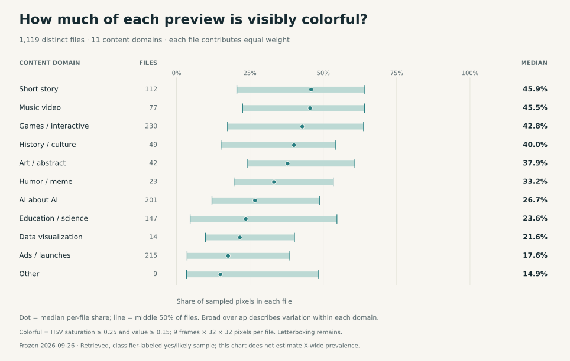
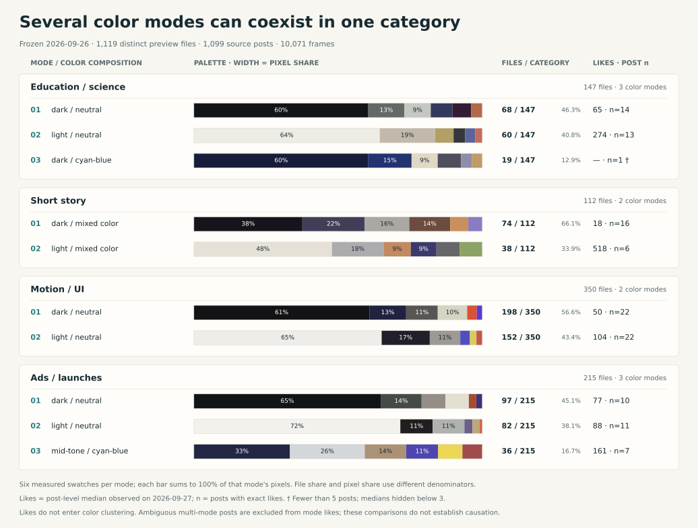

# 同一类视频，可能有几套完全不同的色调

[English](color-modes.md) · [返回首页](../README.zh-CN.md)

我们对 2026 年 9 月 26 日冻结的 X 预览片做了一次色彩研究。纳入的是分类器判断与 Opus 5.5 有关（`yes` 或 `likely`）的 **1,119 个 SHA-256 去重 MP4**，涉及 1,099 条帖子。每个文件等时间抽取九帧，共 **10,071 帧**。这些标签尚未逐片核实制作过程；本研究描述的是这批可取得的预览片，不代表 X 全站作品。

这张总览比较各领域的彩色面积；圆点与线段描述逐视频测量值的中位数和四分位区间，线段不是不确定性区间。下面选了样本较充分的四类，展示类别内部的配色模式：

[打开 13 种画风的完整大图](../assets/color-study/color-modes-style-atlas.svg) · [打开 11 种内容领域的完整大图](../assets/color-study/color-modes-domain-atlas.svg)。图中使用英文标签，适合放大查看；每行文件数与点赞旁的同日精确观测**帖子数**使用不同分母。

## 看到了什么

- 每类只做一张平均色卡，会把内部差异抹平。按颜色在类内分组后，13 种画风中有 **11 种**、11 个内容领域中有 **10 个**分出 2–3 种模式；其余三类只有 4–11 个文件，保留单组。分出的 21 个类别里，**15 个同时有深色和浅色模式**。
- “动态图形／界面”有 350 个文件，其中 198 个落入深色中性模式，152 个落入浅色中性模式。广告／发布片的 215 个文件分为 97、82、36 个的三组。模式是颜色分组，不是质量等级。
- 用另一个不参与聚类的指标看：音乐视频的“彩色像素占比”逐视频中位数为 **45.5%**（77 个文件），广告／发布片为 **17.6%**（215 个文件）。每帧缩至 16、32、64 像素时，两个类别的排序保持一致。这只描述检索样本，不说明哪种颜色更好。
- 点赞没有参与分组。9 月 27 日精确刷新值中，动态图形深／浅两组的点赞中位数分别为 **50 和 104**，各只有 **22 条帖子**。两组的分布很宽，不能推断浅色带来更多点赞。全部 53 个模式里，只有 **20 个**拥有至少五条同日精确点赞记录。

## 怎样量颜色

每个九帧拼图先裁掉拼图留白和时间戳，只保留帧画面；画面内部原有的黑边仍会计入。每帧缩至 32 × 32 像素，每个文件得到 9,216 个取样像素。一个视频只贡献一条颜色向量，因此长视频、重复发布的相同 MP4 不会因时长或重发次数得到更多权重。

颜色向量有 21 个比例：CIELAB 明度的深／中／浅三段，分别与中性色（`C* < 18`）或 HSV 六段色相交叉。我们在每个画风和内容领域内分别聚类，依据组大小和轮廓系数选择 1–3 组；小于 12 个文件的类别保留一组。算法没有使用点赞。每个模式的六段色卡另在 CIELAB 中拟合，**段宽是该模式全部抽帧像素落入这一色段的实际占比**，不是该模式的视频数量占比。

“彩色像素占比”定义为 HSV 饱和度至少 0.25 且明度至少 0.15 的像素比例。它衡量取样画面中的彩色面积，不是审美评分。帧数、X 压缩、分类器标签和画面内黑边都会影响结果；聚类也只是描述连续色彩分布的一种切法。

## 点赞口径与数据

图中只使用 **2026 年 9 月 27 日同日刷新**的精确点赞；这是从 168 条有目的挑选的深读帖里取得的 166 条精确记录，再与本研究样本匹配。每模式按原帖去重，同帖多个文件若落在不同模式，就不参与该类别的模式点赞比较。图中三帖及以上才显示中位数，少于五帖标为样本偏小。[历史归档点赞](../data/color-study/per-video-color-vectors.csv)来自不同且不完整的观测时点，单独保存，不能和同日数据混算。作者粉丝、主题、发布时间与平台分发都可能影响互动；这里没有检验色调对点赞的因果效果。

| 文件 | 用途 |
| --- | --- |
| [模式总表](../data/color-study/color-mode-summary.csv) | 53 行：类别、模式、文件数、色彩和两种点赞口径的摘要。 |
| [六色色卡与像素占比](../data/color-study/color-mode-swatches.csv) | 每模式六行，含色值、精确分配像素数与比例。 |
| [逐视频 21 维向量](../data/color-study/per-video-color-vectors.csv) | 1,119 行：SHA、原帖、类别、颜色比例、日期分开的点赞值。 |
| [逐视频模式归属](../data/color-study/per-video-color-modes.csv) | 每文件各有一行画风归属与一行领域归属。 |
| [完整 JSON](../data/color-study/color-modes.json) | 聚类参数、诊断、模式色卡、点赞分布及代表原帖。 |

公开数据足以重算上述描述性表格和尝试别的分组方法；原始 MP4、九帧拼图及内部采集档案没有在仓库分发，因此不能仅凭这些 CSV 重建抽帧过程。代表帖按颜色接近模式中心选取，**不按点赞排名**；项目维护者自己的视频保留在历史计数中，但不进入展示代表帖。

创作上更有用的启发是：如果作品需要特定气质，应在制作要求中写出背景亮度、主色、点缀色以及逐镜头色彩一致性的验收项，而不是只写“做成某某风格”。这只是工作建议，并非这组观察对最佳配色的证明。一个截点之后的[作者提示词例子](https://x.com/brainextends/status/2104148921027346476)明确给了色值和逐镜头色彩校正要求；它不在本次冻结样本中。
