# Opus 5.5 videos: domain × visual style atlas

[中文](domain-style-atlas.zh-CN.md) · Generated by [`generate_domain_style_atlas.py`](../scripts/generate_domain_style_atlas.py) from the [classifier CSV](../data/domain-style.csv), [case CSV](../data/cases.csv), [engagement observation table](../data/case-engagement-observed.csv), and [English case-note translations](../data/atlas-case-notes-en.csv).

**Frozen data:** 2026-09-26T13:53:20.929497+00:00 (UTC). A matrix cell counts **video files**. The snapshot reports 1,401 SHA-256-distinct files, and the public classifier CSV has 1,401 corresponding rows. It does not expose hashes, so public files alone cannot repeat the byte deduplication. This atlas includes the 1,119 labeled `yes` or `likely` by the classifier. Each file has one primary domain and one primary style; `style2` is excluded. Classifier labels do not verify original authorship or actual model calls.

Of 143 possible combinations, 92 contain files. Among 168 reviewed source-post cases, 157 match `yes`/`likely` files in 58 cells; the other 34 populated cells have no reviewed case. Both likes and views are available for 161 of 168 cases, all 161 from saved raw search results. The other seven cases have older merged-cache values without views and cannot enter the engagement ordering. All 58 cells with a reviewed case have at least one case with both metrics. There are 88 illustrated cases below; all 88 selected examples use saved raw search observations.

**Selection rule:** First restrict to the 168 reviewed cases, then match classifier rows by exact original-post URL and preview duration. Within each cell, select up to two cases with both metrics, ordering by observed likes descending, views descending, then post ID ascending. If every reviewed case in a cell lacks a metric, show one without a rank. Likes and views belong to the X post; views are not video plays. Several video attachments can share these metrics. Popularity does not score quality, production difficulty, Opus's contribution, or effectiveness.

**Timing limit:** These are neither final nor simultaneous counts. The saved raw search files span September 24–26, and some merged cache rows lack an exact capture time. The 161 raw observations were saved about 0.05–53.76 hours after posting (median 24.34 hours). Earlier posts, larger audiences, and reposting have different chances to accumulate engagement. Do not treat within-cell order as a fair performance comparison. Stills identify the look of an accessible X preview; image rights remain with the original creator. See the [statistical profile](statistics.md) and [full 168-case directory](cases-index.zh-CN.md).

## Complete domain × style matrix

Cells count files. Linked numbers jump to illustrated reviewed cases; `†` means classified files exist but no reviewed case maps to that cell. `—` means none in this retrieved sample, not none across X. Scroll horizontally on a phone.

| Domain / use | Motion / UI | 3D render | Flat cartoon | Pixel art | Hand-drawn | Paper cut-out | Ink / paint | Generative | Anime | Math diagram | Photoreal | Live action | Terminal / ASCII |
|---|---:|---:|---:|---:|---:|---:|---:|---:|---:|---:|---:|---:|---:|
| Games / interactive | 34† | [161](#cell-game_interactive-3d_render) | 16† | [12](#cell-game_interactive-pixel_art) | 1† | — | 2† | — | 2† | 1† | — | [1](#cell-game_interactive-live_action) | — |
| Ads / launches | [154](#cell-product_ad-motion_graphics_ui) | [25](#cell-product_ad-3d_render) | [14](#cell-product_ad-flat_vector_cartoon) | 1† | 6† | [4](#cell-product_ad-paper_cutout_collage) | — | — | 2† | — | [4](#cell-product_ad-photoreal) | [5](#cell-product_ad-live_action) | — |
| AI about AI | [62](#cell-ai_self_meta-motion_graphics_ui) | [60](#cell-ai_self_meta-3d_render) | [34](#cell-ai_self_meta-flat_vector_cartoon) | 10† | [8](#cell-ai_self_meta-hand_drawn_sketch) | [5](#cell-ai_self_meta-paper_cutout_collage) | [8](#cell-ai_self_meta-painterly_ink_sand) | [7](#cell-ai_self_meta-generative_abstract) | [2](#cell-ai_self_meta-anime) | — | [4](#cell-ai_self_meta-photoreal) | 1† | — |
| Education / science | [55](#cell-education_science-motion_graphics_ui) | [22](#cell-education_science-3d_render) | [25](#cell-education_science-flat_vector_cartoon) | 5† | [15](#cell-education_science-hand_drawn_sketch) | 4† | — | 1† | — | [19](#cell-education_science-math_diagram) | 1† | — | — |
| Short story | [1](#cell-story_short-motion_graphics_ui) | [21](#cell-story_short-3d_render) | [37](#cell-story_short-flat_vector_cartoon) | [12](#cell-story_short-pixel_art) | [7](#cell-story_short-hand_drawn_sketch) | [12](#cell-story_short-paper_cutout_collage) | [9](#cell-story_short-painterly_ink_sand) | — | [7](#cell-story_short-anime) | — | [3](#cell-story_short-photoreal) | — | 3† |
| Music video | [10](#cell-music_video-motion_graphics_ui) | [7](#cell-music_video-3d_render) | [17](#cell-music_video-flat_vector_cartoon) | [8](#cell-music_video-pixel_art) | [8](#cell-music_video-hand_drawn_sketch) | [6](#cell-music_video-paper_cutout_collage) | [5](#cell-music_video-painterly_ink_sand) | [2](#cell-music_video-generative_abstract) | [8](#cell-music_video-anime) | — | [4](#cell-music_video-photoreal) | 1† | [1](#cell-music_video-retro_terminal_ascii) |
| History / culture | 11† | [9](#cell-history_culture-3d_render) | [8](#cell-history_culture-flat_vector_cartoon) | 3† | [5](#cell-history_culture-hand_drawn_sketch) | 4† | [8](#cell-history_culture-painterly_ink_sand) | 1† | — | — | — | — | — |
| Art / abstract | [6](#cell-art_abstract-motion_graphics_ui) | [10](#cell-art_abstract-3d_render) | [3](#cell-art_abstract-flat_vector_cartoon) | [4](#cell-art_abstract-pixel_art) | [1](#cell-art_abstract-hand_drawn_sketch) | [2](#cell-art_abstract-paper_cutout_collage) | 5† | [11](#cell-art_abstract-generative_abstract) | — | — | — | — | — |
| Humor / meme | 3† | [4](#cell-humor_meme-3d_render) | 7† | 2† | 1† | [2](#cell-humor_meme-paper_cutout_collage) | — | — | — | — | 1† | 3† | — |
| Data visualization | [9](#cell-data_viz-motion_graphics_ui) | 3† | — | 1† | — | — | — | 1† | — | — | — | — | — |
| Other | 5† | [2](#cell-other-3d_render) | 1† | — | — | — | — | — | — | 1† | — | — | — |

## Illustrated cell examples

### Games / interactive × 3D render

161 classified files; 8 matching reviewed cases.

#### 1. [@MengTo Japanese boat environment](https://x.com/MengTo/status/2102760783344189761)

**Subject:** Interactive Three.js Japanese boat scene · **Reviewed production path:** `app_or_game_capture` · [Full case directory](cases-index.zh-CN.md)

**Creator account:** Creator reports a playable Three.js boat scene through Japanese landscapes with weather, day/night lighting, textures and characters, and links a live site.

**Review limit:** Interactive 3D scene capture by creator disclosure; a video sample does not verify every claimed interaction or source asset.

Observed: **5,817 likes, 390,490 views**; saved search file written 2026-09-24 19:26:15+00:00 (UTC, about 29.38 hours after posting; query `threejs`). File-write time is not the exact X read time.

#### 2. [@JaydenDavisNC Splatoon game capture](https://x.com/JaydenDavisNC/status/2103357848961036304)

**Subject:** Splatoon game clone made by Opus · **Reviewed production path:** `app_or_game_capture` · [Full case directory](cases-index.zh-CN.md)

**Creator account:** The creator says Opus 5.5 coded a playable Splatoon-style game from scratch and deployed it on Itch.io. The post links a playable build; the video records the creator playing in a browser.

**Review limit:** Nine sampled frames show third-person gameplay. Source code and development logs are unpublished, so Opus's exact contribution cannot be independently checked.

Observed: **4,992 likes, 530,825 views**; saved search file written 2026-09-26 12:54:23+00:00 (UTC, about 31.31 hours after posting; query `update_20260926_exact_top`). File-write time is not the exact X read time.

### Games / interactive × Pixel art

12 classified files; 2 matching reviewed cases.

#### 1. [@ring_hyacinth](https://x.com/ring_hyacinth/status/2102865595675050010)

<a href="https://x.com/ring_hyacinth/status/2102865595675050010">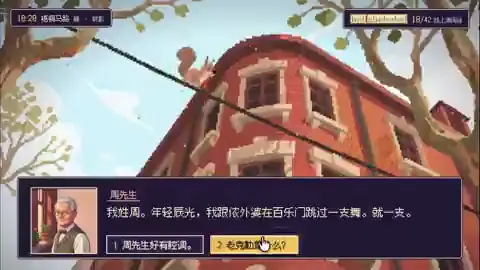</a>

**Subject:** Pixel Shanghai interactive game demo · **Reviewed production path:** `app_or_game_capture` · [Full case directory](cases-index.zh-CN.md)

**Creator account:** Says a prior-year Pixel Shanghai short supplied the scene world, while Opus invoked Nano Banana Pro for characters/map and generated music/SFX in browser.

**Review limit:** Reference-conditioned game creation and screen recording, not a new standalone film from zero assets.

Observed: **699 likes, 43,576 views**; saved search file written 2026-09-24 20:02:19+00:00 (UTC, about 23.04 hours after posting; query `chinese_animate`). File-write time is not the exact X read time.

#### 2. [@KanaWorks_AI siege-game promo](https://x.com/KanaWorks_AI/status/2102684116525437206)

<a href="https://x.com/KanaWorks_AI/status/2102684116525437206">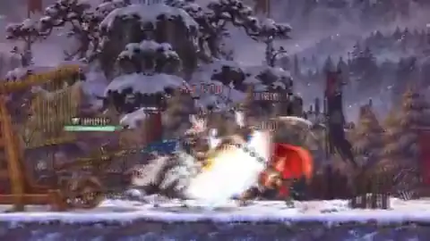</a>

**Subject:** Three Kingdoms siege game showcase · **Reviewed production path:** `external_video_model` · [Full case directory](cases-index.zh-CN.md)

**Creator account:** Japanese creator says Opus built an eight-stage side-scrolling game/site in about two hours, then captured and edited a 60-second promo. The post explicitly credits Opus 5.5 for code and Seedance 2.5, MiniMax H3 and CapCut for video.

**Review limit:** Mixed pipeline with an Opus-coded interactive game and external video/editing tools for the promotional clip. Do not assign the promo's video pixels solely to Opus.

Observed: **161 likes, 13,484 views**; saved search file written 2026-09-24 22:21:39+00:00 (UTC, about 37.38 hours after posting; query `seedance_workflow`). File-write time is not the exact X read time.

### Games / interactive × Live action

1 classified file; 1 matching reviewed case.

#### 1. [@TheViableEdge JEV and Opus visualizer](https://x.com/TheViableEdge/status/2103494684374900862)

<a href="https://x.com/TheViableEdge/status/2103494684374900862">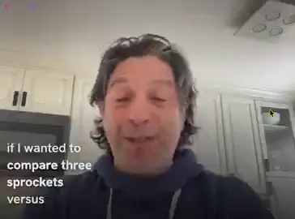</a>

**Subject:** Real-time visualizer app demo · **Reviewed production path:** `app_or_game_capture` · [Full case directory](cases-index.zh-CN.md)

**Creator account:** The creator says Opus 5.5 and JEV built a live visualizer that prepares charts and motion elements for later use. They propose social-video overlays and later mention camera gesture control; JEV's precise role and architecture are not disclosed.

**Review limit:** This is a tool demonstration and screen recording. The proposed later use is not a completed standalone film made with the tool.

Observed: **0 likes, 12 views**; saved search file written 2026-09-25 14:45:19+00:00 (UTC, about 0.09 hours after posting; query `update_20260925_video_latest`). File-write time is not the exact X read time.

### Ads / launches × Motion / UI

154 classified files; 18 matching reviewed cases.

#### 1. [@deedydas](https://x.com/deedydas/status/2102787937482252537)

<a href="https://x.com/deedydas/status/2102787937482252537">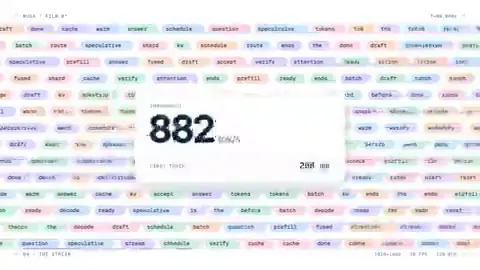</a>

**Subject:** AI inference startup launch promo · **Reviewed production path:** `mixed_or_not_established` · [Full case directory](cases-index.zh-CN.md)

**Creator account:** Short prompt for a modern startup inference ad; self-reports 1 minute and about $2.

**Review limit:** Marketing motion graphics; timing/cost self-reported.

Observed: **3,128 likes, 318,498 views**; saved search file written 2026-09-24 22:21:39+00:00 (UTC, about 30.50 hours after posting; query `seedance_workflow`). File-write time is not the exact X read time.

#### 2. [@trq212 personal-site trailer](https://x.com/trq212/status/2102477340920152162)

<a href="https://x.com/trq212/status/2102477340920152162">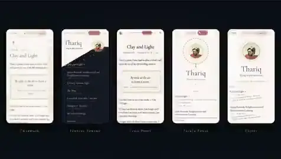</a>

**Subject:** Personal website redesign showcase trailer · **Reviewed production path:** `existing_source_transformation` · [Full case directory](cases-index.zh-CN.md)

**Creator account:** Creator first used workflows to iterate and critique several redesigns of their existing personal site, then asked Opus to make a trailer from those iterations.

**Review limit:** Existing design iterations were source material; this is a website-workflow-to-trailer transformation, not a blank-slate animation prompt.

Observed: **2,166 likes, 176,725 views**; saved search file written 2026-09-24 18:03:12+00:00 (UTC, about 46.77 hours after posting; query `motion_graphics`). File-write time is not the exact X read time.

### Ads / launches × 3D render

25 classified files; 2 matching reviewed cases.

#### 1. [@NiloTechInc](https://x.com/NiloTechInc/status/2102741813719138661)

<a href="https://x.com/NiloTechInc/status/2102741813719138661">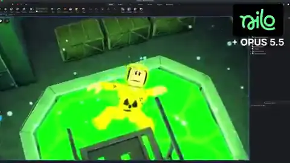</a>

**Subject:** Roblox game trailer showcase · **Reviewed production path:** `app_or_game_capture` · [Full case directory](cases-index.zh-CN.md)

**Creator account:** Says humans manually made animations, clothes and 3D assets in Nilo, then Opus assembled trailer/cameras in Roblox Studio.

**Review limit:** Mixed-asset 3D trailer/demo; clear external/manual material.

Observed: **104 likes, 8,126 views**; saved search file written 2026-09-24 16:13:55+00:00 (UTC, about 27.43 hours after posting; query `claude_phrase_top`). File-write time is not the exact X read time.

#### 2. [@Tariq_at local ComfyUI short](https://x.com/Tariq_at/status/2102561072624410878)

**Subject:** Claude Opus conceptual promo · **Reviewed production path:** `mixed_or_not_established` · [Full case directory](cases-index.zh-CN.md)

**Creator account:** The creator says Opus wrote shot prompts, planned scene details, and composed music, while the visuals were generated locally in ComfyUI. Workflow nodes, underlying models, audio, and hardware costs were not released.

**Review limit:** Opus's reported role is prompt and shot planning; ComfyUI generated the visual pixels. Local generation still uses compute and does not mean the text model directly rendered video.

Observed: **4 likes, 970 views**; saved search file written 2026-09-24 19:58:58+00:00 (UTC, about 43.15 hours after posting; query `prompt`). File-write time is not the exact X read time.

### Ads / launches × Flat cartoon

14 classified files; 4 matching reviewed cases.

#### 1. [@jackfriks Lovelee](https://x.com/jackfriks/status/2103132260589338762)

**Subject:** Lovelee app animated promo · **Reviewed production path:** `procedural_2d` · [Full case directory](cases-index.zh-CN.md)

**Creator account:** One-turn creator claim; the [actual prompt](https://x.com/jackfriks/status/2103134485910892602) points to pig assets on a new app branch and requests a 9:16 story with SFX and app teaser.

**Review limit:** Existing assets and product brief materially shape the output.

Observed: **46 likes, 15,409 views**; saved search file written 2026-09-24 16:50:05+00:00 (UTC, about 2.17 hours after posting; query `one_shot`). File-write time is not the exact X read time.

#### 2. [@hanifproduktif ant-colony animation](https://x.com/hanifproduktif/status/2102742924148830211)

<a href="https://x.com/hanifproduktif/status/2102742924148830211">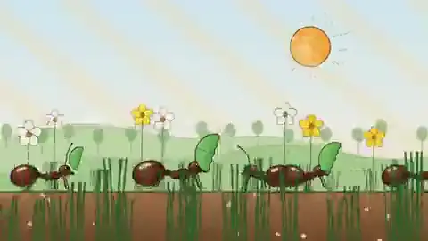</a>

**Subject:** Code-generated ant animation demo · **Reviewed production path:** `procedural_2d` · [Full case directory](cases-index.zh-CN.md)

**Creator account:** The creator links the [claude-animation-skill repository](https://github.com/buildwithhanif/claude-animation-skill). Its matching ant-colony example has a 32-second, 24-fps Node Canvas/ffmpeg frame program, ant rigs, scene and sound scripts, and deterministic frame checks. The repository does not reconstruct this specific Claude conversation.

**Review limit:** The public project gives stronger support for code-rendered frames than a verbal claim alone. Audio output, code authorship, and the original conversation remain unverified.

Observed: **20 likes, 3,084 views**; saved search file written 2026-09-24 21:08:55+00:00 (UTC, about 32.27 hours after posting; query `opus_spaced`). File-write time is not the exact X read time.

### Ads / launches × Paper cut-out

4 classified files; 1 matching reviewed case.

#### 1. [@so_ainsight hand-drawn Claude Code explainer](https://x.com/so_ainsight/status/2103117547776163845)

**Subject:** Claude Code promotional animation · **Reviewed production path:** `procedural_2d` · [Full case directory](cases-index.zh-CN.md)

**Creator account:** The creator's [task reply](https://x.com/so_ainsight/status/2103119227192225926) specifies a 15-second Japanese-narrated paper-collage explainer and permits outside image and speech tools. They report using an image model for 11 assets, Gemini TTS for four speech segments, and HTML/JS frame capture, with agent review of stills. The roughly 12-minute runtime is self-reported.

**Review limit:** External still art and TTS are explicit inputs despite the broad Claude credit. Code handled composition and motion; the quality checks are creator-reported.

Observed: **5 likes, 1,150 views**; saved search file written 2026-09-24 20:36:11+00:00 (UTC, about 6.92 hours after posting; query `japanese_animation`). File-write time is not the exact X read time.

### Ads / launches × Photoreal

4 classified files; 1 matching reviewed case.

#### 1. [@OriSilver Blender blocking to Seedance](https://x.com/OriSilver/status/2102817977812824335)

<a href="https://x.com/OriSilver/status/2102817977812824335">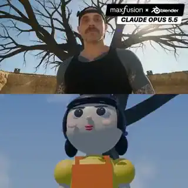</a>

**Subject:** Squid Game recreated with AI and Blender · **Reviewed production path:** `external_video_model` · [Full case directory](cases-index.zh-CN.md)

**Creator account:** The creator says they provided a camera-style reference clip; Opus used MaxFusion MCP to sample it and build Blender camera, staging, and shot blocking. A rough cut and original characters then guided Seedance 2.5 for the final imagery. The source clip and call logs were not checked.

**Review limit:** This has three reference layers: existing video for camera language, Blender blocking for spatial control, and Seedance for final pixels. The 27.6-second public compilation does not prove the duration of the rough cut.

Observed: **31 likes, 6,795 views**; saved search file written 2026-09-24 19:25:29+00:00 (UTC, about 25.58 hours after posting; query `blender`). File-write time is not the exact X read time.

### Ads / launches × Live action

5 classified files; 2 matching reviewed cases.

#### 1. [@gregpr07 selecting talking-head takes](https://x.com/gregpr07/status/2102984873351037161)

**Subject:** video-use AI editor launch promo · **Reviewed production path:** `existing_source_transformation` · [Full case directory](cases-index.zh-CN.md)

**Creator account:** The creator says they provided 13 recordings of one spoken line to Opus 5.5 and video-use. The agent reportedly compared transcripts and frames, chose a clean take, then edited, graded, subtitled, and packaged it. Time and cost are self-reported; raw takes and logs are unavailable.

**Review limit:** The person and speech came from recorded footage. The model's role was selection and editing, not creating the performer from scratch.

Observed: **198 likes, 16,548 views**; saved search file written 2026-09-24 22:20:21+00:00 (UTC, about 17.44 hours after posting; query `french_animation`). File-write time is not the exact X read time.

#### 2. [@sab8a talking-head recut](https://x.com/sab8a/status/2103144778481475686)

**Subject:** AI automated talking-head video editing · **Reviewed production path:** `existing_source_transformation` · [Full case directory](cases-index.zh-CN.md)

**Creator account:** The creator gave a short brief to make existing talking-head footage livelier with captions, graphics, and music, crediting Opus 5.5 and OpenEdit. They report 1 hour 51 minutes, $23 in model tokens, and $49 in fal services, without the raw footage, bills, or logs.

**Review limit:** This is an edit of live-action source footage. Reported costs and the use of third-party services cannot be read as zero-input generation.

Observed: **21 likes, 2,560 views**; saved search file written 2026-09-24 19:58:58+00:00 (UTC, about 4.49 hours after posting; query `prompt`). File-write time is not the exact X read time.

### AI about AI × Motion / UI

62 classified files; 7 matching reviewed cases.

#### 1. [@stephanlivera motion-design showreel](https://x.com/stephanlivera/status/2103315922098470926)

**Subject:** Claude motion designer showreel · **Reviewed production path:** `procedural_2d` · [Full case directory](cases-index.zh-CN.md)

**Creator account:** The creator reports using Opus 5.5 at Max effort with a short brief for a 15-second motion-design résumé showreel. The production project and run log are unpublished.

**Review limit:** The prompt and posted result are visible, but the source project and revision history are not. One high-engagement post cannot establish reliable repeatability.

Observed: **14,618 likes, 959,385 views**; saved search file written 2026-09-26 13:01:24+00:00 (UTC, about 34.20 hours after posting; query `update_20260926_motion_top`). File-write time is not the exact X read time.

#### 2. [@ajith_io motion-design showreel](https://x.com/ajith_io/status/2103449416325890146)

<a href="https://x.com/ajith_io/status/2103449416325890146">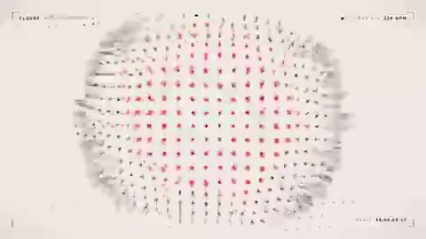</a>

**Subject:** Claude motion designer showreel · **Reviewed production path:** `procedural_2d` · [Full case directory](cases-index.zh-CN.md)

**Creator account:** The creator shares a short brief for a 15-second résumé-style motion-design showreel made with Opus 5.5. The project, audio source, and run log were not released.

**Review limit:** Several similar showreels appeared on the same day. This post documents the brief, but not whether it reliably reproduces the same quality or reach.

Observed: **3,255 likes, 390,776 views**; saved search file written 2026-09-26 13:01:24+00:00 (UTC, about 25.36 hours after posting; query `update_20260926_motion_top`). File-write time is not the exact X read time.

### AI about AI × 3D render

60 classified files; 7 matching reviewed cases.

#### 1. [@higgsfield_ai](https://x.com/higgsfield_ai/status/2102533401110802552)

<a href="https://x.com/higgsfield_ai/status/2102533401110802552">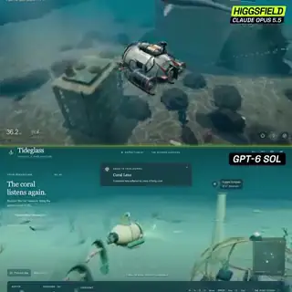</a>

**Subject:** AI 3D game dev comparison · **Reviewed production path:** `app_or_game_capture` · [Full case directory](cases-index.zh-CN.md)

**Creator account:** Opus/GPT-6 comparison for game development in Unreal Engine.

**Review limit:** Benchmark/demo capture, not independent generated video footage.

Observed: **3,484 likes, 508,433 views**; saved search file written 2026-09-24 16:13:55+00:00 (UTC, about 41.23 hours after posting; query `claude_phrase_top`). File-write time is not the exact X read time.

#### 2. [@Stefan_3D_AI Blender model comparison](https://x.com/Stefan_3D_AI/status/2102471841046786153)

<a href="https://x.com/Stefan_3D_AI/status/2102471841046786153">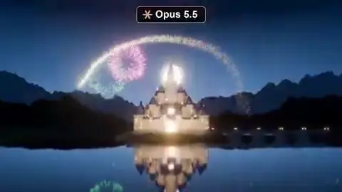</a>

**Subject:** Opus 5.5 vs GPT-6 3D test · **Reviewed production path:** `3d_or_realtime_graphics` · [Full case directory](cases-index.zh-CN.md)

**Creator account:** The creator says Opus 5.5 and GPT-6 Astra received the same procedural Blender task with no premade assets. They report Opus taking 35 minutes and about $13.30 in API-equivalent cost, versus 28 minutes and about $14.50 for Astra. No independent run logs are available.

**Review limit:** This is one creator-reported comparison, not a model ranking. Output tokens, API-equivalent estimates, and subscription charges differ; nine frames cannot quantify visual quality.

Observed: **1,828 likes, 458,987 views**; saved search file written 2026-09-24 19:25:29+00:00 (UTC, about 48.50 hours after posting; query `blender`). File-write time is not the exact X read time.

### AI about AI × Flat cartoon

34 classified files; 1 matching reviewed case.

#### 1. [@jake11moran session-history animation skill](https://x.com/jake11moran/status/2103247490237825416)

**Subject:** Animated Claude coding session story · **Reviewed production path:** `existing_source_transformation` · [Full case directory](cases-index.zh-CN.md)

**Creator account:** The creator says their /session-story skill with Opus 5.5 and HyperFrames reads local Claude Code conversations, finds representative sessions, and animates the messages. They also cite an existing Clawd kit. The skill file and data-handling log were not available in this review.

**Review limit:** A short trigger uses a preset skill, existing toolkit, and personal conversation history as source material. This is not a zero-input animation.

Observed: **2 likes, 18 views**; saved search file written 2026-09-24 22:22:26+00:00 (UTC, about 0.08 hours after posting; query `final_live`). File-write time is not the exact X read time.

### AI about AI × Hand-drawn

8 classified files; 2 matching reviewed cases.

#### 1. [@kevin_t_ngo](https://x.com/kevin_t_ngo/status/2102437977435893771)

<a href="https://x.com/kevin_t_ngo/status/2102437977435893771">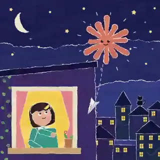</a>

**Subject:** Girl asks Claude what it loves · **Reviewed production path:** `procedural_2d` · [Full case directory](cases-index.zh-CN.md)

**Creator account:** States every frame drawn in JavaScript.

**Review limit:** Code-rendered narrative animation; source claim, no repo checked.

Observed: **5,951 likes, 611,668 views**; saved search file written 2026-09-24 22:20:21+00:00 (UTC, about 53.66 hours after posting; query `french_animation`). File-write time is not the exact X read time.

#### 2. [@N8Programs Gorm Fluid text adaptation](https://x.com/N8Programs/status/2103154189064876406)

<a href="https://x.com/N8Programs/status/2103154189064876406">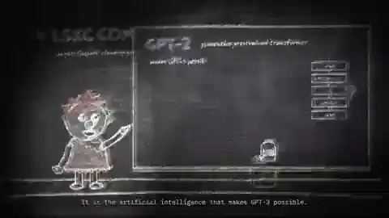</a>

**Subject:** Animation on GPT-4 and simulacra theory · **Reviewed production path:** `existing_source_transformation` · [Full case directory](cases-index.zh-CN.md)

**Creator account:** The creator says they adapted an [existing Cyborgism Wiki text](https://cyborgism.wiki/hypha/gpt-4_gorm_fluid) into video during the Opus 5.5 trend. The prompt, narration method, and rendering project are not public.

**Review limit:** This is an adaptation of a source document. Nine frames cannot establish fidelity to the text, narration quality, or continuity across the long video.

Observed: **0 likes, 62 views**; saved search file written 2026-09-24 16:13:45+00:00 (UTC, about 0.12 hours after posting; query `opus_phrase_latest`). File-write time is not the exact X read time.

### AI about AI × Paper cut-out

5 classified files; 2 matching reviewed cases.

#### 1. [@superalesha Claude-model history](https://x.com/superalesha/status/2102463796149440888)

<a href="https://x.com/superalesha/status/2102463796149440888">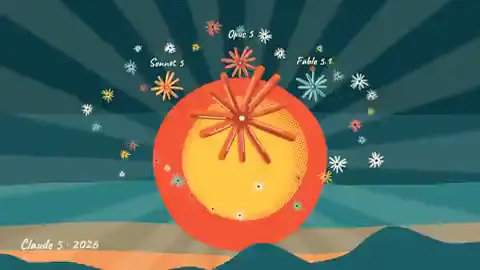</a>

**Subject:** History of Claude models development · **Reviewed production path:** `procedural_2d` · [Full case directory](cases-index.zh-CN.md)

**Creator account:** Creator says Opus built the animation in pure JS using the creator's existing skill. No skill file or code was checked here.

**Review limit:** Another short-visible-brief, rich-prebuilt-skill example; “pure JS” is a creator claim about visual production and does not erase the prior skill.

Observed: **1,165 likes, 65,548 views**; saved search file written 2026-09-24 18:02:05+00:00 (UTC, about 47.64 hours after posting; query `animation`). File-write time is not the exact X read time.

#### 2. [@Voxyz_ai](https://x.com/Voxyz_ai/status/2102531681450119426)

**Subject:** Claude collecting human warmth in user prompts · **Reviewed production path:** `procedural_2d` · [Full case directory](cases-index.zh-CN.md)

**Creator account:** Claims model wrote story, drew every frame and made music; creator wrote no code.

**Review limit:** Procedural narrative motion; no public code checked.

Observed: **929 likes, 116,908 views**; saved search file written 2026-09-24 22:20:21+00:00 (UTC, about 47.45 hours after posting; query `french_animation`). File-write time is not the exact X read time.

### AI about AI × Ink / paint

8 classified files; 2 matching reviewed cases.

#### 1. [@shfred0](https://x.com/shfred0/status/2102495989194236158)

<a href="https://x.com/shfred0/status/2102495989194236158">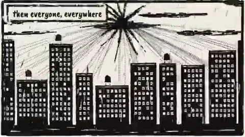</a>

**Subject:** Claude animating its own life journey · **Reviewed production path:** `procedural_2d` · [Full case directory](cases-index.zh-CN.md)

**Creator account:** No video model or images, JS brush strokes.

**Review limit:** Code-rendered 2D, claimed no external generative imagery.

Observed: **4,142 likes, 353,692 views**; saved search file written 2026-09-24 22:20:21+00:00 (UTC, about 49.82 hours after posting; query `french_animation`). File-write time is not the exact X read time.

#### 2. [@Medeo_AI](https://x.com/Medeo_AI/status/2102463091959288264)

<a href="https://x.com/Medeo_AI/status/2102463091959288264">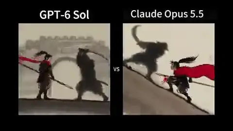</a>

**Subject:** AI ink animation model comparison · **Reviewed production path:** `external_video_model` · [Full case directory](cases-index.zh-CN.md)

**Creator account:** States both compared clips use Seedance 2.5 on Medeo, with GPT-6 Sol vs Opus 5.5 upstream.

**Review limit:** External video model comparison, not direct pixel output by either LLM.

Observed: **285 likes, 126,275 views**; saved search file written 2026-09-24 16:13:55+00:00 (UTC, about 45.89 hours after posting; query `claude_phrase_top`). File-write time is not the exact X read time.

### AI about AI × Generative

7 classified files; 1 matching reviewed case.

#### 1. [@JustinPerea](https://x.com/JustinPerea/status/2102893186330841502)

**Subject:** Procedural demoscene generated by Opus · **Reviewed production path:** `procedural_2d` · [Full case directory](cases-index.zh-CN.md)

**Creator account:** Says a broad demo request led to one 280 KB HTML file making all pixels and sounds. A [creator reply](https://x.com/JustinPerea/status/2103118512315097398) clarifies the striking 697M-token figure was 98.1% cache reads, with 566K output tokens; another reply says he sent “continue” after a session limit.

**Review limit:** Strong pure-code demoscene self-report, but “one prompt” here includes a preconfigured ultra-code workflow and a continuation. Raw token totals are not API billable output totals.

Observed: **981 likes, 72,739 views**; saved search file written 2026-09-24 17:22:33+00:00 (UTC, about 18.55 hours after posting; query `day2_top`). File-write time is not the exact X read time.

### AI about AI × Anime

2 classified files; 1 matching reviewed case.

#### 1. [@ishuagra02 anime model-battle trailer](https://x.com/ishuagra02/status/2103247844542922825)

<a href="https://x.com/ishuagra02/status/2103247844542922825">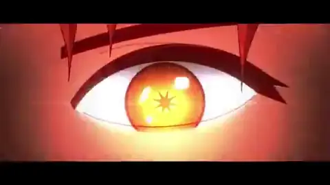</a>

**Subject:** AI models anime battle trailer · **Reviewed production path:** `procedural_2d` · [Full case directory](cases-index.zh-CN.md)

**Creator account:** The creator's [published brief](https://x.com/ishuagra02/status/2103247960272433307) asks for an anime-style Claude-versus-ChatGPT battle with story pacing and audiovisual impact. They say Opus downloaded fonts, made audio, and generated frames in JavaScript in one submission, taking about 1.5 hours and $28 in API usage; code and bills are unavailable.

**Review limit:** The human creative brief is genuinely short, unlike a detailed storyboard. Runtime, cost, and rendering method are creator claims separate from the visible final clip.

Observed: **1 likes, 8 views**; saved search file written 2026-09-24 22:22:26+00:00 (UTC, about 0.06 hours after posting; query `final_live`). File-write time is not the exact X read time.

### AI about AI × Photoreal

4 classified files; 1 matching reviewed case.

#### 1. [@gavinpurcell Runway MCP documentary](https://x.com/gavinpurcell/status/2103304514329854102)

**Subject:** Documentary about AI superintelligence · **Reviewed production path:** `external_video_model` · [Full case directory](cases-index.zh-CN.md)

**Creator account:** The creator says a Claude agent named Fig had access to Runway MCP and was tasked with conceiving and making a five-minute, Netflix-style superintelligence documentary. They show the film and generated shots.

**Review limit:** The creator attributes orchestration to Claude through Runway MCP. X previews show multiple shots, but tool logs and shot-by-shot provenance are unpublished.

Observed: **3,386 likes, 252,592 views**; saved search file written 2026-09-26 12:54:23+00:00 (UTC, about 34.84 hours after posting; query `update_20260926_exact_top`). File-write time is not the exact X read time.

### Education / science × Motion / UI

55 classified files; 15 matching reviewed cases.

#### 1. [@addyosmani browser explainer](https://x.com/addyosmani/status/2103009037164110327)

<a href="https://x.com/addyosmani/status/2103009037164110327">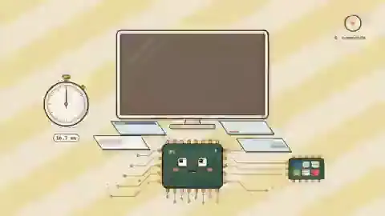</a>

**Subject:** How web browsers work · **Reviewed production path:** `educational_explainer` · [Full case directory](cases-index.zh-CN.md)

**Creator account:** Creator says Opus 5.5 drew each frame in JavaScript and, in a reply, says most of these demos were one-shot. No source repository was checked.

**Review limit:** Code-drawn educational explainer by creator disclosure; the sampled frames cannot validate the technical narration or full frame continuity.

Observed: **1,548 likes, 81,416 views**; saved search file written 2026-09-24 22:20:21+00:00 (UTC, about 15.84 hours after posting; query `french_animation`). File-write time is not the exact X read time.

#### 2. [@Ror_Fly Negroni recipe](https://x.com/Ror_Fly/status/2102853258582880547)

**Subject:** Negroni cocktail recipe animated explainer · **Reviewed production path:** `educational_explainer` · [Full case directory](cases-index.zh-CN.md)

**Creator account:** The root shares a short cocktail explainer prompt and explicitly says one reference image was supplied; asks for JavaScript/HTML, 30 s, ingredients and measurements from empty glass to finished drink. The creator later says the work ran in Claude Code.

**Review limit:** Short, asset-conditioned motion-graphics brief; the uploaded image is part of the input despite a compact text prompt.

Observed: **947 likes, 60,469 views**; saved search file written 2026-09-24 22:20:21+00:00 (UTC, about 26.16 hours after posting; query `french_animation`). File-write time is not the exact X read time.

### Education / science × 3D render

22 classified files; 4 matching reviewed cases.

#### 1. [@RyanSael interactive lens lab](https://x.com/RyanSael/status/2102591147927654847)

<a href="https://x.com/RyanSael/status/2102591147927654847">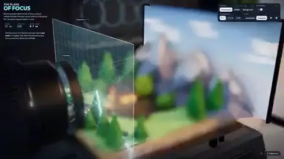</a>

**Subject:** Interactive camera lens focus simulator · **Reviewed production path:** `app_or_game_capture` · [Full case directory](cases-index.zh-CN.md)

**Creator account:** Creator says they asked Opus to explain camera focus by building an interactive lens lab; one-shot run of 1h26 and $25.66 API equivalent are self-reported. Users can move the focus ring in the linked app.

**Review limit:** Interactive optical simulator capture, not a pre-rendered educational film; scientific fidelity and cost were not independently checked.

Observed: **9,300 likes, 643,873 views**; saved search file written 2026-09-24 16:50:05+00:00 (UTC, about 38.01 hours after posting; query `one_shot`). File-write time is not the exact X read time.

#### 2. [@superalesha LHC](https://x.com/superalesha/status/2102779758408774104)

<a href="https://x.com/superalesha/status/2102779758408774104">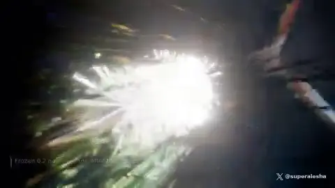</a>

**Subject:** LHC proton collision simulation · **Reviewed production path:** `3d_or_realtime_graphics` · [Full case directory](cases-index.zh-CN.md)

**Creator account:** Asked Opus for a Blender proton-collision scene.

**Review limit:** 3D generated scene / Blender, not native video pixels.

Observed: **537 likes, 23,128 views**; saved search file written 2026-09-24 19:25:29+00:00 (UTC, about 28.11 hours after posting; query `blender`). File-write time is not the exact X read time.

### Education / science × Flat cartoon

25 classified files; 2 matching reviewed cases.

#### 1. [@devteamdrew](https://x.com/devteamdrew/status/2102436464323661880)

**Subject:** Journey through science and the cosmos · **Reviewed production path:** `mixed_or_not_established` · [Full case directory](cases-index.zh-CN.md)

**Creator account:** “Made with Opus 5.5”; no stack in root post.

**Review limit:** Original stylized short; render method undisclosed in root.

Observed: **9,286 likes, 1,611,843 views**; saved search file written 2026-09-24 22:20:21+00:00 (UTC, about 53.76 hours after posting; query `french_animation`). File-write time is not the exact X read time.

#### 2. [@0x0funky](https://x.com/0x0funky/status/2102736587708854585)

**Subject:** English past continuous tense animated lesson · **Reviewed production path:** `educational_explainer` · [Full case directory](cases-index.zh-CN.md)

**Creator account:** Creator follow-ups identify pre-organized course content, Remotion for video, React/SVG/HTML/CSS/web fonts for visuals, and local CosyVoice TTS; says production took about 45 minutes and less than 1% weekly subscription usage.

**Review limit:** Educational explainer with existing teaching material and multiple code/audio tools. The root's “one-shot” does not mean content was researched from scratch.

Observed: **338 likes, 34,143 views**; saved search file written 2026-09-24 22:20:21+00:00 (UTC, about 33.88 hours after posting; query `french_animation`). File-write time is not the exact X read time.

### Education / science × Hand-drawn

15 classified files; 5 matching reviewed cases.

#### 1. [@akokoi1 geography](https://x.com/akokoi1/status/2102606609574941028)

<a href="https://x.com/akokoi1/status/2102606609574941028">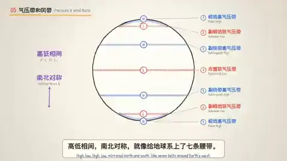</a>

**Subject:** Atmospheric circulation geography explainer · **Reviewed production path:** `educational_explainer` · [Full case directory](cases-index.zh-CN.md)

**Creator account:** Full workflow: supply a TTS vendor's docs and API configuration, request line-art high-school atmospheric-circulation video, bilingual subtitles and export.

**Review limit:** Code/diagram educational explainer with external TTS; creator's exact prompt in root post.

Observed: **672 likes, 129,180 views**; saved search file written 2026-09-24 20:02:19+00:00 (UTC, about 40.19 hours after posting; query `chinese_animate`). File-write time is not the exact X read time.

#### 2. [@AxtonLiu](https://x.com/AxtonLiu/status/2102827887732932956)

**Subject:** Work adaptation strategies explainer · **Reviewed production path:** `existing_source_transformation` · [Full case directory](cases-index.zh-CN.md)

**Creator account:** Supplied original 83 s talking-head video; requested circular presenter inset, concept-matched line-art B-roll, preserved original audio/subtitles/duration; claims no human intervention.

**Review limit:** Source-conditioned video transformation/editing, not zero-asset generation.

Observed: **362 likes, 27,908 views**; saved search file written 2026-09-24 20:02:19+00:00 (UTC, about 25.54 hours after posting; query `chinese_animate`). File-write time is not the exact X read time.

### Education / science × Math diagram

19 classified files; 3 matching reviewed cases.

#### 1. [@LinearUncle](https://x.com/LinearUncle/status/2103128559174971663)

<a href="https://x.com/LinearUncle/status/2103128559174971663">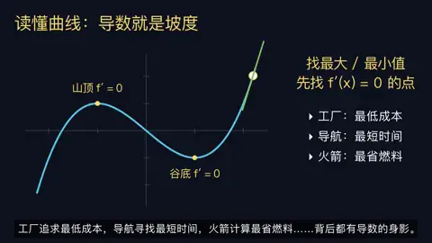</a>

**Subject:** Calculus derivative concept explanation · **Reviewed production path:** `educational_explainer` · [Full case directory](cases-index.zh-CN.md)

**Creator account:** Explicit Manim derivative lesson, edge-tts; short Chinese prompt disclosed.

**Review limit:** Manim educational explainer with TTS. The 12-frame supplementary grid is in `evidence/`.

Observed: **126 likes, 10,511 views**; saved search file written 2026-09-24 22:20:21+00:00 (UTC, about 7.92 hours after posting; query `french_animation`). File-write time is not the exact X read time.

#### 2. [@ng169onX VAE mathematics explainer](https://x.com/ng169onX/status/2103183904563998809)

**Subject:** Variational Autoencoders explainer · **Reviewed production path:** `educational_explainer` · [Full case directory](cases-index.zh-CN.md)

**Creator account:** The creator says a short prompt led Opus to use Manim for a variational-autoencoder lesson, train an MNIST model, use Qwen3-TTS on MLX for cloned narration, and make original background music. Training code, voice authorization, and content checks were not shared.

**Review limit:** Visual explanation, model training, speech, and music are separate tasks. One human brief does not establish one model call or academic review of a five-minute lesson.

Observed: **1 likes, 44 views**; saved search file written 2026-09-24 19:24:42+00:00 (UTC, about 1.33 hours after posting; query `manim`). File-write time is not the exact X read time.

### Short story × Motion / UI

1 classified file; 1 matching reviewed case.

#### 1. [@KamStudioLabs bug-that-refuses-fixing short](https://x.com/KamStudioLabs/status/2102903173161877996)

**Subject:** A bug refusing to be fixed · **Reviewed production path:** `procedural_2d` · [Full case directory](cases-index.zh-CN.md)

**Creator account:** In the same thread, the creator offered a second brief for a 90-second animated story about a bug that does not want to be fixed. The renderer and audio source were not specified.

**Review limit:** This is a separate story commission from the creator's collision-music experiment, not a revision of that video.

Observed: **4 likes, 40 views**; saved search file written 2026-09-24 19:58:58+00:00 (UTC, about 20.49 hours after posting; query `prompt`). File-write time is not the exact X read time.

### Short story × 3D render

21 classified files; 3 matching reviewed cases.

#### 1. [@Hesamation robot story set in 2076](https://x.com/Hesamation/status/2103457566978162901)

<a href="https://x.com/Hesamation/status/2103457566978162901">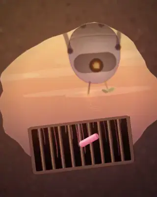</a>

**Subject:** Lonely robot in a post-human world · **Reviewed production path:** `procedural_2d` · [Full case directory](cases-index.zh-CN.md)

**Creator account:** The creator says they asked Opus to imagine a world after AI destroys humanity. They credit Claude with the story, animation, sound effects, and music, and say the video was encoded in JavaScript.

**Review limit:** Sampled frames show narrative and visual structure, but source code and audio records are unavailable, so the sound attribution and production process remain unverified.

Observed: **833 likes, 74,892 views**; saved search file written 2026-09-26 13:02:06+00:00 (UTC, about 24.83 hours after posting; query `update_20260926_animation_top`). File-write time is not the exact X read time.

#### 2. [@akokoi1 fight](https://x.com/akokoi1/status/2103149275945517546)

<a href="https://x.com/akokoi1/status/2103149275945517546">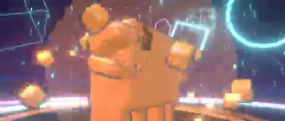</a>

**Subject:** 3D character fight animation · **Reviewed production path:** `3d_or_realtime_graphics` · [Full case directory](cases-index.zh-CN.md)

**Creator account:** Root highlights ~2,000 lines of code and a one-minute fight. [Creator follow-up](https://x.com/akokoi1/status/2103149539880562718) gives three stages: first make a Three.js character and adjust it until satisfactory, then ask for a 60-second cinematic fight based on that model, then add sound/export.

**Review limit:** Clear multi-step workflow and human visual acceptance before main video prompt, despite the simple-looking root result.

Observed: **54 likes, 8,459 views**; saved search file written 2026-09-24 20:02:19+00:00 (UTC, about 4.25 hours after posting; query `chinese_animate`). File-write time is not the exact X read time.

### Short story × Flat cartoon

37 classified files; 6 matching reviewed cases.

#### 1. [@cherry_mx_reds](https://x.com/cherry_mx_reds/status/2102472218269900876)

<a href="https://x.com/cherry_mx_reds/status/2102472218269900876">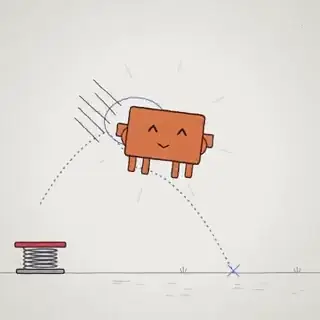</a>

**Subject:** Creature bouncing to reach candy · **Reviewed production path:** `procedural_2d` · [Full case directory](cases-index.zh-CN.md)

**Creator account:** Claims an 18m31s one-shot animation. In creator replies, says it was code without frameworks, but also says the short prompt included an image, and that prior animation files existed on disk.

**Review limit:** A useful boundary case: a single user turn can still be conditioned by image and workspace files.

Observed: **998 likes, 161,990 views**; saved search file written 2026-09-24 18:02:05+00:00 (UTC, about 47.09 hours after posting; query `animation`). File-write time is not the exact X read time.

#### 2. [@cherry_mx_reds Oktoberfest](https://x.com/cherry_mx_reds/status/2102493303388475855)

<a href="https://x.com/cherry_mx_reds/status/2102493303388475855">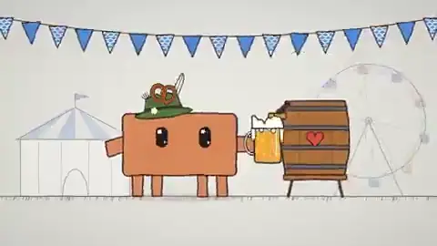</a>

**Subject:** Oktoberfest celebration animation · **Reviewed production path:** `procedural_2d` · [Full case directory](cases-index.zh-CN.md)

**Creator account:** The [prompt screenshot](https://x.com/cherry_mx_reds/status/2102493305992880314) explicitly references an attached character image, asks for a 30-second Oktoberfest animation, and tells Opus to find and use audio samples already on disk instead of synthesizing audio.

**Review limit:** Short single-turn prompt, but neither zero-image nor zero-audio-assets. Prompt screenshot archived under `evidence/prompts/`.

Observed: **875 likes, 114,999 views**; saved search file written 2026-09-24 18:02:05+00:00 (UTC, about 45.69 hours after posting; query `animation`). File-write time is not the exact X read time.

### Short story × Pixel art

12 classified files; 1 matching reviewed case.

#### 1. [@yangfei33113 rainy street composite](https://x.com/yangfei33113/status/2102611841122017632)

**Subject:** Pixel character walking in rainy Asakusa · **Reviewed production path:** `existing_source_transformation` · [Full case directory](cases-index.zh-CN.md)

**Creator account:** The creator says the agent found a real street photograph online, then coded rain, reflections, focus, human lighting, and sound without a video generation model. The source photo, rights, and program were not disclosed.

**Review limit:** This is a procedural composite over an existing photograph. No video model does not mean no external image input.

Observed: **1 likes, 1,733 views**; saved search file written 2026-09-24 20:01:06+00:00 (UTC, about 39.82 hours after posting; query `chinese_video`). File-write time is not the exact X read time.

### Short story × Hand-drawn

7 classified files; 1 matching reviewed case.

#### 1. [@araminta_k After Effects line-art draft](https://x.com/araminta_k/status/2103244081388503196)

<a href="https://x.com/araminta_k/status/2103244081388503196">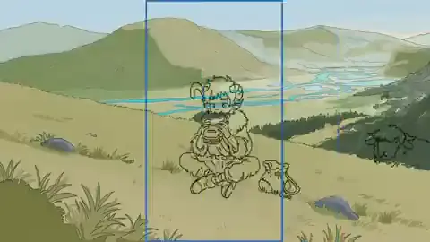</a>

**Subject:** hand-drawn character animation comp test · **Reviewed production path:** `existing_source_transformation` · [Full case directory](cases-index.zh-CN.md)

**Creator account:** The creator says Opus worked in After Effects from their style reference, adjusting x-sheet exposure timing and layered compositing. A human then directed more natural motion over about an hour; coloring was still a future step. The After Effects project and layer logs are unavailable.

**Review limit:** This demonstrates model assistance in an animation workflow with human revisions. The preview is an unfinished line-art draft, not a finished color short.

Observed: **1 likes, 69 views**; saved search file written 2026-09-24 22:22:26+00:00 (UTC, about 0.31 hours after posting; query `final_live`). File-write time is not the exact X read time.

### Short story × Paper cut-out

12 classified files; 3 matching reviewed cases.

#### 1. [@ring_hyacinth Mid-Autumn collage short](https://x.com/ring_hyacinth/status/2102986085328716066)

**Subject:** Cat Mid-Autumn Festival animated short · **Reviewed production path:** `procedural_2d` · [Full case directory](cases-index.zh-CN.md)

**Creator account:** The creator says they supplied the script and music, while Opus used JavaScript and p5.js/p5.brush for frame animation, Nano Banana Pro made backgrounds and paper textures, and Node.js composed sound effects. Full prompts, code, and assets were not shared.

**Review limit:** Code animation was combined with externally generated still art and supplied script and music. It is neither zero-asset nor a one-model end-to-end result.

Observed: **440 likes, 21,121 views**; saved search file written 2026-09-24 20:02:19+00:00 (UTC, about 15.06 hours after posting; query `chinese_animate`). File-write time is not the exact X read time.

#### 2. [@NFT_Chen Mid-Autumn paper-cut collage](https://x.com/NFT_Chen/status/2103380404791333144)

**Subject:** Cat mends the moon for Mid-Autumn · **Reviewed production path:** `procedural_2d` · [Full case directory](cases-index.zh-CN.md)

**Creator account:** The creator says they supplied script and music; Nano Banana Pro made the background and torn-paper textures, while Opus coded per-frame drawing in JavaScript, p5.js, and p5.brush, with Node.js sound effects. Code, layers, and call logs are unavailable.

**Review limit:** The visible result mixes coded motion and external image assets. Per-frame code does not imply every visual element began as code.

Observed: **83 likes, 23,442 views**; saved search file written 2026-09-25 14:44:45+00:00 (UTC, about 7.65 hours after posting; query `update_20260925_exact_top`). File-write time is not the exact X read time.

### Short story × Ink / paint

9 classified files; 5 matching reviewed cases.

#### 1. [@jurlycat](https://x.com/jurlycat/status/2102645793828036643)

<a href="https://x.com/jurlycat/status/2102645793828036643">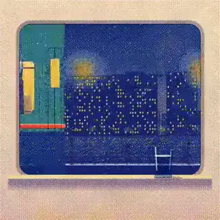</a>

**Subject:** Animated scenery viewed through a window · **Reviewed production path:** `procedural_2d` · [Full case directory](cases-index.zh-CN.md)

**Creator account:** One index.html file, no images, video files or libraries; later says they ran and tweaked the generated file.

**Review limit:** Single-file code animation with disclosed human refinement; not a clean zero-edit example.

Observed: **1,097 likes, 41,643 views**; saved search file written 2026-09-24 22:20:21+00:00 (UTC, about 39.90 hours after posting; query `french_animation`). File-write time is not the exact X read time.

#### 2. [@mablesjoseph hand-drawn animated short](https://x.com/mablesjoseph/status/2103465246014746943)

**Subject:** Girl and animated flying lantern short · **Reviewed production path:** `procedural_2d` · [Full case directory](cases-index.zh-CN.md)

**Creator account:** The creator says code generated brushwork, watercolor effects, and sound, while explicitly describing a multi-round process: 163 model calls, about 6 hours 45 minutes elapsed, 1.5 hours of human involvement, and 12 minutes of rendering. Their reported 62.7 million tokens, mostly cache reads, and roughly $34 API-equivalent cost are self-reported.

**Review limit:** No bills, run logs, or token records corroborate the numbers. This is an openly iterative example, not evidence of a one-prompt result.

Observed: **151 likes, 10,461 views**; saved search file written 2026-09-26 13:02:06+00:00 (UTC, about 24.32 hours after posting; query `update_20260926_animation_top`). File-write time is not the exact X read time.

### Short story × Anime

7 classified files; 1 matching reviewed case.

#### 1. [@sbalhatlani Arabic-dubbed anime pilot](https://x.com/sbalhatlani/status/2103475507471806929)

<a href="https://x.com/sbalhatlani/status/2103475507471806929">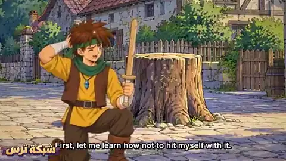</a>

**Subject:** Arabic dubbed anime pilot episode · **Reviewed production path:** `mixed_or_not_established` · [Full case directory](cases-index.zh-CN.md)

**Creator account:** The creator says they guided Opus 5.5 in Claude Code for about 14 hours to make an 8-minute-33-second pilot, reporting 211 planned shots, over 300 character and scene images, 11 characters, 70 Arabic voice lines, 16 music cues, subtitles, and a 2D animation engine. No project or call log was released.

**Review limit:** This is a multi-asset, multi-stage workflow. Nine frames cannot verify translation, voice performances, music, continuity, or the reported shot count.

Observed: **10 likes, 3,855 views**; saved search file written 2026-09-25 14:46:35+00:00 (UTC, about 1.38 hours after posting; query `update_20260925_animation_top`). File-write time is not the exact X read time.

### Short story × Photoreal

3 classified files; 1 matching reviewed case.

#### 1. [@razeden0](https://x.com/razeden0/status/2103153899431432535)

<a href="https://x.com/razeden0/status/2103153899431432535">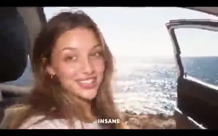</a>

**Subject:** Coastal road trip cinematic video · **Reviewed production path:** `external_video_model` · [Full case directory](cases-index.zh-CN.md)

**Creator account:** Explicitly says Opus wrote story plan, character sheet, start frames, camera moves and timing, then Seedance 2.5 animated them; user provided a concept and a few look screenshots.

**Review limit:** External video-model renderer with Opus as director; a second clear example beyond @abxxai.

Observed: **6 likes, 772 views**; saved search file written 2026-09-24 22:21:39+00:00 (UTC, about 6.27 hours after posting; query `seedance_workflow`). File-write time is not the exact X read time.

### Music video × Motion / UI

10 classified files; 2 matching reviewed cases.

#### 1. [@sankakuten91256 four-tool dance motion graphic](https://x.com/sankakuten91256/status/2103483923783373039)

**Subject:** Anime girl rhythmic motion graphics dance · **Reviewed production path:** `external_video_model` · [Full case directory](cases-index.zh-CN.md)

**Creator account:** The creator describes GPT Images 2.5 making a nine-panel dance image, Grok making green-screen dance footage, Opus 5.5 coding motion backgrounds and layout, and Astra replacing audio. Integration code was not released.

**Review limit:** The role split is creator-reported. Sampled frames cannot establish each tool's actual output without the integration project.

Observed: **2,755 likes, 447,518 views**; saved search file written 2026-09-26 12:54:23+00:00 (UTC, about 22.96 hours after posting; query `update_20260926_exact_top`). File-write time is not the exact X read time.

#### 2. [@elianiva_ black-and-white motion continuation](https://x.com/elianiva_/status/2103003425915195750)

**Subject:** Japanese lyric motion graphics · **Reviewed production path:** `existing_source_transformation` · [Full case directory](cases-index.zh-CN.md)

**Creator account:** The creator says they hand-coded the first four seconds years earlier and asked Opus to continue it over about an hour and several exchanges. The black-and-white constraint came from the old work; the source project is not public.

**Review limit:** This continues an existing human-made animation and art direction, rather than starting from an empty project.

Observed: **6 likes, 512 views**; saved search file written 2026-09-24 21:44:00+00:00 (UTC, about 15.60 hours after posting; query `day1_latest`). File-write time is not the exact X read time.

### Music video × 3D render

7 classified files; 2 matching reviewed cases.

#### 1. [@aj_dev_smith No Samples](https://x.com/aj_dev_smith/status/2102803889183736141)

<a href="https://x.com/aj_dev_smith/status/2102803889183736141">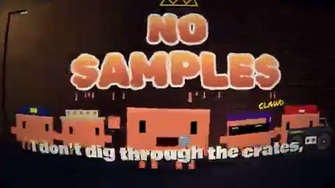</a>

**Subject:** Claude Opus rap music video · **Reviewed production path:** `procedural_2d` · [Full case directory](cases-index.zh-CN.md)

**Creator account:** Root says custom JavaScript written by Opus powers both music and visuals. In a [creator reply](https://x.com/aj_dev_smith/status/2102888015903474051), the artist clarifies roughly two hours, two prompts (one song, one video), about 700k tokens in one Claude Code session, no subagents, and prior EDM/pop-punk projects as a base.

**Review limit:** Code video plus code audio by self-report. This is neither one prompt nor a blank workspace; earlier projects shaped the output.

Observed: **1,842 likes, 123,988 views**; saved search file written 2026-09-24 21:08:55+00:00 (UTC, about 28.23 hours after posting; query `opus_spaced`). File-write time is not the exact X read time.

#### 2. [@xlcomplete five-minute song video](https://x.com/xlcomplete/status/2103015953877647820)

<a href="https://x.com/xlcomplete/status/2103015953877647820">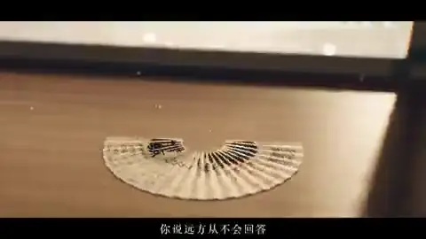</a>

**Subject:** Train journey shader music video · **Reviewed production path:** `procedural_2d` · [Full case directory](cases-index.zh-CN.md)

**Creator account:** The creator says they supplied a song previously made with Suno, and Opus 5.5 at xhigh effort wrote shaders to draw the video frame by frame. The prompt, project, cost, and song file were not shared.

**Review limit:** The pre-existing song is a clear input. Code-drawn visuals are a creator claim and should be kept separate from the supplied music.

Observed: **0 likes, 233 views**; saved search file written 2026-09-24 21:44:00+00:00 (UTC, about 14.78 hours after posting; query `day1_latest`). File-write time is not the exact X read time.

### Music video × Flat cartoon

17 classified files; 4 matching reviewed cases.

#### 1. [@other__reality](https://x.com/other__reality/status/2102514581684052169)

**Subject:** Animated song about AI singularity · **Reviewed production path:** `procedural_2d` · [Full case directory](cases-index.zh-CN.md)

**Creator account:** Praises Opus 5.5 visual design; quotes an older song post.

**Review limit:** Music-video case; public [PDoomVideo repo](https://github.com/JohnHeibel/PDoomVideo) documents a matching p5.js/Chrome/ffmpeg pipeline, existing song and two generations. Verify ownership before attributing repository authorship to X account.

Observed: **5,950 likes, 1,815,458 views**; saved search file written 2026-09-24 22:20:21+00:00 (UTC, about 48.59 hours after posting; query `french_animation`). File-write time is not the exact X read time.

#### 2. [@ExistentialEnso pre-existing song MV](https://x.com/ExistentialEnso/status/2102599211212554616)

<a href="https://x.com/ExistentialEnso/status/2102599211212554616">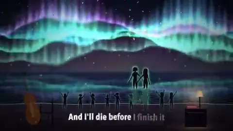</a>

**Subject:** animated music video · **Reviewed production path:** `procedural_2d` · [Full case directory](cases-index.zh-CN.md)

**Creator account:** Creator calls it a one-shot-style request and openly says the subtitles desynchronize near the end; [a reply](https://x.com/ExistentialEnso/status/2102647383200768306) says the song already existed and was made with Suno a week earlier.

**Review limit:** Existing-audio-conditioned long MV with creator-reported QA defect. A nine-frame tile cannot measure exact subtitle drift, so that part remains their disclosure.

Observed: **38 likes, 2,712 views**; saved search file written 2026-09-24 18:04:14+00:00 (UTC, about 38.71 hours after posting; query `music_video`). File-write time is not the exact X read time.

### Music video × Pixel art

8 classified files; 4 matching reviewed cases.

#### 1. [@pleometric Donald-workflow follow-up](https://x.com/pleometric/status/2103082510607610023)

**Subject:** Retro anime MV about AI singularity · **Reviewed production path:** `mixed_or_not_established` · [Full case directory](cases-index.zh-CN.md)

**Creator account:** Creator explicitly says a previous video inspired them to push Opus 5.5 and that they followed @donaldjewkes's general workflow. They do not publish their full prompt, asset list or invocation log in this root.

**Review limit:** Direct creator acknowledgement that a production recipe propagated. It does not prove a copied prompt, identical tool calls or that any particular video model generated the footage.

Observed: **1,506 likes, 87,499 views**; saved search file written 2026-09-24 17:27:16+00:00 (UTC, about 6.09 hours after posting; query `day3_top`). File-write time is not the exact X read time.

#### 2. [@gandamu_ml Nightcall pixel short](https://x.com/gandamu_ml/status/2103116003689550013)

<a href="https://x.com/gandamu_ml/status/2103116003689550013">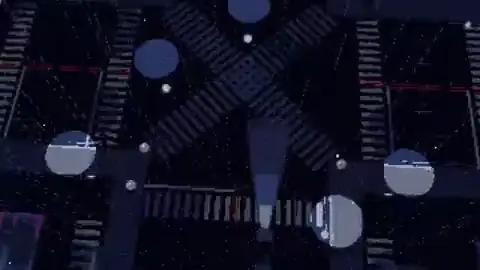</a>

**Subject:** Pixel art music video for Nightcall · **Reviewed production path:** `mixed_or_not_established` · [Full case directory](cases-index.zh-CN.md)

**Creator account:** The creator asked Opus for a pixel-art real-time demo set to Kavinsky's existing Nightcall song, using Blender MCP to keep geometry consistent. After disliking the first draft, they requested an Another World-inspired low-poly style. The full instructions and project are unpublished.

**Review limit:** The final result reflects existing music, Blender geometry, and a second round of human art direction. It should not be described as the first output.

Observed: **71 likes, 2,251 views**; saved search file written 2026-09-24 19:25:29+00:00 (UTC, about 5.84 hours after posting; query `blender`). File-write time is not the exact X read time.

### Music video × Hand-drawn

8 classified files; 1 matching reviewed case.

#### 1. [@coolbat1999 child's drawing](https://x.com/coolbat1999/status/2103127192591065595)

**Subject:** Music video from kid's drawings · **Reviewed production path:** `existing_source_transformation` · [Full case directory](cases-index.zh-CN.md)

**Creator account:** Creator says two conversations with Opus animated a child's doodle into an MV. Full input drawings, prompt and render stack were not published in the root.

**Review limit:** Source-image-conditioned family MV, expressly two rounds; the existing drawing is the important visual asset.

Observed: **1 likes, 22 views**; saved search file written 2026-09-24 17:27:16+00:00 (UTC, about 3.13 hours after posting; query `day3_top`). File-write time is not the exact X read time.

### Music video × Paper cut-out

6 classified files; 1 matching reviewed case.

#### 1. [@anjmaxx 20 s MV](https://x.com/anjmaxx/status/2103173729656459455)

<a href="https://x.com/anjmaxx/status/2103173729656459455">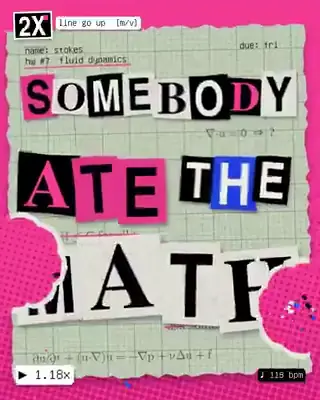</a>

**Subject:** Line Go Up AI meme music video · **Reviewed production path:** `mixed_or_not_established` · [Full case directory](cases-index.zh-CN.md)

**Creator account:** Root claims one prompt. The [later full prompt](https://x.com/anjmaxx/status/2103174007319413155) is 5,594 characters: two protagonists, style references/attachments, lyric typography, internet research, a style sheet, optional Seedance 2.5 base generations and repeated review. Its literal wording overlaps extensively with @donaldjewkes's earlier public prompt: 87.0% of unique five-word spans in the later text occur in the earlier text, by `research/compare_public_prompts.py`.

**Review limit:** A one-submission claim with a long, reference-conditioned production brief. Shared prompt wording shows a reusable recipe spreading through public posts, but does not establish authorship or which services were executed.

Observed: **1 likes, 20 views**; saved search file written 2026-09-24 17:27:42+00:00 (UTC, about 0.05 hours after posting; query `day3_latest`). File-write time is not the exact X read time.

### Music video × Ink / paint

5 classified files; 1 matching reviewed case.

#### 1. [@johnknopf watercolor MV](https://x.com/johnknopf/status/2103170666187117006)

**Subject:** Watercolor animated music video of life · **Reviewed production path:** `procedural_2d` · [Full case directory](cases-index.zh-CN.md)

**Creator account:** Creator supplied a song they had made in Suno and says one prompt led Opus to build a watercolor renderer, draw scenes from lyrics and finish within an hour. No source code was checked.

**Review limit:** Source-audio-conditioned animation; “one prompt” includes an existing song. Renderer and elapsed-time statements remain self-reports.

Observed: **9 likes, 396 views**; saved search file written 2026-09-24 17:27:42+00:00 (UTC, about 0.26 hours after posting; query `day3_latest`). File-write time is not the exact X read time.

### Music video × Generative

2 classified files; 2 matching reviewed cases.

#### 1. [@cube__lol 13-minute Tool music video](https://x.com/cube__lol/status/2102879729594343605)

**Subject:** Tool music video generated with code · **Reviewed production path:** `mixed_or_not_established` · [Full case directory](cases-index.zh-CN.md)

**Creator account:** The creator says Opus 5.5 made a 13-minute Tool music video with code. They did not share the prompt, project, song input, or production logs.

**Review limit:** The preview duration is measurable; the all-code process and music source still need a project and source records to verify.

Observed: **22 likes, 661 views**; saved search file written 2026-09-24 21:08:55+00:00 (UTC, about 23.21 hours after posting; query `opus_spaced`). File-write time is not the exact X read time.

#### 2. [@KamStudioLabs collision music machine](https://x.com/KamStudioLabs/status/2102899866762440893)

<a href="https://x.com/KamStudioLabs/status/2102899866762440893">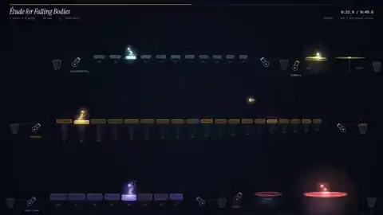</a>

**Subject:** Physics collision music machine · **Reviewed production path:** `procedural_2d` · [Full case directory](cases-index.zh-CN.md)

**Creator account:** The creator describes a one-sentence brief in which every visible collision should play a note. They report a 47 KB single HTML file, no images or external audio, and browser-synthesized sound, without releasing code or sound analysis.

**Review limit:** This is a short-brief procedural audiovisual experiment. Video duration was measured from the MP4; the file size is the creator's claim.

Observed: **0 likes, 89 views**; saved search file written 2026-09-24 19:58:58+00:00 (UTC, about 20.71 hours after posting; query `prompt`). File-write time is not the exact X read time.

### Music video × Anime

8 classified files; 2 matching reviewed cases.

#### 1. [@donaldjewkes](https://x.com/donaldjewkes/status/2102801274173587569)

<a href="https://x.com/donaldjewkes/status/2102801274173587569">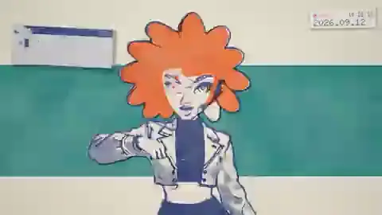</a>

**Subject:** AI singularity and p(doom) music video · **Reviewed production path:** `mixed_or_not_established` · [Full case directory](cases-index.zh-CN.md)

**Creator account:** Reports one prompt, 5 minutes speaking to computer, 12 hours autonomous work. The [full prompt](https://x.com/donaldjewkes/status/2102801469976248500) is ~9.5k characters and supplies an existing MP4/song, source code and a project folder; it directs the agent toward image generation, Seedance 2.5 base clips, optional ElevenLabs sound design, JavaScript paint-over, multiple viewing/revision loops and substantial available credits.

**Review limit:** Source-conditioned, multi-tool direction. The prompt proves what was requested, not which external services were actually invoked. “One prompt” here refers to the number of user submissions, not brevity, lack of assets or absence of iteration.

Observed: **5,673 likes, 1,131,805 views**; saved search file written 2026-09-24 22:20:21+00:00 (UTC, about 29.60 hours after posting; query `french_animation`). File-write time is not the exact X read time.

#### 2. [@ruinolab character MV](https://x.com/ruinolab/status/2103120880796873091)

**Subject:** AI generated anime music video · **Reviewed production path:** `mixed_or_not_established` · [Full case directory](cases-index.zh-CN.md)

**Creator account:** Creator says they supplied a character setting; Opus planned shots/performance, wrote lyrics/Suno directions, aligned cuts and lyric text, and applied effects. The post tags MiniMax H3. [Follow-up](https://x.com/ruinolab/status/2103135617567924603) reports beat-level shot selection and frame review.

**Review limit:** Multi-tool character-conditioned MV; Suno role is explicit, MiniMax H3 is tagged, but exact video-generation calls and human selection history are not public.

Observed: **5 likes, 178 views**; saved search file written 2026-09-24 20:36:11+00:00 (UTC, about 6.70 hours after posting; query `japanese_animation`). File-write time is not the exact X read time.

### Music video × Photoreal

4 classified files; 1 matching reviewed case.

#### 1. [@abxxai](https://x.com/abxxai/status/2102775755646337530)

**Subject:** Coastal road trip music video · **Reviewed production path:** `external_video_model` · [Full case directory](cases-index.zh-CN.md)

**Creator account:** Explicit Opus 5.5 + Seedance 2.5; Opus supplied prompt/direction.

**Review limit:** External video-model generation. Clear division between director/prompt writer and renderer.

Observed: **1,539 likes, 231,931 views**; saved search file written 2026-09-24 22:21:39+00:00 (UTC, about 31.31 hours after posting; query `seedance_workflow`). File-write time is not the exact X read time.

### Music video × Terminal / ASCII

1 classified file; 1 matching reviewed case.

#### 1. [@bradmillscan monetary-history MV](https://x.com/bradmillscan/status/2103108967194833310)

<a href="https://x.com/bradmillscan/status/2103108967194833310">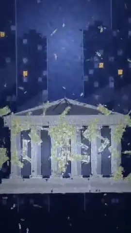</a>

**Subject:** Bitcoin and monetary history music video · **Reviewed production path:** `procedural_2d` · [Full case directory](cases-index.zh-CN.md)

**Creator account:** Creator supplied Bitcoin and monetary-history wikis; says Opus used ElevenLabs for the track, agents made about 75 beat-cut shots, and the human requested two revisions after stick-like people and then to add matrix code.

**Review limit:** Existing source wikis, external music and explicit human revisions materially shaped the work. “Code only” in the post describes visual production, not a zero-tool/zero-input process.

Observed: **158 likes, 24,603 views**; saved search file written 2026-09-24 18:04:14+00:00 (UTC, about 4.95 hours after posting; query `music_video`). File-write time is not the exact X read time.

### History / culture × 3D render

9 classified files; 1 matching reviewed case.

#### 1. [@tetumemo](https://x.com/tetumemo/status/2102652072252584046)

<a href="https://x.com/tetumemo/status/2102652072252584046">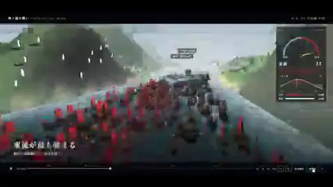</a>

**Subject:** 3D recreation of Battle of Dan-no-ura · **Reviewed production path:** `3d_or_realtime_graphics` · [Full case directory](cases-index.zh-CN.md)

**Creator account:** Creator [reply](https://x.com/tetumemo/status/2102652076702716273) prompts a TV-special style 3D overhead treatment of the Battle of Dan-no-ura, including geography, ships, tide reversal, arrows, mist and changing camera positions.

**Review limit:** Brief but highly domain-structured 3D storyboard request; historical accuracy not checked by visual sampling.

Observed: **56 likes, 13,686 views**; saved search file written 2026-09-24 16:13:55+00:00 (UTC, about 33.37 hours after posting; query `claude_phrase_top`). File-write time is not the exact X read time.

### History / culture × Flat cartoon

8 classified files; 3 matching reviewed cases.

#### 1. [@makwired Shaml paper-cut short](https://x.com/makwired/status/2103008945220567166)

**Subject:** Islamic wisdom quote animation · **Reviewed production path:** `procedural_2d` · [Full case directory](cases-index.zh-CN.md)

**Creator account:** The creator links an [open repository](https://github.com/klsoen/opus-js-animations). Its matching Shaml example describes a 20.4-second Canvas 2D animation, an existing spoken recording, and several rounds of human art direction. The full conversation for this particular post is unavailable.

**Review limit:** The public project supports the code-rendered-frame path and shows that existing audio and human revisions matter. A short trigger phrase does not describe the full production input.

Observed: **3 likes, 252 views**; saved search file written 2026-09-24 21:44:00+00:00 (UTC, about 15.24 hours after posting; query `day1_latest`). File-write time is not the exact X read time.

#### 2. [@RetropunkAI Sphere history motion graphic](https://x.com/RetropunkAI/status/2103237989065277590)

<a href="https://x.com/RetropunkAI/status/2103237989065277590">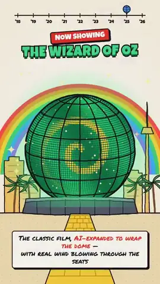</a>

**Subject:** Las Vegas Sphere brief history · **Reviewed production path:** `educational_explainer` · [Full case directory](cases-index.zh-CN.md)

**Creator account:** The creator's [shared brief](https://x.com/RetropunkAI/status/2103237991091060898) supplies three images, a folder, background material, and GSAP as the animation platform for a roughly 30–60-second Sphere explainer. They report a single Opus Medium submission taking about 25 minutes, with no follow-up questions.

**Review limit:** One submitted brief can still contain images, research, platform selection, and a planned story. Execution details are known only from the creator's account.

Observed: **2 likes, 66 views**; saved search file written 2026-09-24 22:22:26+00:00 (UTC, about 0.71 hours after posting; query `final_live`). File-write time is not the exact X read time.

### History / culture × Hand-drawn

5 classified files; 3 matching reviewed cases.

#### 1. [@akokoi1 history](https://x.com/akokoi1/status/2102583898865873225)

**Subject:** Brief animation of Chinese history · **Reviewed production path:** `educational_explainer` · [Full case directory](cases-index.zh-CN.md)

**Creator account:** Says Opus 5.5 made a Chinese-history explainer; gives subscription usage.

**Review limit:** Educational explainer; origin of voice/audio still to verify.

Observed: **677 likes, 148,701 views**; saved search file written 2026-09-24 20:02:19+00:00 (UTC, about 41.69 hours after posting; query `chinese_animate`). File-write time is not the exact X read time.

#### 2. [@hanifproduktif Indonesian-history comparison](https://x.com/hanifproduktif/status/2102695622042411419)

<a href="https://x.com/hanifproduktif/status/2102695622042411419">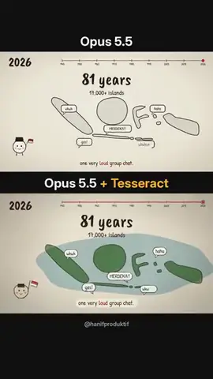</a>

**Subject:** 81 years of Indonesian history · **Reviewed production path:** `educational_explainer` · [Full case directory](cases-index.zh-CN.md)

**Creator account:** Creator publishes a short prompt for a less-than-one-minute light line-drawing history of Indonesia with music/voiceover. They say the second version used the same prompt and voiceover but added the Tesseract CLI.

**Review limit:** Downstream helper/tool comparison, not two independent prompts. The composite clip cannot prove that Tesseract was the sole cause of differences, but creator attribution and split-screen labels establish the intended comparison.

Observed: **156 likes, 9,250 views**; saved search file written 2026-09-24 19:58:58+00:00 (UTC, about 34.24 hours after posting; query `prompt`). File-write time is not the exact X read time.

### History / culture × Ink / paint

8 classified files; 3 matching reviewed cases.

#### 1. [@dhruvalgolakiya](https://x.com/dhruvalgolakiya/status/2102733714845491558)

<a href="https://x.com/dhruvalgolakiya/status/2102733714845491558">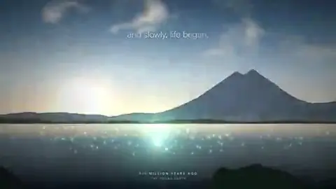</a>

**Subject:** Journey of human civilization and future · **Reviewed production path:** `existing_source_transformation` · [Full case directory](cases-index.zh-CN.md)

**Creator account:** Three prompts and 2 h; creator follow-up discloses video reference, 6–7 subagents, JavaScript single file and ElevenLabs speech.

**Review limit:** Reference-conditioned code animation + external audio; expressly not one shot.

Observed: **602 likes, 53,273 views**; saved search file written 2026-09-24 22:20:21+00:00 (UTC, about 34.07 hours after posting; query `french_animation`). File-write time is not the exact X read time.

#### 2. [@AxtonLiu breathing ink painting](https://x.com/AxtonLiu/status/2103288413969621231)

**Subject:** Procedural Chinese ink wash landscape generation · **Reviewed production path:** `procedural_2d` · [Full case directory](cases-index.zh-CN.md)

**Creator account:** The creator describes a broad artistic brief and says Opus wrote an HTML/Canvas program that draws a landscape, boat, pines, and red sun stroke by stroke over a rice-paper-like texture.

**Review limit:** Nine frames show the ink scene developing, consistent with procedural drawing. No source code is public to confirm the renderer or an alleged quality ceiling.

Observed: **409 likes, 57,938 views**; saved search file written 2026-09-26 12:54:23+00:00 (UTC, about 35.90 hours after posting; query `update_20260926_exact_top`). File-write time is not the exact X read time.

### Art / abstract × Motion / UI

6 classified files; 1 matching reviewed case.

#### 1. [@leo_xiaolei reference-video procedural animation](https://x.com/leo_xiaolei/status/2102724347446305104)

**Subject:** Procedural motion graphic cosmic journey · **Reviewed production path:** `existing_source_transformation` · [Full case directory](cases-index.zh-CN.md)

**Creator account:** The creator published a long Chinese brief specifying a supplied reference video, Vite/TypeScript/Canvas 2D, deterministic timing, target resolution and frame rate, and a near-complete sequence of scenes and transitions. The reference file and execution logs were not shared.

**Review limit:** The result is conditioned on a reference video and detailed human storyboarding. A single prompt can contain extensive design work and outside visual input.

Observed: **119 likes, 13,115 views**; saved search file written 2026-09-24 22:20:21+00:00 (UTC, about 34.69 hours after posting; query `french_animation`). File-write time is not the exact X read time.

### Art / abstract × 3D render

10 classified files; 1 matching reviewed case.

#### 1. [@gandamu_ml 1990s-style demoscene](https://x.com/gandamu_ml/status/2102919394775220530)

**Subject:** 90s style demoscene demo · **Reviewed production path:** `3d_or_realtime_graphics` · [Full case directory](cases-index.zh-CN.md)

**Creator account:** The creator describes a first attempt from one human prompt, with pre-existing Purple Motion music from Second Reality supplied as input. They say Opus wrote the C/C++ and OpenGL demo. The full prompt, project, and music permission are not public.

**Review limit:** This long procedural demo uses existing music. A one-prompt claim does not mean there were no input assets, and duration alone says nothing about visual consistency.

Observed: **625 likes, 26,014 views**; saved search file written 2026-09-24 19:58:58+00:00 (UTC, about 19.42 hours after posting; query `prompt`). File-write time is not the exact X read time.

### Art / abstract × Flat cartoon

3 classified files; 1 matching reviewed case.

#### 1. [@ianstig animation showreel](https://x.com/ianstig/status/2103169675928764486)

**Subject:** Multi-style character animation showreel · **Reviewed production path:** `procedural_2d` · [Full case directory](cases-index.zh-CN.md)

**Creator account:** Creator says one request produced 19 shots of a character in multiple visual styles, with every frame drawn in code and sound effects synchronized from the same program. No repo or prompt was checked.

**Review limit:** Multi-style code animation by creator claim; nine frames corroborate style variety, not the exact number of shots or code-only provenance.

Observed: **0 likes, 27 views**; saved search file written 2026-09-24 18:02:05+00:00 (UTC, about 0.90 hours after posting; query `animation`). File-write time is not the exact X read time.

### Art / abstract × Pixel art

4 classified files; 1 matching reviewed case.

#### 1. [@riku720720](https://x.com/riku720720/status/2102515055116063144)

<a href="https://x.com/riku720720/status/2102515055116063144">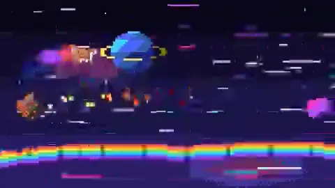</a>

**Subject:** pixel art character in space · **Reviewed production path:** `procedural_2d` · [Full case directory](cases-index.zh-CN.md)

**Creator account:** Detailed creator-reply prompt demands one standalone HTML, Canvas 2D, 160×90 integer pixel grid, fixed palette, no external assets or libraries, authored obstacle/action patterns.

**Review limit:** Constrained code animation. The prompt is long and precise despite the post’s “under 5 minutes” framing.

Observed: **1,071 likes, 236,989 views**; saved search file written 2026-09-24 22:20:21+00:00 (UTC, about 48.55 hours after posting; query `french_animation`). File-write time is not the exact X read time.

### Art / abstract × Hand-drawn

1 classified file; 1 matching reviewed case.

#### 1. [@AnduArtist spinning-cup overlay](https://x.com/AnduArtist/status/2102548178646016377)

**Subject:** Hand-drawn animation on rotating coffee cup · **Reviewed production path:** `external_video_model` · [Full case directory](cases-index.zh-CN.md)

**Creator account:** Creator says fal H3 Max first generated a spinning-cup video, then Opus 5.5 animated drawings on top.

**Review limit:** Clear base-video-plus-code-overlay case: the cup's photographic footage is attributed to H3 Max, Opus to the added animation by creator disclosure.

Observed: **3 likes, 326 views**; saved search file written 2026-09-24 18:02:05+00:00 (UTC, about 42.06 hours after posting; query `animation`). File-write time is not the exact X read time.

### Art / abstract × Paper cut-out

2 classified files; 1 matching reviewed case.

#### 1. [@koldo2k infinite-zoom collage](https://x.com/koldo2k/status/2103129343253778767)

<a href="https://x.com/koldo2k/status/2103129343253778767">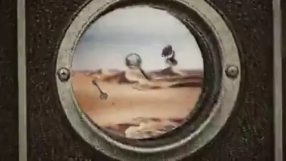</a>

**Subject:** Surreal infinite zoom collage loop · **Reviewed production path:** `external_video_model` · [Full case directory](cases-index.zh-CN.md)

**Creator account:** The creator's [shared brief](https://x.com/koldo2k/status/2103129347791986942) asks for a looping 20-second zoom through objects and explicitly assigns asset generation to Magnific MCP services: Seedream for scenery, GPT for cut-outs, Kling for animated figures, and Lyria for music. A [follow-up](https://x.com/koldo2k/status/2103155960688627834) reports 1,500 credits; bills and logs were not checked.

**Review limit:** Opus reportedly planned and orchestrated a multi-service pipeline. The external models made the scenery, cut-outs, animation, and music, so the final pixels should not be credited solely to Opus.

Observed: **334 likes, 24,830 views**; saved search file written 2026-09-24 22:20:21+00:00 (UTC, about 7.87 hours after posting; query `french_animation`). File-write time is not the exact X read time.

### Art / abstract × Generative

11 classified files; 2 matching reviewed cases.

#### 1. [@dfeinition mosaic](https://x.com/dfeinition/status/2102436001473786054)

**Subject:** Code-generated mosaic goldfish animation · **Reviewed production path:** `procedural_2d` · [Full case directory](cases-index.zh-CN.md)

**Creator account:** Creator claims 13,081 mosaic tiles, all code-drawn and animated by Opus without image files. No repo or prompt was checked.

**Review limit:** Procedural 2D narrative by creator disclosure; exact tile count and no-image claim are not independently verified by MP4 frames.

Observed: **1,336 likes, 145,805 views**; saved search file written 2026-09-24 17:22:06+00:00 (UTC, about 48.82 hours after posting; query `day1_top`). File-write time is not the exact X read time.

#### 2. [@LCSlates](https://x.com/LCSlates/status/2102503027340988559)

<a href="https://x.com/LCSlates/status/2102503027340988559">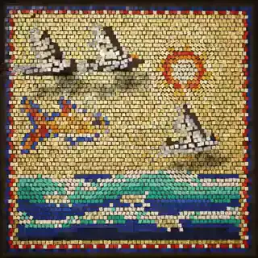</a>

**Subject:** Animated mosaic tile art · **Reviewed production path:** `procedural_2d` · [Full case directory](cases-index.zh-CN.md)

**Creator account:** Creator reply specifies 80 s square WebGL2/plain JS, no external assets; agent readout details timed scenes and creator’s frame-by-frame changes.

**Review limit:** Procedural WebGL animation with explicit storyboard and iteration.

Observed: **970 likes, 80,239 views**; saved search file written 2026-09-24 19:58:58+00:00 (UTC, about 46.99 hours after posting; query `prompt`). File-write time is not the exact X read time.

### Humor / meme × 3D render

4 classified files; 1 matching reviewed case.

#### 1. [@AxtonLiu pelican cycling film](https://x.com/AxtonLiu/status/2103119648271290566)

**Subject:** Pelican riding a bicycle along pier · **Reviewed production path:** `3d_or_realtime_graphics` · [Full case directory](cases-index.zh-CN.md)

**Creator account:** The creator shared an open-ended brief for an elaborate pelican-on-a-bicycle animation, then said Opus wrote a GPU ray-marching renderer. They report code-generated characters, bicycle, pier, sea, sky, and music, with no external models, textures, or audio. They report 1,140 frames at 40 samples per frame.

**Review limit:** The preview supports a detailed 3D-looking result, but no code or run log establishes the sampling count or absence of external assets.

Observed: **31 likes, 3,592 views**; saved search file written 2026-09-24 20:01:06+00:00 (UTC, about 6.19 hours after posting; query `chinese_video`). File-write time is not the exact X read time.

### Humor / meme × Paper cut-out

2 classified files; 1 matching reviewed case.

#### 1. [@YoshiKura535130](https://x.com/YoshiKura535130/status/2102910805721362875)

<a href="https://x.com/YoshiKura535130/status/2102910805721362875">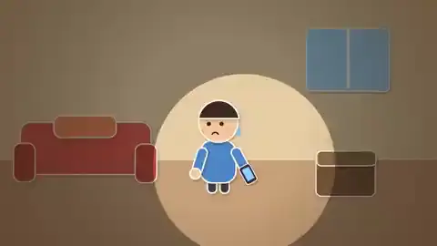</a>

**Subject:** Relatable everyday situations animation · **Reviewed production path:** `procedural_2d` · [Full case directory](cases-index.zh-CN.md)

**Creator account:** Says everyday “relatable moments” brief led to 1,290 Canvas frames, with JS-made BGM/SFX.

**Review limit:** Code-rendered 2D narrative by creator disclosure.

Observed: **0 likes, 39 views**; saved search file written 2026-09-24 20:36:11+00:00 (UTC, about 20.61 hours after posting; query `japanese_animation`). File-write time is not the exact X read time.

### Data visualization × Motion / UI

9 classified files; 1 matching reviewed case.

#### 1. [@Luchigatica La Redonda vertical recommendation](https://x.com/Luchigatica/status/2102853289259729328)

**Subject:** Fantasy football player recommendations · **Reviewed production path:** `existing_source_transformation` · [Full case directory](cases-index.zh-CN.md)

**Creator account:** The creator says one trigger prompt started an existing workflow: read and transcribe a YouTube commentary, identify five players, cross-check Winning data, and combine photos, crests, and statistics into a vertical animation. The prompt, code, data checks, and image permissions are not public.

**Review limit:** The workflow depends on existing video, data, and photos. Factual claims about real players require separate verification.

Observed: **24 likes, 3,718 views**; saved search file written 2026-09-24 21:48:28+00:00 (UTC, about 25.62 hours after posting; query `spanish_animation`). File-write time is not the exact X read time.

### Other × 3D render

2 classified files; 1 matching reviewed case.

#### 1. [@manaimovie Tripo/Blender character](https://x.com/manaimovie/status/2103138089790996843)

**Subject:** 3D anime character animation demo · **Reviewed production path:** `3d_or_realtime_graphics` · [Full case directory](cases-index.zh-CN.md)

**Creator account:** Creator explicitly says this is 3D Blender animation rather than video-model generation, with Tripo and Opus 5.5; they did not operate Blender manually. The post mentions a video-generation skill for motion/posing and ongoing texture correction.

**Review limit:** External 3D asset/model plus Opus-controlled Blender according to creator. The visual is a render/capture, not evidence of native LLM video output.

Observed: **132 likes, 5,479 views**; saved search file written 2026-09-24 17:33:22+00:00 (UTC, about 2.51 hours after posting; query `japanese_day3`). File-write time is not the exact X read time.

---

Check generated pages: `python3 scripts/generate_domain_style_atlas.py --check`.
