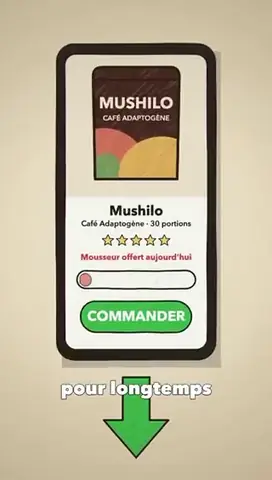
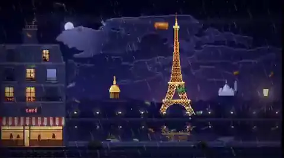

# Opus 5.5 视频：主题 × 视觉风格图谱

[English](domain-style-atlas.md) · 本页由 [`generate_domain_style_atlas.py`](../scripts/generate_domain_style_atlas.py) 根据[分类 CSV](../data/domain-style.csv)、[案例 CSV](../data/cases.csv)、[9 月 27 日 X 页面互动量观察](../data/case-engagement-refresh-2026-09-27.csv)生成；[9 月 24–26 日旧观察表](../data/case-engagement-observed.csv)保留供追溯。

**分类数据截点：** 2026-09-26T13:53:20.929497+00:00（UTC）。矩阵单元是**视频文件数**：存档快照报告 1,401 个 SHA-256 去重文件，公开分类 CSV 有对应的 1,401 行，但没有文件哈希，读者无法仅凭公开文件重做去重。图谱仅纳入分类器标为 `yes` 或 `likely` 的 1,119 个文件。每个文件只进一个主要主题和一种主要风格；`style2` 未计入。分类器判断不等于原作者身份或真实模型调用得到验证。

143 个组合里有 92 个非空格。168 个审读帖子中，157 个案例对应 `yes`／`likely` 的文件，落在 58 格；其余 34 个非空格没有已审读案例。在本轮官方 X 帖子页面观察里，166/168 帖有**精确赞数与精确浏览数**，166 帖有精确赞数，166 帖有精确浏览数，2 帖两项精确值均未取得。58/58 个有审读案例的格子至少有一条本轮可用互动量；下方展示 87 个带截图案例。

**选例规则：** 先限定在 168 个已审读案例中，再按原帖 URL 和预览时长精确对应分类结果；每格先从有本轮精确点赞或点赞缩写保守区间的案例找一例。若可能领先的点赞区间互相重叠，用精确帖子浏览量在这些候选里选择，不声称严格点赞名次；若全格缺点赞，则首例按精确浏览量。随后从剩余案例中按精确浏览数选第二例；若没有精确浏览数，才用点赞保守下界。完全没有本轮可用指标的格子只展示一例且不排名。维护者自己的帖子留在历史案例数据里，但不作为本页的展示选例。页面缩写不被伪装成精确数；赞和浏览属于 X 原帖，浏览数不是视频播放次数，多个视频附件可能共用同一帖指标。这不是质量、制作难度、Opus 贡献或效果评分。

**时间限制：** 本轮记录逐帖发生在 2026-09-27T11:50:53+00:00 至 2026-09-27T12:32:39+00:00（UTC），不是同一瞬间，也不是“最终”互动量。各帖发表时间、粉丝和转发条件不同；格子内展示顺序不能当成公平的作品比较。旧观察表保存 9 月 24–26 日的原始检索记录，不与本轮数字混作一次观测。截图仅用于辨认可取得的 X 预览画面，权利仍归原作者。详情请看[统计说明](statistics.zh-CN.md)和[完整 168 案例目录](cases-index.zh-CN.md)。

## 全部主题 × 风格矩阵

表内数字为文件数。可点击的数字跳转到有截图的审读案例；`†` 代表有分类文件、但没有落在该格的已审读案例；`—` 表示该次检索样本中没有文件，不代表全网不存在。手机上可横向滚动。

| 主题 / 用途 | 动态图形／界面 | 三维渲染 | 扁平卡通 | 像素 | 手绘 | 纸片拼贴 | 水墨／油彩 | 生成艺术 | 动漫 | 数学图解 | 写实 | 真人 | 终端／ASCII |
|---|---:|---:|---:|---:|---:|---:|---:|---:|---:|---:|---:|---:|---:|
| 游戏／交互 | 34† | [161](#cell-game_interactive-3d_render) | 16† | [12](#cell-game_interactive-pixel_art) | 1† | — | 2† | — | 2† | 1† | — | [1](#cell-game_interactive-live_action) | — |
| 广告／发布片 | [154](#cell-product_ad-motion_graphics_ui) | [25](#cell-product_ad-3d_render) | [14](#cell-product_ad-flat_vector_cartoon) | 1† | 6† | [4](#cell-product_ad-paper_cutout_collage) | — | — | 2† | — | [4](#cell-product_ad-photoreal) | [5](#cell-product_ad-live_action) | — |
| AI 讲 AI | [62](#cell-ai_self_meta-motion_graphics_ui) | [60](#cell-ai_self_meta-3d_render) | [34](#cell-ai_self_meta-flat_vector_cartoon) | 10† | [8](#cell-ai_self_meta-hand_drawn_sketch) | [5](#cell-ai_self_meta-paper_cutout_collage) | [8](#cell-ai_self_meta-painterly_ink_sand) | [7](#cell-ai_self_meta-generative_abstract) | [2](#cell-ai_self_meta-anime) | — | [4](#cell-ai_self_meta-photoreal) | 1† | — |
| 科普／教育 | [55](#cell-education_science-motion_graphics_ui) | [22](#cell-education_science-3d_render) | [25](#cell-education_science-flat_vector_cartoon) | 5† | [15](#cell-education_science-hand_drawn_sketch) | 4† | — | 1† | — | [19](#cell-education_science-math_diagram) | 1† | — | — |
| 故事短片 | [1](#cell-story_short-motion_graphics_ui) | [21](#cell-story_short-3d_render) | [37](#cell-story_short-flat_vector_cartoon) | [12](#cell-story_short-pixel_art) | [7](#cell-story_short-hand_drawn_sketch) | [12](#cell-story_short-paper_cutout_collage) | [9](#cell-story_short-painterly_ink_sand) | — | [7](#cell-story_short-anime) | — | [3](#cell-story_short-photoreal) | — | 3† |
| 音乐视频 | [10](#cell-music_video-motion_graphics_ui) | [7](#cell-music_video-3d_render) | [17](#cell-music_video-flat_vector_cartoon) | [8](#cell-music_video-pixel_art) | [8](#cell-music_video-hand_drawn_sketch) | [6](#cell-music_video-paper_cutout_collage) | [5](#cell-music_video-painterly_ink_sand) | [2](#cell-music_video-generative_abstract) | [8](#cell-music_video-anime) | — | [4](#cell-music_video-photoreal) | 1† | [1](#cell-music_video-retro_terminal_ascii) |
| 历史／文化 | 11† | [9](#cell-history_culture-3d_render) | [8](#cell-history_culture-flat_vector_cartoon) | 3† | [5](#cell-history_culture-hand_drawn_sketch) | 4† | [8](#cell-history_culture-painterly_ink_sand) | 1† | — | — | — | — | — |
| 艺术／抽象 | [6](#cell-art_abstract-motion_graphics_ui) | [10](#cell-art_abstract-3d_render) | [3](#cell-art_abstract-flat_vector_cartoon) | [4](#cell-art_abstract-pixel_art) | [1](#cell-art_abstract-hand_drawn_sketch) | [2](#cell-art_abstract-paper_cutout_collage) | 5† | [11](#cell-art_abstract-generative_abstract) | — | — | — | — | — |
| 幽默／梗 | 3† | [4](#cell-humor_meme-3d_render) | 7† | 2† | 1† | [2](#cell-humor_meme-paper_cutout_collage) | — | — | — | — | 1† | 3† | — |
| 数据可视化 | [9](#cell-data_viz-motion_graphics_ui) | 3† | — | 1† | — | — | — | 1† | — | — | — | — | — |
| 其他 | 5† | [2](#cell-other-3d_render) | 1† | — | — | — | — | — | — | 1† | — | — | — |

## 逐格案例

### 游戏／交互 × 三维渲染

161 个分类文件；8 个对应已审读案例。

#### 示例 A：[@MengTo Japanese boat environment](https://x.com/MengTo/status/2102760783344189761)

**画面主题：** Interactive Three.js Japanese boat scene · **案例制作路径：** `app_or_game_capture` · [完整目录](cases-index.zh-CN.md#case-2102760783344189761)

**作者披露：** Creator reports a playable Three.js boat scene through Japanese landscapes with weather, day/night lighting, textures and characters, and links a live site.

**审读边界：** Interactive 3D scene capture by creator disclosure; a video sample does not verify every claimed interaction or source asset.

**本轮 X 页面观察：** 6,418 赞（页面按钮 精确值）；458,308 次帖子浏览（页面 tooltip 精确值）。记录于 2026-09-27 11:52:50+00:00（UTC）。

**选例依据：** 按本轮点赞选出；在有赞数的案例中，下界高于其余案例的上界。

#### 示例 B：[@JaydenDavisNC Splatoon 游戏录屏](https://x.com/JaydenDavisNC/status/2103357848961036304)

**画面主题：** Splatoon game clone made by Opus · **案例制作路径：** `app_or_game_capture` · [完整目录](cases-index.zh-CN.md#case-2103357848961036304)

**作者披露：** 作者称由 Opus 5.5 从零编写可玩版喷射战士（Splatoon）游戏并部署至 Itch.io；视频为其在浏览器中的实际操作游戏录屏。附公开游戏试玩链接。

**审读边界：** 作者将成片描述为游戏录屏；九帧可见第三人称游戏画面。源码与开发日志未公开，不能独立核定 Opus 的具体贡献。

**本轮 X 页面观察：** 5,190 赞（页面按钮 精确值）；662,140 次帖子浏览（页面 tooltip 精确值）。记录于 2026-09-27 11:52:41+00:00（UTC）。

**选例依据：** 按本轮精确帖子浏览量选出。

### 游戏／交互 × 像素

12 个分类文件；2 个对应已审读案例。

#### 示例 A：[@ring_hyacinth](https://x.com/ring_hyacinth/status/2102865595675050010)

**画面主题：** Pixel Shanghai interactive game demo · **案例制作路径：** `app_or_game_capture` · [完整目录](cases-index.zh-CN.md#case-2102865595675050010)

**作者披露：** Says a prior-year Pixel Shanghai short supplied the scene world, while Opus invoked Nano Banana Pro for characters/map and generated music/SFX in browser.

**审读边界：** Reference-conditioned game creation and screen recording, not a new standalone film from zero assets.

**本轮 X 页面观察：** 735 赞（页面按钮 精确值）；49,263 次帖子浏览（页面 tooltip 精确值）。记录于 2026-09-27 11:54:39+00:00（UTC）。

**选例依据：** 按本轮点赞选出；在有赞数的案例中，下界高于其余案例的上界。

#### 示例 B：[@KanaWorks_AI siege-game promo](https://x.com/KanaWorks_AI/status/2102684116525437206)

**画面主题：** Three Kingdoms siege game showcase · **案例制作路径：** `external_video_model` · [完整目录](cases-index.zh-CN.md#case-2102684116525437206)

**作者披露：** Japanese creator says Opus built an eight-stage side-scrolling game/site in about two hours, then captured and edited a 60-second promo. The post explicitly credits Opus 5.5 for code and Seedance 2.5, MiniMax H3 and CapCut for video.

**审读边界：** Mixed pipeline with an Opus-coded interactive game and external video/editing tools for the promotional clip. Do not assign the promo's video pixels solely to Opus.

**本轮 X 页面观察：** 166 赞（页面按钮 精确值）；19,283 次帖子浏览（页面 tooltip 精确值）。记录于 2026-09-27 12:07:13+00:00（UTC）。

**选例依据：** 按本轮精确帖子浏览量选出。

### 游戏／交互 × 真人

1 个分类文件；1 个对应已审读案例。

#### 示例 A：[@TheViableEdge JEV＋Opus 实时视觉器](https://x.com/TheViableEdge/status/2103494684374900862)

**画面主题：** Real-time visualizer app demo · **案例制作路径：** `app_or_game_capture` · [完整目录](cases-index.zh-CN.md#case-2103494684374900862)

**作者披露：** 作者称用 Opus 5.5 与 JEV 搭建实时可视化工具，可把资料拆成待调用的图表／动效，并计划为社媒短片增加实时图形叠层；后续补充摄像头手势操作。JEV 的具体分工和技术架构未披露。

**审读边界：** 这是工具演示录屏，作者说的是未来用途，帖子没有展示由该工具制作完成的独立短片。

**本轮 X 页面观察：** 5 赞（页面按钮 精确值）；333 次帖子浏览（页面 tooltip 精确值）。记录于 2026-09-27 11:53:44+00:00（UTC）。

**选例依据：** 按本轮点赞选出；在有赞数的案例中，下界高于其余案例的上界。

### 广告／发布片 × 动态图形／界面

154 个分类文件；18 个对应已审读案例。

#### 示例 A：[@deedydas](https://x.com/deedydas/status/2102787937482252537)

**画面主题：** AI inference startup launch promo · **案例制作路径：** `mixed_or_not_established` · [完整目录](cases-index.zh-CN.md#case-2102787937482252537)

**作者披露：** Short prompt for a modern startup inference ad; self-reports 1 minute and about $2.

**审读边界：** Marketing motion graphics; timing/cost self-reported.

**本轮 X 页面观察：** 3,244 赞（页面按钮 精确值）；338,541 次帖子浏览（页面 tooltip 精确值）。记录于 2026-09-27 12:10:13+00:00（UTC）。

**选例依据：** 按本轮点赞选出；在有赞数的案例中，下界高于其余案例的上界。

#### 示例 B：[@trq212 personal-site trailer](https://x.com/trq212/status/2102477340920152162)

**画面主题：** Personal website redesign showcase trailer · **案例制作路径：** `existing_source_transformation` · [完整目录](cases-index.zh-CN.md#case-2102477340920152162)

**作者披露：** Creator first used workflows to iterate and critique several redesigns of their existing personal site, then asked Opus to make a trailer from those iterations.

**审读边界：** Existing design iterations were source material; this is a website-workflow-to-trailer transformation, not a blank-slate animation prompt.

**本轮 X 页面观察：** 2,174 赞（页面按钮 精确值）；181,095 次帖子浏览（页面 tooltip 精确值）。记录于 2026-09-27 12:05:34+00:00（UTC）。

**选例依据：** 按本轮精确帖子浏览量选出。

### 广告／发布片 × 三维渲染

25 个分类文件；2 个对应已审读案例。

#### 示例 A：[@NiloTechInc](https://x.com/NiloTechInc/status/2102741813719138661)

**画面主题：** Roblox game trailer showcase · **案例制作路径：** `app_or_game_capture` · [完整目录](cases-index.zh-CN.md#case-2102741813719138661)

**作者披露：** Says humans manually made animations, clothes and 3D assets in Nilo, then Opus assembled trailer/cameras in Roblox Studio.

**审读边界：** Mixed-asset 3D trailer/demo; clear external/manual material.

**本轮 X 页面观察：** 116 赞（页面按钮 精确值）；16,341 次帖子浏览（页面 tooltip 精确值）。记录于 2026-09-27 11:53:06+00:00（UTC）。

**选例依据：** 按本轮点赞选出；在有赞数的案例中，下界高于其余案例的上界。

#### 示例 B：[@Tariq_at 本地 ComfyUI 短片](https://x.com/Tariq_at/status/2102561072624410878)

**画面主题：** Claude Opus conceptual promo · **案例制作路径：** `mixed_or_not_established` · [完整目录](cases-index.zh-CN.md#case-2102561072624410878)

**作者披露：** 作者说 Opus 编写每镜视觉提示词、安排镜头细节并写配乐，画面“100% locally in ComfyUI”生成；未公开工作流节点、底层模型、音轨或硬件账单。

**审读边界：** Opus 是提示词与镜头编排者，ComfyUI 本地生成画面；本地运行不等于文本模型直接生成视频像素或没有算力成本。

**本轮 X 页面观察：** 4 赞（页面按钮 精确值）；1,078 次帖子浏览（页面 tooltip 精确值）。记录于 2026-09-27 12:09:29+00:00（UTC）。

**选例依据：** 按本轮精确帖子浏览量选出。

### 广告／发布片 × 扁平卡通

14 个分类文件；4 个对应已审读案例。

#### 示例 A：[@Lucas_IA_ skill-based ad](https://x.com/Lucas_IA_/status/2103152093733253544)

**画面主题：** Adaptogenic mushroom coffee advertisement · **案例制作路径：** `procedural_2d` · [完整目录](cases-index.zh-CN.md#case-2103152093733253544)

**作者披露：** The creator's [12-post workflow thread](https://x.com/Lucas_IA_/status/2103152094958026953) describes an existing paid skill containing a drawing engine and scripts, then a short [trigger prompt](https://x.com/Lucas_IA_/status/2103152108224573507). Claude Code writes JS frames, HyperFrames exports MP4, ElevenLabs provides narration, Whisper aligns words, optional Suno supplies music, and ffmpeg mixes. The full skill/source is not public.

**审读边界：** The visible short prompt depends on a prebuilt pipeline and prewritten script/brief. “$0 image/video generations” is compatible with paid Claude tokens and ElevenLabs voice; not total-zero cost.

**本轮 X 页面观察：** 403 赞（公开帖子 HTML 精确值）；59,918 次帖子浏览（公开帖子 HTML 精确值）。记录于 2026-09-27 12:29:42+00:00（UTC）。

**选例依据：** 按本轮点赞选出；在有赞数的案例中，下界高于其余案例的上界。

#### 示例 B：[@jackfriks Lovelee](https://x.com/jackfriks/status/2103132260589338762)

**画面主题：** Lovelee app animated promo · **案例制作路径：** `procedural_2d` · [完整目录](cases-index.zh-CN.md#case-2103132260589338762)

**作者披露：** One-turn creator claim; the [actual prompt](https://x.com/jackfriks/status/2103134485910892602) points to pig assets on a new app branch and requests a 9:16 story with SFX and app teaser.

**审读边界：** Existing assets and product brief materially shape the output.

**本轮 X 页面观察：** 161 赞（页面按钮 精确值）；51,278 次帖子浏览（页面 tooltip 精确值）。记录于 2026-09-27 12:19:36+00:00（UTC）。

**选例依据：** 按本轮精确帖子浏览量选出。

### 广告／发布片 × 纸片拼贴

4 个分类文件；1 个对应已审读案例。

#### 示例 A：[@so_ainsight 手绘风 Claude Code 解说](https://x.com/so_ainsight/status/2103117547776163845)

**画面主题：** Claude Code promotional animation · **案例制作路径：** `procedural_2d` · [完整目录](cases-index.zh-CN.md#case-2103117547776163845)

**作者披露：** [作者回复的任务](https://x.com/so_ainsight/status/2103119227192225926)指定 15 秒／16:9／日语旁白、纸张拼贴风，允许 gpt-image-2.5 与 Gemini TTS；根帖称实际用外部图像模型生成 11 张背景／人物／物件，用 Gemini TTS 配四段声音，HTML/JS 逐帧截图并导出，代理还看静帧修铅笔位置和气泡溢出；约 12 分钟为自报。

**审读边界：** “全交给 Claude”仍明确包含外部静态美术与 TTS，代码是合成／动效；质量自检是作者披露。

**本轮 X 页面观察：** 38 赞（页面按钮 精确值）；3,992 次帖子浏览（页面 tooltip 精确值）。记录于 2026-09-27 12:24:18+00:00（UTC）。

**选例依据：** 按本轮点赞选出；在有赞数的案例中，下界高于其余案例的上界。

### 广告／发布片 × 写实

4 个分类文件；1 个对应已审读案例。

#### 示例 A：[@OriSilver Blender 草模到 Seedance](https://x.com/OriSilver/status/2102817977812824335)

**画面主题：** Squid Game recreated with AI and Blender · **案例制作路径：** `external_video_model` · [完整目录](cases-index.zh-CN.md#case-2102817977812824335)

**作者披露：** 作者说先提供一段镜头风格参考片，Opus 以 MaxFusion MCP 抽样、在 Blender 里重建机位、走位与分镜，导出约 30 秒草模，再将草模和自有角色作为 Seedance 2.5 参考做最终画面；实际 15 fps 抽样、调用日志与源片未核。

**审读边界：** 三层参考链：已有视频给镜头语言，Blender 草模给空间与动作控制，Seedance 做上方最终像素。不能称 Opus 直接生成真人场景，也不能把公开合辑的 27.6 秒当作草模母版时长。

**本轮 X 页面观察：** 33 赞（页面按钮 精确值）；7,298 次帖子浏览（页面 tooltip 精确值）。记录于 2026-09-27 12:07:44+00:00（UTC）。

**选例依据：** 按本轮点赞选出；在有赞数的案例中，下界高于其余案例的上界。

### 广告／发布片 × 真人

5 个分类文件；2 个对应已审读案例。

#### 示例 A：[@gregpr07 口播多条 take 自动挑剪](https://x.com/gregpr07/status/2102984873351037161)

**画面主题：** video-use AI editor launch promo · **案例制作路径：** `existing_source_transformation` · [完整目录](cases-index.zh-CN.md#case-2102984873351037161)

**作者披露：** 作者称把同一句口播的 13 条拍摄 take 交给 Opus 5.5＋video-use，代理读转写、逐帧比较候选、挑干净版本，再剪辑、调色、改字幕并围绕它做发布片；约两分钟和 0.90 美元为作者口径，原始 13 条素材与执行日志未公开。

**审读边界：** 已有真人表演的选择、剪辑和包装，模型作用是编辑与判断；不能称它从零生成片中人物或口播。

**本轮 X 页面观察：** 299 赞（页面按钮 精确值）；56,301 次帖子浏览（页面 tooltip 精确值）。记录于 2026-09-27 12:03:35+00:00（UTC）。

**选例依据：** 按本轮点赞选出；在有赞数的案例中，下界高于其余案例的上界。

#### 示例 B：[@sab8a 真人口播改剪](https://x.com/sab8a/status/2103144778481475686)

**画面主题：** AI automated talking-head video editing · **案例制作路径：** `existing_source_transformation` · [完整目录](cases-index.zh-CN.md#case-2103144778481475686)

**作者披露：** 创作者给“把原始口播剪得活泼、加字幕图形音乐”的简短提示，署名 Opus 5.5 + OpenEdit；自报约 1 小时 51 分、token 使用 $23、fal 使用 $49。未公布原片、账单或操作日志。

**审读边界：** 典型真人素材改剪，第三方服务成本高于其自报模型 token 成本；费用数字是作者口径，不能解释为零素材生成。

**本轮 X 页面观察：** 288 赞（公开帖子 HTML 精确值）；60,661 次帖子浏览（公开帖子 HTML 精确值）。记录于 2026-09-27 12:28:24+00:00（UTC）。

**选例依据：** 按本轮精确帖子浏览量选出。

### AI 讲 AI × 动态图形／界面

62 个分类文件；7 个对应已审读案例。

#### 示例 A：[@stephanlivera 15 秒 motion-design showreel](https://x.com/stephanlivera/status/2103315922098470926)

**画面主题：** Claude motion designer showreel · **案例制作路径：** `procedural_2d` · [完整目录](cases-index.zh-CN.md#case-2103315922098470926)

**作者披露：** 作者称用 Opus 5.5 on Max effort 执行简短提示词：“make a dynamic 15-second motion graphics video that shows what an incredible motion designer you are, like it's your showreel for a résumé. go all out.” 未公开底层生成工程或日志。

**审读边界：** 本批次收录的一条高互动 showreel；短提示词与成片均可见，但源工程和修改过程未公开，不能推断稳定产出能力。

**本轮 X 页面观察：** 16,061 赞（公开帖子 HTML 精确值）；1,640,686 次帖子浏览（公开帖子 HTML 精确值）。记录于 2026-09-27 12:32:16+00:00（UTC）。

**选例依据：** 按本轮点赞选出；在有赞数的案例中，下界高于其余案例的上界。

#### 示例 B：[@ajith_io 15 秒 motion-design showreel](https://x.com/ajith_io/status/2103449416325890146)

**画面主题：** Claude motion designer showreel · **案例制作路径：** `procedural_2d` · [完整目录](cases-index.zh-CN.md#case-2103449416325890146)

**作者披露：** 作者称用 Opus 5.5 做简历风动态设计片，并贴出提示词：“make a dynamic 15-second motion graphics video that shows what an incredible motion designer you are, like it's your showreel for a résumé. go all out.” 未公开工程、音轨或执行日志。

**审读边界：** 同日有多个相近的“15 秒 motion designer showreel”变体；这条证明作者公开了 brief，不证明它能稳定复现或带来相同传播。

**本轮 X 页面观察：** 3,715 赞（公开帖子 HTML 精确值）；528,391 次帖子浏览（公开帖子 HTML 精确值）。记录于 2026-09-27 12:30:16+00:00（UTC）。

**选例依据：** 按本轮精确帖子浏览量选出。

### AI 讲 AI × 三维渲染

60 个分类文件；7 个对应已审读案例。

#### 示例 A：[@higgsfield_ai](https://x.com/higgsfield_ai/status/2102533401110802552)

**画面主题：** AI 3D game dev comparison · **案例制作路径：** `app_or_game_capture` · [完整目录](cases-index.zh-CN.md#case-2102533401110802552)

**作者披露：** Opus/GPT-6 comparison for game development in Unreal Engine.

**审读边界：** Benchmark/demo capture, not independent generated video footage.

**本轮 X 页面观察：** 3,547 赞（页面按钮 精确值）；524,692 次帖子浏览（页面 tooltip 精确值）。记录于 2026-09-27 11:54:09+00:00（UTC）。

**选例依据：** 按本轮点赞选出；在有赞数的案例中，下界高于其余案例的上界。

#### 示例 B：[@Stefan_3D_AI Blender 双模型对照](https://x.com/Stefan_3D_AI/status/2102471841046786153)

**画面主题：** Opus 5.5 vs GPT-6 3D test · **案例制作路径：** `3d_or_realtime_graphics` · [完整目录](cases-index.zh-CN.md#case-2102471841046786153)

**作者披露：** 作者称用同一条“Blender 程序化、无预制资产、10 秒镜头并录制建造过程”的任务比较 Opus 5.5 与 GPT-6 Astra。Opus 35 分钟、19.96 万输出 token、约 $13.3 API 等价；Astra 28 分钟、5.66 万输出 token、约 $14.5 API 等价，均为作者口径。未见独立运行日志。

**审读边界：** 有共同任务描述和作者给出的耗时／费用，属于有参考价值的单例对照；输出 token 数、API 等价与实际订阅费用不能混作同一指标，视觉高下也不能由九帧量化。

**本轮 X 页面观察：** 1,846 赞（页面按钮 精确值）；465,542 次帖子浏览（页面 tooltip 精确值）。记录于 2026-09-27 11:51:19+00:00（UTC）。

**选例依据：** 按本轮精确帖子浏览量选出。

### AI 讲 AI × 扁平卡通

34 个分类文件；1 个对应已审读案例。

#### 示例 A：[@jake11moran 会话历史动画 skill](https://x.com/jake11moran/status/2103247490237825416)

**画面主题：** Animated Claude coding session story · **案例制作路径：** `existing_source_transformation` · [完整目录](cases-index.zh-CN.md#case-2103247490237825416)

**作者披露：** 作者称为 Opus 5.5＋HyperFrames 做了 `/session-story` skill：读取本地 Claude Code 对话历史，找出典型会话并以消息为素材动画化；还说明依托现有 Clawd kit。skill 实际文件、读取范围和数据处理日志未在本次审计中公开。

**审读边界：** 短触发词背后有预置 skill、既有工具包和个人会话史；个人数据本身是素材，不应当成零输入动画。

**本轮 X 页面观察：** 28 赞（页面按钮 精确值）；5,557 次帖子浏览（页面 tooltip 精确值）。记录于 2026-09-27 12:04:07+00:00（UTC）。

**选例依据：** 按本轮点赞选出；在有赞数的案例中，下界高于其余案例的上界。

### AI 讲 AI × 手绘

8 个分类文件；2 个对应已审读案例。

#### 示例 A：[@kevin_t_ngo](https://x.com/kevin_t_ngo/status/2102437977435893771)

**画面主题：** Girl asks Claude what it loves · **案例制作路径：** `procedural_2d` · [完整目录](cases-index.zh-CN.md#case-2102437977435893771)

**作者披露：** States every frame drawn in JavaScript.

**审读边界：** Code-rendered narrative animation; source claim, no repo checked.

**本轮 X 页面观察：** 6,041 赞（公开帖子 HTML 精确值）；632,277 次帖子浏览（公开帖子 HTML 精确值）。记录于 2026-09-27 12:31:26+00:00（UTC）。

**选例依据：** 按本轮点赞选出；在有赞数的案例中，下界高于其余案例的上界。

#### 示例 B：[@N8Programs Gorm Fluid 文本改编](https://x.com/N8Programs/status/2103154189064876406)

**画面主题：** Animation on GPT-4 and simulacra theory · **案例制作路径：** `existing_source_transformation` · [完整目录](cases-index.zh-CN.md#case-2103154189064876406)

**作者披露：** 作者称顺着 Opus 5.5 视频热潮，把一篇[既有 Cyborgism Wiki 文本](https://cyborgism.wiki/hypha/gpt-4_gorm_fluid)改编成视频；没有公开原始提示词、配音或渲染工程。

**审读边界：** 明确的源文档改编，而非空白主题生成。视频很长，但九帧不能检验 10 分钟内的叙事完整性、朗读和与原文的忠实程度。

**本轮 X 页面观察：** 1 赞（页面按钮 精确值）；1,650 次帖子浏览（页面 tooltip 精确值）。记录于 2026-09-27 12:00:20+00:00（UTC）。

**选例依据：** 按本轮精确帖子浏览量选出。

### AI 讲 AI × 纸片拼贴

5 个分类文件；2 个对应已审读案例。

#### 示例 A：[@superalesha Claude-model history](https://x.com/superalesha/status/2102463796149440888)

**画面主题：** History of Claude models development · **案例制作路径：** `procedural_2d` · [完整目录](cases-index.zh-CN.md#case-2102463796149440888)

**作者披露：** Creator says Opus built the animation in pure JS using the creator's existing skill. No skill file or code was checked here.

**审读边界：** Another short-visible-brief, rich-prebuilt-skill example; “pure JS” is a creator claim about visual production and does not erase the prior skill.

**本轮 X 页面观察：** 1,195 赞（页面按钮 精确值）；68,880 次帖子浏览（页面 tooltip 精确值）。记录于 2026-09-27 12:24:40+00:00（UTC）。

**选例依据：** 按本轮点赞选出；在有赞数的案例中，下界高于其余案例的上界。

#### 示例 B：[@Voxyz_ai](https://x.com/Voxyz_ai/status/2102531681450119426)

**画面主题：** Claude collecting human warmth in user prompts · **案例制作路径：** `procedural_2d` · [完整目录](cases-index.zh-CN.md#case-2102531681450119426)

**作者披露：** Claims model wrote story, drew every frame and made music; creator wrote no code.

**审读边界：** Procedural narrative motion; no public code checked.

**本轮 X 页面观察：** 939 赞（公开帖子 HTML 精确值）；121,984 次帖子浏览（公开帖子 HTML 精确值）。记录于 2026-09-27 12:29:59+00:00（UTC）。

**选例依据：** 按本轮精确帖子浏览量选出。

### AI 讲 AI × 水墨／油彩

8 个分类文件；2 个对应已审读案例。

#### 示例 A：[@shfred0](https://x.com/shfred0/status/2102495989194236158)

**画面主题：** Claude animating its own life journey · **案例制作路径：** `procedural_2d` · [完整目录](cases-index.zh-CN.md#case-2102495989194236158)

**作者披露：** No video model or images, JS brush strokes.

**审读边界：** Code-rendered 2D, claimed no external generative imagery.

**本轮 X 页面观察：** 4,175 赞（公开帖子 HTML 精确值）；365,635 次帖子浏览（公开帖子 HTML 精确值）。记录于 2026-09-27 12:32:09+00:00（UTC）。

**选例依据：** 按本轮点赞选出；在有赞数的案例中，下界高于其余案例的上界。

#### 示例 B：[@Medeo_AI](https://x.com/Medeo_AI/status/2102463091959288264)

**画面主题：** AI ink animation model comparison · **案例制作路径：** `external_video_model` · [完整目录](cases-index.zh-CN.md#case-2102463091959288264)

**作者披露：** States both compared clips use Seedance 2.5 on Medeo, with GPT-6 Sol vs Opus 5.5 upstream.

**审读边界：** External video model comparison, not direct pixel output by either LLM.

**本轮 X 页面观察：** 287 赞（页面按钮 精确值）；128,452 次帖子浏览（页面 tooltip 精确值）。记录于 2026-09-27 12:07:25+00:00（UTC）。

**选例依据：** 按本轮精确帖子浏览量选出。

### AI 讲 AI × 生成艺术

7 个分类文件；1 个对应已审读案例。

#### 示例 A：[@JustinPerea](https://x.com/JustinPerea/status/2102893186330841502)

**画面主题：** Procedural demoscene generated by Opus · **案例制作路径：** `procedural_2d` · [完整目录](cases-index.zh-CN.md#case-2102893186330841502)

**作者披露：** Says a broad demo request led to one 280 KB HTML file making all pixels and sounds. A [creator reply](https://x.com/JustinPerea/status/2103118512315097398) clarifies the striking 697M-token figure was 98.1% cache reads, with 566K output tokens; another reply says he sent “continue” after a session limit.

**审读边界：** Strong pure-code demoscene self-report, but “one prompt” here includes a preconfigured ultra-code workflow and a continuation. Raw token totals are not API billable output totals.

**本轮 X 页面观察：** 1,565 赞（页面按钮 精确值）；125,178 次帖子浏览（页面 tooltip 精确值）。记录于 2026-09-27 12:13:26+00:00（UTC）。

**选例依据：** 按本轮点赞选出；在有赞数的案例中，下界高于其余案例的上界。

### AI 讲 AI × 动漫

2 个分类文件；1 个对应已审读案例。

#### 示例 A：[@ishuagra02 动漫式模型对战预告](https://x.com/ishuagra02/status/2103247844542922825)

**画面主题：** AI models anime battle trailer · **案例制作路径：** `procedural_2d` · [完整目录](cases-index.zh-CN.md#case-2103247844542922825)

**作者披露：** 作者[回复给出的完整人类提示](https://x.com/ishuagra02/status/2103247960272433307)只要求 Claude 与 ChatGPT 的激烈动漫式对战、故事节奏与声画效果；称 Opus 下载字体、做音频并用 JavaScript 逐帧生成，一轮提交、约 1.5 小时和 $28 API 用量，未公开代码或账单。

**审读边界：** 与长分镜提示相反，这是真正简短的公开创意委托；较长成片与成本、渲染路径分开记录。

**本轮 X 页面观察：** 60 赞（页面按钮 精确值）；3,762 次帖子浏览（页面 tooltip 精确值）。记录于 2026-09-27 12:19:10+00:00（UTC）。

**选例依据：** 按本轮点赞选出；在有赞数的案例中，下界高于其余案例的上界。

### AI 讲 AI × 写实

4 个分类文件；1 个对应已审读案例。

#### 示例 A：[@gavinpurcell Runway MCP 纪录片](https://x.com/gavinpurcell/status/2103304514329854102)

**画面主题：** Documentary about AI superintelligence · **案例制作路径：** `external_video_model` · [完整目录](cases-index.zh-CN.md#case-2103304514329854102)

**作者披露：** 作者称给 Claude Agent（Fig）挂载 Runway MCP 工具权限，令其自主构思并制作一部 5 分钟 Netflix 风格的超级智能纪录片；展示成片及多镜头生成结果。

**审读边界：** 作者披露 Claude 代理通过 Runway MCP 编排制作；X 预览可见多镜头成片，但具体调用记录和逐镜来源未公开。

**本轮 X 页面观察：** 3,583 赞（公开帖子 HTML 精确值）；584,787 次帖子浏览（公开帖子 HTML 精确值）。记录于 2026-09-27 12:28:40+00:00（UTC）。

**选例依据：** 按本轮点赞选出；在有赞数的案例中，下界高于其余案例的上界。

### 科普／教育 × 动态图形／界面

55 个分类文件；15 个对应已审读案例。

#### 示例 A：[@addyosmani browser explainer](https://x.com/addyosmani/status/2103009037164110327)

**画面主题：** How web browsers work · **案例制作路径：** `educational_explainer` · [完整目录](cases-index.zh-CN.md#case-2103009037164110327)

**作者披露：** Creator says Opus 5.5 drew each frame in JavaScript and, in a reply, says most of these demos were one-shot. No source repository was checked.

**审读边界：** Code-drawn educational explainer by creator disclosure; the sampled frames cannot validate the technical narration or full frame continuity.

**本轮 X 页面观察：** 2,372 赞（页面按钮 精确值）；210,498 次帖子浏览（页面 tooltip 精确值）。记录于 2026-09-27 11:56:14+00:00（UTC）。

**选例依据：** 按本轮点赞选出；在有赞数的案例中，下界高于其余案例的上界。

#### 示例 B：[@dotey Transformer 教学讲解片](https://x.com/dotey/status/2103683057689522564)

**画面主题：** Transformer architecture explained · **案例制作路径：** `educational_explainer` · [完整目录](cases-index.zh-CN.md#case-2103683057689522564)

**作者披露：** 作者使用 Claude Code + Opus 5.5 并开放工具安装与联网检索权限，要求用 JS 深入浅出讲解 Transformer、自注意力机制与数学原理；作者称由此生成约 12 分钟讲解视频。

**审读边界：** 较长的教育图解案例；X 预览可见图表与公式，但源码、工具调用和数学正确性仍需分别核查。

**本轮 X 页面观察：** 1,186 赞（页面按钮 精确值）；161,957 次帖子浏览（页面 tooltip 精确值）。记录于 2026-09-27 11:56:50+00:00（UTC）。

**选例依据：** 按本轮精确帖子浏览量选出。

### 科普／教育 × 三维渲染

22 个分类文件；4 个对应已审读案例。

#### 示例 A：[@RyanSael interactive lens lab](https://x.com/RyanSael/status/2102591147927654847)

**画面主题：** Interactive camera lens focus simulator · **案例制作路径：** `app_or_game_capture` · [完整目录](cases-index.zh-CN.md#case-2102591147927654847)

**作者披露：** Creator says they asked Opus to explain camera focus by building an interactive lens lab; one-shot run of 1h26 and $25.66 API equivalent are self-reported. Users can move the focus ring in the linked app.

**审读边界：** Interactive optical simulator capture, not a pre-rendered educational film; scientific fidelity and cost were not independently checked.

**本轮 X 页面观察：** 15,510 赞（公开帖子 HTML 精确值）；3,115,565 次帖子浏览（公开帖子 HTML 精确值）。记录于 2026-09-27 12:26:15+00:00（UTC）。

**选例依据：** 按本轮点赞选出；在有赞数的案例中，下界高于其余案例的上界。

#### 示例 B：[@superalesha LHC](https://x.com/superalesha/status/2102779758408774104)

**画面主题：** LHC proton collision simulation · **案例制作路径：** `3d_or_realtime_graphics` · [完整目录](cases-index.zh-CN.md#case-2102779758408774104)

**作者披露：** Asked Opus for a Blender proton-collision scene.

**审读边界：** 3D generated scene / Blender, not native video pixels.

**本轮 X 页面观察：** 614 赞（页面按钮 精确值）；79,004 次帖子浏览（页面 tooltip 精确值）。记录于 2026-09-27 11:52:09+00:00（UTC）。

**选例依据：** 按本轮精确帖子浏览量选出。

### 科普／教育 × 扁平卡通

25 个分类文件；2 个对应已审读案例。

#### 示例 A：[@devteamdrew](https://x.com/devteamdrew/status/2102436464323661880)

**画面主题：** Journey through science and the cosmos · **案例制作路径：** `mixed_or_not_established` · [完整目录](cases-index.zh-CN.md#case-2102436464323661880)

**作者披露：** “Made with Opus 5.5”; no stack in root post.

**审读边界：** Original stylized short; render method undisclosed in root.

**本轮 X 页面观察：** 9,642 赞（页面按钮 精确值）；1,786,160 次帖子浏览（页面 tooltip 精确值）。记录于 2026-09-27 12:10:37+00:00（UTC）。

**选例依据：** 按本轮点赞选出；在有赞数的案例中，下界高于其余案例的上界。

#### 示例 B：[@0x0funky](https://x.com/0x0funky/status/2102736587708854585)

**画面主题：** English past continuous tense animated lesson · **案例制作路径：** `educational_explainer` · [完整目录](cases-index.zh-CN.md#case-2102736587708854585)

**作者披露：** Creator follow-ups identify pre-organized course content, Remotion for video, React/SVG/HTML/CSS/web fonts for visuals, and local CosyVoice TTS; says production took about 45 minutes and less than 1% weekly subscription usage.

**审读边界：** Educational explainer with existing teaching material and multiple code/audio tools. The root's “one-shot” does not mean content was researched from scratch.

**本轮 X 页面观察：** 341 赞（页面按钮 精确值）；35,080 次帖子浏览（页面 tooltip 精确值）。记录于 2026-09-27 11:54:47+00:00（UTC）。

**选例依据：** 按本轮精确帖子浏览量选出。

### 科普／教育 × 手绘

15 个分类文件；5 个对应已审读案例。

#### 示例 A：[@akokoi1 geography](https://x.com/akokoi1/status/2102606609574941028)

**画面主题：** Atmospheric circulation geography explainer · **案例制作路径：** `educational_explainer` · [完整目录](cases-index.zh-CN.md#case-2102606609574941028)

**作者披露：** Full workflow: supply a TTS vendor's docs and API configuration, request line-art high-school atmospheric-circulation video, bilingual subtitles and export.

**审读边界：** Code/diagram educational explainer with external TTS; creator's exact prompt in root post.

**本轮 X 页面观察：** 694 赞（页面按钮 精确值）；134,233 次帖子浏览（页面 tooltip 精确值）。记录于 2026-09-27 11:56:32+00:00（UTC）。

**选例依据：** 按本轮点赞选出；在有赞数的案例中，下界高于其余案例的上界。

#### 示例 B：[@AxtonLiu](https://x.com/AxtonLiu/status/2102827887732932956)

**画面主题：** Work adaptation strategies explainer · **案例制作路径：** `existing_source_transformation` · [完整目录](cases-index.zh-CN.md#case-2102827887732932956)

**作者披露：** Supplied original 83 s talking-head video; requested circular presenter inset, concept-matched line-art B-roll, preserved original audio/subtitles/duration; claims no human intervention.

**审读边界：** Source-conditioned video transformation/editing, not zero-asset generation.

**本轮 X 页面观察：** 371 赞（页面按钮 精确值）；31,551 次帖子浏览（页面 tooltip 精确值）。记录于 2026-09-27 11:59:41+00:00（UTC）。

**选例依据：** 按本轮精确帖子浏览量选出。

### 科普／教育 × 数学图解

19 个分类文件；3 个对应已审读案例。

#### 示例 A：[@LinearUncle](https://x.com/LinearUncle/status/2103128559174971663)

**画面主题：** Calculus derivative concept explanation · **案例制作路径：** `educational_explainer` · [完整目录](cases-index.zh-CN.md#case-2103128559174971663)

**作者披露：** Explicit Manim derivative lesson, edge-tts; short Chinese prompt disclosed.

**审读边界：** Manim educational explainer with TTS. The 12-frame supplementary grid is in `evidence/`.

**本轮 X 页面观察：** 258 赞（页面按钮 精确值）；21,936 次帖子浏览（页面 tooltip 精确值）。记录于 2026-09-27 11:55:37+00:00（UTC）。

**选例依据：** 按本轮点赞选出；在有赞数的案例中，下界高于其余案例的上界。

#### 示例 B：[@ng169onX VAE 数学讲解](https://x.com/ng169onX/status/2103183904563998809)

**画面主题：** Variational Autoencoders explainer · **案例制作路径：** `educational_explainer` · [完整目录](cases-index.zh-CN.md#case-2103183904563998809)

**作者披露：** 作者称只给一条简短提示，Opus 5.5 用 Manim 讲变分自编码器，训练真实 MNIST 模型，使用 MLX 上的 Qwen3-TTS 克隆人声并制作原创背景音乐；实际训练代码、语音授权、音频与知识校验未公开。

**审读边界：** 约五分半的复合教育视频：视觉演示、计算实验、TTS 和音乐是不同任务，单条人类指令不等于只有一次模型调用或经过学术校对。

**本轮 X 页面观察：** 4 赞（页面按钮 精确值）；836 次帖子浏览（页面 tooltip 精确值）。记录于 2026-09-27 11:58:35+00:00（UTC）。

**选例依据：** 按本轮精确帖子浏览量选出。

### 故事短片 × 动态图形／界面

1 个分类文件；1 个对应已审读案例。

#### 示例 A：[@KamStudioLabs 不想被修复的 bug](https://x.com/KamStudioLabs/status/2102903173161877996)

**画面主题：** A bug refusing to be fixed · **案例制作路径：** `procedural_2d` · [完整目录](cases-index.zh-CN.md#case-2102903173161877996)

**作者披露：** 作者同帖串第二条短任务：“Make a 90-second animated short film about a bug that doesn't want to be fixed”；未说明具体渲染器或音轨来源。

**审读边界：** 程序／代码意象叙事；与前一段碰撞机器是不同创意委托，不能把两者当同片迭代。

**本轮 X 页面观察：** 5 赞（公开帖子 HTML 精确值）；52 次帖子浏览（公开帖子 HTML 精确值）。记录于 2026-09-27 12:29:27+00:00（UTC）。

**选例依据：** 按本轮点赞选出；在有赞数的案例中，下界高于其余案例的上界。

### 故事短片 × 三维渲染

21 个分类文件；3 个对应已审读案例。

#### 示例 A：[@Hesamation 2076 年机器人短片](https://x.com/Hesamation/status/2103457566978162901)

**画面主题：** Lonely robot in a post-human world · **案例制作路径：** `procedural_2d` · [完整目录](cases-index.zh-CN.md#case-2103457566978162901)

**作者披露：** 作者称请 Opus 5.5 想象 AI 消灭人类后的世界；故事、动画、音效和音乐由 Claude 制作，视频用 JavaScript 编码。没有源码或音轨制作记录。

**审读边界：** 媒体抽帧支持故事与视觉结构，不能验证作者对音效／音乐来源的归因，也不能复现其完整制作过程。

**本轮 X 页面观察：** 890 赞（页面按钮 精确值）；80,344 次帖子浏览（页面 tooltip 精确值）。记录于 2026-09-27 12:13:14+00:00（UTC）。

**选例依据：** 按本轮点赞选出；在有赞数的案例中，下界高于其余案例的上界。

#### 示例 B：[@akokoi1 fight](https://x.com/akokoi1/status/2103149275945517546)

**画面主题：** 3D character fight animation · **案例制作路径：** `3d_or_realtime_graphics` · [完整目录](cases-index.zh-CN.md#case-2103149275945517546)

**作者披露：** Root highlights ~2,000 lines of code and a one-minute fight. [Creator follow-up](https://x.com/akokoi1/status/2103149539880562718) gives three stages: first make a Three.js character and adjust it until satisfactory, then ask for a 60-second cinematic fight based on that model, then add sound/export.

**审读边界：** Clear multi-step workflow and human visual acceptance before main video prompt, despite the simple-looking root result.

**本轮 X 页面观察：** 157 赞（页面按钮 精确值）；26,046 次帖子浏览（页面 tooltip 精确值）。记录于 2026-09-27 11:51:26+00:00（UTC）。

**选例依据：** 按本轮精确帖子浏览量选出。

### 故事短片 × 扁平卡通

37 个分类文件；6 个对应已审读案例。

#### 示例 A：[@cherry_mx_reds](https://x.com/cherry_mx_reds/status/2102472218269900876)

**画面主题：** Creature bouncing to reach candy · **案例制作路径：** `procedural_2d` · [完整目录](cases-index.zh-CN.md#case-2102472218269900876)

**作者披露：** Claims an 18m31s one-shot animation. In creator replies, says it was code without frameworks, but also says the short prompt included an image, and that prior animation files existed on disk.

**审读边界：** A useful boundary case: a single user turn can still be conditioned by image and workspace files.

**本轮 X 页面观察：** 1,004 赞（页面按钮 精确值）；165,787 次帖子浏览（页面 tooltip 精确值）。记录于 2026-09-27 12:17:16+00:00（UTC）。

**选例依据：** 按本轮点赞选出；在有赞数的案例中，下界高于其余案例的上界。

#### 示例 B：[@cherry_mx_reds Oktoberfest](https://x.com/cherry_mx_reds/status/2102493303388475855)

**画面主题：** Oktoberfest celebration animation · **案例制作路径：** `procedural_2d` · [完整目录](cases-index.zh-CN.md#case-2102493303388475855)

**作者披露：** The [prompt screenshot](https://x.com/cherry_mx_reds/status/2102493305992880314) explicitly references an attached character image, asks for a 30-second Oktoberfest animation, and tells Opus to find and use audio samples already on disk instead of synthesizing audio.

**审读边界：** Short single-turn prompt, but neither zero-image nor zero-audio-assets. Prompt screenshot archived under `evidence/prompts/`.

**本轮 X 页面观察：** 879 赞（页面按钮 精确值）；117,927 次帖子浏览（页面 tooltip 精确值）。记录于 2026-09-27 12:17:27+00:00（UTC）。

**选例依据：** 按本轮精确帖子浏览量选出。

### 故事短片 × 像素

12 个分类文件；1 个对应已审读案例。

#### 示例 A：[@yangfei33113 街景雨夜](https://x.com/yangfei33113/status/2102611841122017632)

**画面主题：** Pixel character walking in rainy Asakusa · **案例制作路径：** `existing_source_transformation` · [完整目录](cases-index.zh-CN.md#case-2102611841122017632)

**作者披露：** 作者称代理先上网找真实街景照片，再用代码叠雨、倒影、对焦、人物光影与音效，没有视频生成模型；没有公布所用照片的原始地址、授权或程序。

**审读边界：** 真实照片条件下的程序合成，而非从纯文本合成完整背景；“没有视频模型”与“没有外部图像”应分开。

**本轮 X 页面观察：** 1 赞（页面按钮 精确值）；1,773 次帖子浏览（页面 tooltip 精确值）。记录于 2026-09-27 12:06:20+00:00（UTC）。

**选例依据：** 按本轮点赞选出；在有赞数的案例中，下界高于其余案例的上界。

### 故事短片 × 手绘

7 个分类文件；1 个对应已审读案例。

#### 示例 A：[@araminta_k After Effects 线稿合成草稿](https://x.com/araminta_k/status/2103244081388503196)

**画面主题：** hand-drawn character animation comp test · **案例制作路径：** `existing_source_transformation` · [完整目录](cases-index.zh-CN.md#case-2103244081388503196)

**作者披露：** 作者称让 Opus 5.5 参照自己的风格图，在 After Effects 中处理 x-sheet 曝光节奏及分层合成；人又指导动作更自然，花约一小时，并说下一步才上色。未见 `.aep` 工程或动作分层日志。

**审读边界：** 模型辅助动画工序和人工修订的案例；预览不应误写成已完成的彩色短片。

**本轮 X 页面观察：** 112 赞（页面按钮 精确值）；7,039 次帖子浏览（页面 tooltip 精确值）。记录于 2026-09-27 12:01:31+00:00（UTC）。

**选例依据：** 按本轮点赞选出；在有赞数的案例中，下界高于其余案例的上界。

### 故事短片 × 纸片拼贴

12 个分类文件；3 个对应已审读案例。

#### 示例 A：[@ring_hyacinth 中秋拼贴短片](https://x.com/ring_hyacinth/status/2102986085328716066)

**画面主题：** Cat Mid-Autumn Festival animated short · **案例制作路径：** `procedural_2d` · [完整目录](cases-index.zh-CN.md#case-2102986085328716066)

**作者披露：** 作者说脚本和音乐由自己提供，Opus 以 JavaScript、p5.js/p5.brush 逐帧动画，Nano Banana Pro 生成背景底稿和纸张材质，Node.js 合成音效。没有公开完整提示词、工程或原始素材。

**审读边界：** 代码动画叠加外部生成的静态美术资产，再配现成脚本和音乐；不能称整支片“零素材”或单一模型端到端生成。

**本轮 X 页面观察：** 674 赞（页面按钮 精确值）；53,443 次帖子浏览（页面 tooltip 精确值）。记录于 2026-09-27 12:23:26+00:00（UTC）。

**选例依据：** 按本轮点赞选出；在有赞数的案例中，下界高于其余案例的上界。

#### 示例 B：[@NFT_Chen 中秋剪纸拼贴](https://x.com/NFT_Chen/status/2103380404791333144)

**画面主题：** Cat mends the moon for Mid-Autumn · **案例制作路径：** `procedural_2d` · [完整目录](cases-index.zh-CN.md#case-2103380404791333144)

**作者披露：** 作者称提供脚本和音乐；Nano Banana Pro 生成背景底稿与撕纸材质，Opus 用 JavaScript、p5.js 与 p5.brush 逐帧绘制，并用 Node.js 合成音效。没有源码、原始图层或调用记录。

**审读边界：** 可见画面是代码动效与外部图像素材的混合；“逐帧代码绘制”不表示所有视觉元素都从空白代码生成。

**本轮 X 页面观察：** 117 赞（页面按钮 精确值）；46,006 次帖子浏览（页面 tooltip 精确值）。记录于 2026-09-27 12:15:15+00:00（UTC）。

**选例依据：** 按本轮精确帖子浏览量选出。

### 故事短片 × 水墨／油彩

9 个分类文件；5 个对应已审读案例。

#### 示例 A：[@jurlycat](https://x.com/jurlycat/status/2102645793828036643)

**画面主题：** Animated scenery viewed through a window · **案例制作路径：** `procedural_2d` · [完整目录](cases-index.zh-CN.md#case-2102645793828036643)

**作者披露：** One index.html file, no images, video files or libraries; later says they ran and tweaked the generated file.

**审读边界：** Single-file code animation with disclosed human refinement; not a clean zero-edit example.

**本轮 X 页面观察：** 1,119 赞（公开帖子 HTML 精确值）；45,817 次帖子浏览（公开帖子 HTML 精确值）。记录于 2026-09-27 12:31:06+00:00（UTC）。

**选例依据：** 按本轮点赞选出；在有赞数的案例中，下界高于其余案例的上界。

#### 示例 B：[@mablesjoseph 手绘感动画短片](https://x.com/mablesjoseph/status/2103465246014746943)

**画面主题：** Girl and animated flying lantern short · **案例制作路径：** `procedural_2d` · [完整目录](cases-index.zh-CN.md#case-2103465246014746943)

**作者披露：** 作者称 45 秒短片的笔触、水彩晕染和音效都由代码生成，但明确说“并非一次就做好”：总计 163 次模型调用、约 6 小时 45 分、约 1.5 小时人工参与、12 分钟渲染、6,270 万 token（其中 96% 缓存读取），约 34 美元 API 标价等价；这些均为作者口径。

**审读边界：** 作者的数字没有账单、运行日志或 token 记录佐证；但它是公开承认多轮引导的例子，不能包装成短 prompt 的 one-shot。

**本轮 X 页面观察：** 153 赞（公开帖子 HTML 精确值）；10,848 次帖子浏览（公开帖子 HTML 精确值）。记录于 2026-09-27 12:31:46+00:00（UTC）。

**选例依据：** 按本轮精确帖子浏览量选出。

### 故事短片 × 动漫

7 个分类文件；1 个对应已审读案例。

#### 示例 A：[@sbalhatlani 阿拉伯语配音动漫试播集](https://x.com/sbalhatlani/status/2103475507471806929)

**画面主题：** Arabic dubbed anime pilot episode · **案例制作路径：** `mixed_or_not_established` · [完整目录](cases-index.zh-CN.md#case-2103475507471806929)

**作者披露：** 作者称在 Claude Code 中指导 Opus 5.5，约 14 小时制作一集 8 分 33 秒试播片：从脚本规划 211 镜、制作二维动画引擎、生成 300 多张人物／场景图、11 个角色与 70 条阿拉伯语配音、16 段音乐并完成字幕和混音；没有发布工程或调用日志。

**审读边界：** 是多资产、多工序的代理编排案例；九帧不能验收台词翻译、配音、音乐、完整连贯性或作者所称的镜头数量。

**本轮 X 页面观察：** 68 赞（页面按钮 精确值）；48,797 次帖子浏览（页面 tooltip 精确值）。记录于 2026-09-27 12:12:11+00:00（UTC）。

**选例依据：** 按本轮点赞选出；在有赞数的案例中，下界高于其余案例的上界。

### 故事短片 × 写实

3 个分类文件；1 个对应已审读案例。

#### 示例 A：[@razeden0](https://x.com/razeden0/status/2103153899431432535)

**画面主题：** Coastal road trip cinematic video · **案例制作路径：** `external_video_model` · [完整目录](cases-index.zh-CN.md#case-2103153899431432535)

**作者披露：** Explicitly says Opus wrote story plan, character sheet, start frames, camera moves and timing, then Seedance 2.5 animated them; user provided a concept and a few look screenshots.

**审读边界：** External video-model renderer with Opus as director; a second clear example beyond @abxxai.

**本轮 X 页面观察：** 8 赞（公开帖子 HTML 精确值）；1,258 次帖子浏览（公开帖子 HTML 精确值）。记录于 2026-09-27 12:29:02+00:00（UTC）。

**选例依据：** 按本轮点赞选出；在有赞数的案例中，下界高于其余案例的上界。

### 音乐视频 × 动态图形／界面

10 个分类文件；2 个对应已审读案例。

#### 示例 A：[@sankakuten91256 四工具多模态舞蹈动效](https://x.com/sankakuten91256/status/2103483923783373039)

**画面主题：** Anime girl rhythmic motion graphics dance · **案例制作路径：** `external_video_model` · [完整目录](cases-index.zh-CN.md#case-2103483923783373039)

**作者披露：** 作者披露组合工作流：GPT Images 2.5 绘制 9 分割舞蹈图、Grok 生成绿幕舞蹈视频、Opus 5.5 编写生成动效背景与排版、Astra 进行音频替换。未公开集成代码。

**审读边界：** 作者披露多模型分工；集成代码未公开，不能仅凭九帧核定每个工具的实际输出。

**本轮 X 页面观察：** 3,584 赞（页面按钮 精确值）；674,740 次帖子浏览（页面 tooltip 精确值）。记录于 2026-09-27 12:09:18+00:00（UTC）。

**选例依据：** 按本轮点赞选出；在有赞数的案例中，下界高于其余案例的上界。

#### 示例 B：[@elianiva_ 黑白动效续作](https://x.com/elianiva_/status/2103003425915195750)

**画面主题：** Japanese lyric motion graphics · **案例制作路径：** `existing_source_transformation` · [完整目录](cases-index.zh-CN.md#case-2103003425915195750)

**作者披露：** 作者明说前四秒是多年前自己手工写的代码，要求 Opus 5.5 沿既有动效继续，约一小时、数轮来回；黑白限制是旧作时自己设的，并承认部分镜头夸张，未公开源工程。

**审读边界：** “模型完成作品”有明确的人工手写开头与既定美术，属于现有项目续作，非空白起步。

**本轮 X 页面观察：** 7 赞（页面按钮 精确值）；605 次帖子浏览（页面 tooltip 精确值）。记录于 2026-09-27 12:03:23+00:00（UTC）。

**选例依据：** 按本轮精确帖子浏览量选出。

### 音乐视频 × 三维渲染

7 个分类文件；2 个对应已审读案例。

#### 示例 A：[@aj_dev_smith No Samples](https://x.com/aj_dev_smith/status/2102803889183736141)

**画面主题：** Claude Opus rap music video · **案例制作路径：** `procedural_2d` · [完整目录](cases-index.zh-CN.md#case-2102803889183736141)

**作者披露：** Root says custom JavaScript written by Opus powers both music and visuals. In a [creator reply](https://x.com/aj_dev_smith/status/2102888015903474051), the artist clarifies roughly two hours, two prompts (one song, one video), about 700k tokens in one Claude Code session, no subagents, and prior EDM/pop-punk projects as a base.

**审读边界：** Code video plus code audio by self-report. This is neither one prompt nor a blank workspace; earlier projects shaped the output.

**本轮 X 页面观察：** 1,951 赞（页面按钮 精确值）；139,661 次帖子浏览（页面 tooltip 精确值）。记录于 2026-09-27 12:16:31+00:00（UTC）。

**选例依据：** 按本轮点赞选出；在有赞数的案例中，下界高于其余案例的上界。

#### 示例 B：[@xlcomplete 五分钟歌曲影像](https://x.com/xlcomplete/status/2103015953877647820)

**画面主题：** Train journey shader music video · **案例制作路径：** `procedural_2d` · [完整目录](cases-index.zh-CN.md#case-2103015953877647820)

**作者披露：** 作者说给之前用 Suno 制作的歌曲配 MV，Opus 5.5（xhigh）写着色器逐帧绘制；未公开提示词、工程、生成成本或歌曲文件。

**审读边界：** 现成歌曲是明确的人类输入；“画面逐帧由代码算出”是作者声明，应与已给的 Suno 音乐分开记。

**本轮 X 页面观察：** 0 赞（公开帖子 HTML 精确值）；797 次帖子浏览（公开帖子 HTML 精确值）。记录于 2026-09-27 12:32:31+00:00（UTC）。

**选例依据：** 按本轮精确帖子浏览量选出。

### 音乐视频 × 扁平卡通

17 个分类文件；4 个对应已审读案例。

#### 示例 A：[@other__reality](https://x.com/other__reality/status/2102514581684052169)

**画面主题：** Animated song about AI singularity · **案例制作路径：** `procedural_2d` · [完整目录](cases-index.zh-CN.md#case-2102514581684052169)

**作者披露：** Praises Opus 5.5 visual design; quotes an older song post.

**审读边界：** Music-video case; public [PDoomVideo repo](https://github.com/JohnHeibel/PDoomVideo) documents a matching p5.js/Chrome/ffmpeg pipeline, existing song and two generations. Verify ownership before attributing repository authorship to X account.

**本轮 X 页面观察：** 6,691 赞（页面按钮 精确值）；2,451,339 次帖子浏览（页面 tooltip 精确值）。记录于 2026-09-27 12:22:31+00:00（UTC）。

**选例依据：** 按本轮点赞选出；在有赞数的案例中，下界高于其余案例的上界。

#### 示例 B：[@ExistentialEnso pre-existing song MV](https://x.com/ExistentialEnso/status/2102599211212554616)

**画面主题：** animated music video · **案例制作路径：** `procedural_2d` · [完整目录](cases-index.zh-CN.md#case-2102599211212554616)

**作者披露：** Creator calls it a one-shot-style request and openly says the subtitles desynchronize near the end; [a reply](https://x.com/ExistentialEnso/status/2102647383200768306) says the song already existed and was made with Suno a week earlier.

**审读边界：** Existing-audio-conditioned long MV with creator-reported QA defect. A nine-frame tile cannot measure exact subtitle drift, so that part remains their disclosure.

**本轮 X 页面观察：** 41 赞（页面按钮 精确值）；2,836 次帖子浏览（页面 tooltip 精确值）。记录于 2026-09-27 12:13:04+00:00（UTC）。

**选例依据：** 按本轮精确帖子浏览量选出。

### 音乐视频 × 像素

8 个分类文件；4 个对应已审读案例。

#### 示例 A：[@pleometric Donald-workflow follow-up](https://x.com/pleometric/status/2103082510607610023)

**画面主题：** Retro anime MV about AI singularity · **案例制作路径：** `mixed_or_not_established` · [完整目录](cases-index.zh-CN.md#case-2103082510607610023)

**作者披露：** Creator explicitly says a previous video inspired them to push Opus 5.5 and that they followed @donaldjewkes's general workflow. They do not publish their full prompt, asset list or invocation log in this root.

**审读边界：** Direct creator acknowledgement that a production recipe propagated. It does not prove a copied prompt, identical tool calls or that any particular video model generated the footage.

**本轮 X 页面观察：** 4,289 赞（页面按钮 精确值）；541,502 次帖子浏览（页面 tooltip 精确值）。记录于 2026-09-27 12:11:49+00:00（UTC）。

**选例依据：** 按本轮点赞选出；在有赞数的案例中，下界高于其余案例的上界。

#### 示例 B：[@minosdevs Paris loop](https://x.com/minosdevs/status/2103112945341251920)

**画面主题：** Pixel art Paris rain lofi loop · **案例制作路径：** `procedural_2d` · [完整目录](cases-index.zh-CN.md#case-2103112945341251920)

**作者披露：** The [3,027-character French prompt](https://x.com/minosdevs/status/2103112948478570675) asks for one standalone HTML/Canvas, a rainy pixel Paris night, deterministic 240 s seamless loop, 480×270 nearest-neighbor upscale to 1080p, 60 fps, and keyboard capture/export. The creator suggests looping it under lofi music for YouTube.

**审读边界：** Detailed technical visual spec; the posted excerpt does not verify that the demanded 4-minute perfect loop, 60 fps or 1080p export was actually achieved.

**本轮 X 页面观察：** 661 赞（页面按钮 精确值）；135,173 次帖子浏览（页面 tooltip 精确值）。记录于 2026-09-27 12:22:06+00:00（UTC）。

**选例依据：** 按本轮精确帖子浏览量选出。

### 音乐视频 × 手绘

8 个分类文件；1 个对应已审读案例。

#### 示例 A：[@coolbat1999 child's drawing](https://x.com/coolbat1999/status/2103127192591065595)

**画面主题：** Music video from kid's drawings · **案例制作路径：** `existing_source_transformation` · [完整目录](cases-index.zh-CN.md#case-2103127192591065595)

**作者披露：** Creator says two conversations with Opus animated a child's doodle into an MV. Full input drawings, prompt and render stack were not published in the root.

**审读边界：** Source-image-conditioned family MV, expressly two rounds; the existing drawing is the important visual asset.

**本轮 X 页面观察：** 1 赞（页面按钮 精确值）；187 次帖子浏览（页面 tooltip 精确值）。记录于 2026-09-27 12:02:13+00:00（UTC）。

**选例依据：** 按本轮点赞选出；在有赞数的案例中，下界高于其余案例的上界。

### 音乐视频 × 纸片拼贴

6 个分类文件；1 个对应已审读案例。

#### 示例 A：[@anjmaxx 20 s MV](https://x.com/anjmaxx/status/2103173729656459455)

**画面主题：** Line Go Up AI meme music video · **案例制作路径：** `mixed_or_not_established` · [完整目录](cases-index.zh-CN.md#case-2103173729656459455)

**作者披露：** Root claims one prompt. The [later full prompt](https://x.com/anjmaxx/status/2103174007319413155) is 5,594 characters: two protagonists, style references/attachments, lyric typography, internet research, a style sheet, optional Seedance 2.5 base generations and repeated review. Its literal wording overlaps extensively with @donaldjewkes's earlier public prompt: 87.0% of unique five-word spans in the later text occur in the earlier text, by `research/compare_public_prompts.py`.

**审读边界：** A one-submission claim with a long, reference-conditioned production brief. Shared prompt wording shows a reusable recipe spreading through public posts, but does not establish authorship or which services were executed.

**本轮 X 页面观察：** 10 赞（页面按钮 精确值）；770 次帖子浏览（页面 tooltip 精确值）。记录于 2026-09-27 12:09:39+00:00（UTC）。

**选例依据：** 按本轮点赞选出；在有赞数的案例中，下界高于其余案例的上界。

### 音乐视频 × 水墨／油彩

5 个分类文件；1 个对应已审读案例。

#### 示例 A：[@johnknopf watercolor MV](https://x.com/johnknopf/status/2103170666187117006)

**画面主题：** Watercolor animated music video of life · **案例制作路径：** `procedural_2d` · [完整目录](cases-index.zh-CN.md#case-2103170666187117006)

**作者披露：** Creator supplied a song they had made in Suno and says one prompt led Opus to build a watercolor renderer, draw scenes from lyrics and finish within an hour. No source code was checked.

**审读边界：** Source-audio-conditioned animation; “one prompt” includes an existing song. Renderer and elapsed-time statements remain self-reports.

**本轮 X 页面观察：** 40 赞（公开帖子 HTML 精确值）；2,981 次帖子浏览（公开帖子 HTML 精确值）。记录于 2026-09-27 12:30:51+00:00（UTC）。

**选例依据：** 按本轮点赞选出；在有赞数的案例中，下界高于其余案例的上界。

### 音乐视频 × 生成艺术

2 个分类文件；2 个对应已审读案例。

#### 示例 A：[@cube__lol Tool 音乐长片](https://x.com/cube__lol/status/2102879729594343605)

**画面主题：** Tool music video generated with code · **案例制作路径：** `mixed_or_not_established` · [完整目录](cases-index.zh-CN.md#case-2102879729594343605)

**作者披露：** 作者称 Opus 5.5 用代码做了 13 分钟 Tool 音乐视频；未公开提示词、仓库、曲目输入或制作日志。

**审读边界：** 超长作品的真实时长可独立测量；“完全用代码”的制作声明仍需源码和音乐来源才能复核。

**本轮 X 页面观察：** 22 赞（页面按钮 精确值）；724 次帖子浏览（页面 tooltip 精确值）。记录于 2026-09-27 12:09:56+00:00（UTC）。

**选例依据：** 按本轮点赞选出；在有赞数的案例中，下界高于其余案例的上界。

#### 示例 B：[@KamStudioLabs 碰撞奏乐机](https://x.com/KamStudioLabs/status/2102899866762440893)

**画面主题：** Physics collision music machine · **案例制作路径：** `procedural_2d` · [完整目录](cases-index.zh-CN.md#case-2102899866762440893)

**作者披露：** 作者给一句 45 秒的“每个可见碰撞产生一个音符”任务，称产物为 47 KB 单 HTML、无图像或外部音轨、声音在浏览器合成；无源码与声音分析记录。

**审读边界：** 短提示的程序视听实验；时长和文件大小分别是 MP4 实测与作者自报。

**本轮 X 页面观察：** 1 赞（公开帖子 HTML 精确值）；146 次帖子浏览（公开帖子 HTML 精确值）。记录于 2026-09-27 12:29:19+00:00（UTC）。

**选例依据：** 按本轮精确帖子浏览量选出。

### 音乐视频 × 动漫

8 个分类文件；2 个对应已审读案例。

#### 示例 A：[@donaldjewkes](https://x.com/donaldjewkes/status/2102801274173587569)

**画面主题：** AI singularity and p(doom) music video · **案例制作路径：** `mixed_or_not_established` · [完整目录](cases-index.zh-CN.md#case-2102801274173587569)

**作者披露：** Reports one prompt, 5 minutes speaking to computer, 12 hours autonomous work. The [full prompt](https://x.com/donaldjewkes/status/2102801469976248500) is ~9.5k characters and supplies an existing MP4/song, source code and a project folder; it directs the agent toward image generation, Seedance 2.5 base clips, optional ElevenLabs sound design, JavaScript paint-over, multiple viewing/revision loops and substantial available credits.

**审读边界：** Source-conditioned, multi-tool direction. The prompt proves what was requested, not which external services were actually invoked. “One prompt” here refers to the number of user submissions, not brevity, lack of assets or absence of iteration.

**本轮 X 页面观察：** 8,907 赞（页面按钮 精确值）；2,528,633 次帖子浏览（页面 tooltip 精确值）。记录于 2026-09-27 12:10:54+00:00（UTC）。

**选例依据：** 按本轮点赞选出；在有赞数的案例中，下界高于其余案例的上界。

#### 示例 B：[@ruinolab character MV](https://x.com/ruinolab/status/2103120880796873091)

**画面主题：** AI generated anime music video · **案例制作路径：** `mixed_or_not_established` · [完整目录](cases-index.zh-CN.md#case-2103120880796873091)

**作者披露：** Creator says they supplied a character setting; Opus planned shots/performance, wrote lyrics/Suno directions, aligned cuts and lyric text, and applied effects. The post tags MiniMax H3. [Follow-up](https://x.com/ruinolab/status/2103135617567924603) reports beat-level shot selection and frame review.

**审读边界：** Multi-tool character-conditioned MV; Suno role is explicit, MiniMax H3 is tagged, but exact video-generation calls and human selection history are not public.

**本轮 X 页面观察：** 31 赞（页面按钮 精确值）；2,718 次帖子浏览（页面 tooltip 精确值）。记录于 2026-09-27 12:12:00+00:00（UTC）。

**选例依据：** 按本轮精确帖子浏览量选出。

### 音乐视频 × 写实

4 个分类文件；1 个对应已审读案例。

#### 示例 A：[@abxxai](https://x.com/abxxai/status/2102775755646337530)

**画面主题：** Coastal road trip music video · **案例制作路径：** `external_video_model` · [完整目录](cases-index.zh-CN.md#case-2102775755646337530)

**作者披露：** Explicit Opus 5.5 + Seedance 2.5; Opus supplied prompt/direction.

**审读边界：** External video-model generation. Clear division between director/prompt writer and renderer.

**本轮 X 页面观察：** 1,643 赞（页面按钮 精确值）；249,405 次帖子浏览（页面 tooltip 精确值）。记录于 2026-09-27 12:07:56+00:00（UTC）。

**选例依据：** 按本轮点赞选出；在有赞数的案例中，下界高于其余案例的上界。

### 音乐视频 × 终端／ASCII

1 个分类文件；1 个对应已审读案例。

#### 示例 A：[@bradmillscan monetary-history MV](https://x.com/bradmillscan/status/2103108967194833310)

**画面主题：** Bitcoin and monetary history music video · **案例制作路径：** `procedural_2d` · [完整目录](cases-index.zh-CN.md#case-2103108967194833310)

**作者披露：** Creator supplied Bitcoin and monetary-history wikis; says Opus used ElevenLabs for the track, agents made about 75 beat-cut shots, and the human requested two revisions after stick-like people and then to add matrix code.

**审读边界：** Existing source wikis, external music and explicit human revisions materially shaped the work. “Code only” in the post describes visual production, not a zero-tool/zero-input process.

**本轮 X 页面观察：** 994 赞（页面按钮 精确值）；183,090 次帖子浏览（页面 tooltip 精确值）。记录于 2026-09-27 12:17:04+00:00（UTC）。

**选例依据：** 按本轮点赞选出；在有赞数的案例中，下界高于其余案例的上界。

### 历史／文化 × 三维渲染

9 个分类文件；1 个对应已审读案例。

#### 示例 A：[@tetumemo](https://x.com/tetumemo/status/2102652072252584046)

**画面主题：** 3D recreation of Battle of Dan-no-ura · **案例制作路径：** `3d_or_realtime_graphics` · [完整目录](cases-index.zh-CN.md#case-2102652072252584046)

**作者披露：** Creator [reply](https://x.com/tetumemo/status/2102652076702716273) prompts a TV-special style 3D overhead treatment of the Battle of Dan-no-ura, including geography, ships, tide reversal, arrows, mist and changing camera positions.

**审读边界：** Brief but highly domain-structured 3D storyboard request; historical accuracy not checked by visual sampling.

**本轮 X 页面观察：** 56 赞（页面按钮 精确值）；14,353 次帖子浏览（页面 tooltip 精确值）。记录于 2026-09-27 11:52:15+00:00（UTC）。

**选例依据：** 按本轮点赞选出；在有赞数的案例中，下界高于其余案例的上界。

### 历史／文化 × 扁平卡通

8 个分类文件；3 个对应已审读案例。

#### 示例 A：[@makwired Shaml 纸雕短片](https://x.com/makwired/status/2103008945220567166)

**画面主题：** Islamic wisdom quote animation · **案例制作路径：** `procedural_2d` · [完整目录](cases-index.zh-CN.md#case-2103008945220567166)

**作者披露：** 作者在回复中链接[opus-js-animations 仓库](https://github.com/klsoen/opus-js-animations)，其 Shaml 示例 `FILM.md` 描述 20.4 秒／16:9 纸雕夜景、Canvas 2D 逐帧绘制、既有宗教朗读录音作音轨，以及从 v1 至 v4.2 的用户美术修订；skill 总流程要求先问音源、听音、提导演方案、等人批准，再写程序。仓库与当前 X 片的夜景、金色圆饰、字幕和时长匹配，但未公开本次会话全日志。

**审读边界：** 开源代码能支持代码画帧路径，也清楚显示现成录音与多轮人类修订；“短触发词”不能代表生产链的全部输入。

**本轮 X 页面观察：** 8 赞（页面按钮 精确值）；1,129 次帖子浏览（页面 tooltip 精确值）。记录于 2026-09-27 12:21:56+00:00（UTC）。

**选例依据：** 按本轮点赞选出；在有赞数的案例中，下界高于其余案例的上界。

#### 示例 B：[@RetropunkAI Sphere 发展史动效](https://x.com/RetropunkAI/status/2103237989065277590)

**画面主题：** Las Vegas Sphere brief history · **案例制作路径：** `educational_explainer` · [完整目录](cases-index.zh-CN.md#case-2103237989065277590)

**作者披露：** [作者回复的英文提示词](https://x.com/RetropunkAI/status/2103237991091060898)写明提供三张图片和文件夹，要求用 GSAP 制作拉斯维加斯 Sphere 从建造到演出的大约 30–60 秒解释片，还附背景资料与动画平台链接；作者自述 Opus Medium 约 25 分钟一次提交、没有向人追问。

**审读边界：** 一轮人类提示实际上含有外部图像、资料、平台选型和结构化故事范围；成片接近上限时长，但制作链仍以作者披露为准。

**本轮 X 页面观察：** 3 赞（页面按钮 精确值）；220 次帖子浏览（页面 tooltip 精确值）。记录于 2026-09-27 11:55:45+00:00（UTC）。

**选例依据：** 按本轮精确帖子浏览量选出。

### 历史／文化 × 手绘

5 个分类文件；3 个对应已审读案例。

#### 示例 A：[@akokoi1 history](https://x.com/akokoi1/status/2102583898865873225)

**画面主题：** Brief animation of Chinese history · **案例制作路径：** `educational_explainer` · [完整目录](cases-index.zh-CN.md#case-2102583898865873225)

**作者披露：** Says Opus 5.5 made a Chinese-history explainer; gives subscription usage.

**审读边界：** Educational explainer; origin of voice/audio still to verify.

**本轮 X 页面观察：** 688 赞（页面按钮 精确值）；154,717 次帖子浏览（页面 tooltip 精确值）。记录于 2026-09-27 11:56:24+00:00（UTC）。

**选例依据：** 按本轮点赞选出；在有赞数的案例中，下界高于其余案例的上界。

#### 示例 B：[@hanifproduktif Indonesian-history comparison](https://x.com/hanifproduktif/status/2102695622042411419)

**画面主题：** 81 years of Indonesian history · **案例制作路径：** `educational_explainer` · [完整目录](cases-index.zh-CN.md#case-2102695622042411419)

**作者披露：** Creator publishes a short prompt for a less-than-one-minute light line-drawing history of Indonesia with music/voiceover. They say the second version used the same prompt and voiceover but added the Tesseract CLI.

**审读边界：** Downstream helper/tool comparison, not two independent prompts. The composite clip cannot prove that Tesseract was the sole cause of differences, but creator attribution and split-screen labels establish the intended comparison.

**本轮 X 页面观察：** 165 赞（页面按钮 精确值）；9,859 次帖子浏览（页面 tooltip 精确值）。记录于 2026-09-27 11:57:17+00:00（UTC）。

**选例依据：** 按本轮精确帖子浏览量选出。

### 历史／文化 × 水墨／油彩

8 个分类文件；3 个对应已审读案例。

#### 示例 A：[@dhruvalgolakiya](https://x.com/dhruvalgolakiya/status/2102733714845491558)

**画面主题：** Journey of human civilization and future · **案例制作路径：** `existing_source_transformation` · [完整目录](cases-index.zh-CN.md#case-2102733714845491558)

**作者披露：** Three prompts and 2 h; creator follow-up discloses video reference, 6–7 subagents, JavaScript single file and ElevenLabs speech.

**审读边界：** Reference-conditioned code animation + external audio; expressly not one shot.

**本轮 X 页面观察：** 616 赞（页面按钮 精确值）；55,401 次帖子浏览（页面 tooltip 精确值）。记录于 2026-09-27 12:02:41+00:00（UTC）。

**选例依据：** 按本轮点赞选出；在有赞数的案例中，下界高于其余案例的上界。

#### 示例 B：[@Michaelzsguo](https://x.com/Michaelzsguo/status/2102592355165782312)

**画面主题：** 250 years of American history in sand · **案例制作路径：** `procedural_2d` · [完整目录](cases-index.zh-CN.md#case-2102592355165782312)

**作者披露：** Creator reply gives a short two-minute U.S.-history sand-animation prompt with music/sound; says no Blender/Three.js and code-generated music.

**审读边界：** Code-generated historical animation by creator disclosure; “one prompt” and subscription usage remain self-reported.

**本轮 X 页面观察：** 338 赞（页面按钮 精确值）；71,179 次帖子浏览（页面 tooltip 精确值）。记录于 2026-09-27 12:15:05+00:00（UTC）。

**选例依据：** 按本轮精确帖子浏览量选出。

### 艺术／抽象 × 动态图形／界面

6 个分类文件；1 个对应已审读案例。

#### 示例 A：[@leo_xiaolei 参考片程序动画](https://x.com/leo_xiaolei/status/2102724347446305104)

**画面主题：** Procedural motion graphic cosmic journey · **案例制作路径：** `existing_source_transformation` · [完整目录](cases-index.zh-CN.md#case-2102724347446305104)

**作者披露：** 作者公开约 4,766 字符中文提示词，要求依据其提供的参考片重做视觉语言、节奏与转场；指定 Vite/TypeScript/Canvas 2D、确定性时间线、1920×1080/30 fps 的目标，并逐秒写出橙色角色→神经网络→棱镜→向日葵→星系→黑洞→地球→角色的场景和形变。没有公开参考文件或执行日志。

**审读边界：** 这是参考视频条件下、近完整分镜与技术美术规格驱动的程序动画；“一个提示词”在此包含大量人类设计与外部视觉参照。

**本轮 X 页面观察：** 120 赞（页面按钮 精确值）；18,333 次帖子浏览（页面 tooltip 精确值）。记录于 2026-09-27 12:04:18+00:00（UTC）。

**选例依据：** 按本轮点赞选出；在有赞数的案例中，下界高于其余案例的上界。

### 艺术／抽象 × 三维渲染

10 个分类文件；1 个对应已审读案例。

#### 示例 A：[@gandamu_ml 90 年代风 demoscene](https://x.com/gandamu_ml/status/2102919394775220530)

**画面主题：** 90s style demoscene demo · **案例制作路径：** `3d_or_realtime_graphics` · [完整目录](cases-index.zh-CN.md#case-2102919394775220530)

**作者披露：** 作者说这是首次同类请求、单条人类提示词，自己提供了 Purple Motion 为 *Second Reality* 创作的既有音乐，由 Opus 写 C/C++／OpenGL 演示；没有公布提示全文、工程或音乐使用许可。

**审读边界：** 长程序图形演示明显依赖现成音乐；“one shot”与“无输入资产”不同，时长也不保证视觉全程同质量。

**本轮 X 页面观察：** 771 赞（页面按钮 精确值）；37,459 次帖子浏览（页面 tooltip 精确值）。记录于 2026-09-27 11:51:40+00:00（UTC）。

**选例依据：** 按本轮点赞选出；在有赞数的案例中，下界高于其余案例的上界。

### 艺术／抽象 × 扁平卡通

3 个分类文件；1 个对应已审读案例。

#### 示例 A：[@ianstig animation showreel](https://x.com/ianstig/status/2103169675928764486)

**画面主题：** Multi-style character animation showreel · **案例制作路径：** `procedural_2d` · [完整目录](cases-index.zh-CN.md#case-2103169675928764486)

**作者披露：** Creator says one request produced 19 shots of a character in multiple visual styles, with every frame drawn in code and sound effects synchronized from the same program. No repo or prompt was checked.

**审读边界：** Multi-style code animation by creator claim; nine frames corroborate style variety, not the exact number of shots or code-only provenance.

**本轮 X 页面观察：** 0 赞（公开帖子 HTML 精确值）；98 次帖子浏览（公开帖子 HTML 精确值）。记录于 2026-09-27 12:30:43+00:00（UTC）。

**选例依据：** 按本轮点赞选出；在有赞数的案例中，下界高于其余案例的上界。

### 艺术／抽象 × 像素

4 个分类文件；1 个对应已审读案例。

#### 示例 A：[@riku720720](https://x.com/riku720720/status/2102515055116063144)

**画面主题：** pixel art character in space · **案例制作路径：** `procedural_2d` · [完整目录](cases-index.zh-CN.md#case-2102515055116063144)

**作者披露：** Detailed creator-reply prompt demands one standalone HTML, Canvas 2D, 160×90 integer pixel grid, fixed palette, no external assets or libraries, authored obstacle/action patterns.

**审读边界：** Constrained code animation. The prompt is long and precise despite the post’s “under 5 minutes” framing.

**本轮 X 页面观察：** 1,080 赞（公开帖子 HTML 精确值）；240,772 次帖子浏览（公开帖子 HTML 精确值）。记录于 2026-09-27 12:32:00+00:00（UTC）。

**选例依据：** 按本轮点赞选出；在有赞数的案例中，下界高于其余案例的上界。

### 艺术／抽象 × 手绘

1 个分类文件；1 个对应已审读案例。

#### 示例 A：[@AnduArtist spinning-cup overlay](https://x.com/AnduArtist/status/2102548178646016377)

**画面主题：** Hand-drawn animation on rotating coffee cup · **案例制作路径：** `external_video_model` · [完整目录](cases-index.zh-CN.md#case-2102548178646016377)

**作者披露：** Creator says fal H3 Max first generated a spinning-cup video, then Opus 5.5 animated drawings on top.

**审读边界：** Clear base-video-plus-code-overlay case: the cup's photographic footage is attributed to H3 Max, Opus to the added animation by creator disclosure.

**本轮 X 页面观察：** 3 赞（页面按钮 精确值）；350 次帖子浏览（页面 tooltip 精确值）。记录于 2026-09-27 12:06:58+00:00（UTC）。

**选例依据：** 按本轮点赞选出；在有赞数的案例中，下界高于其余案例的上界。

### 艺术／抽象 × 纸片拼贴

2 个分类文件；1 个对应已审读案例。

#### 示例 A：[@koldo2k 无限放大拼贴](https://x.com/koldo2k/status/2103129343253778767)

**画面主题：** Surreal infinite zoom collage loop · **案例制作路径：** `external_video_model` · [完整目录](cases-index.zh-CN.md#case-2103129343253778767)

**作者披露：** 作者[公开的原始提示词](https://x.com/koldo2k/status/2103129347791986942)要求 20 秒可循环、1920×1080/30 fps、依次穿越怀表／相机／放大镜／镜子等门户；明确指定 Magnific MCP 生成素材：Seedream 5 Pro 风景、GPT 2.5 透明剪纸、Kling 2.5 人物／鲸鱼动画、Lyria 3 音乐，并在昂贵步骤前列清单等确认。[作者补充](https://x.com/koldo2k/status/2103155960688627834)称实际用了 1500 credits；未独立核对账单与执行日志。

**审读边界：** 这是高度编排的多服务生成视频：Opus 负责规划与编排，外部模型生成景观、剪纸、动片和音乐；“Opus 制片”不能描述为它自己直接绘制写实画面。

**本轮 X 页面观察：** 704 赞（公开帖子 HTML 精确值）；67,258 次帖子浏览（公开帖子 HTML 精确值）。记录于 2026-09-27 12:28:53+00:00（UTC）。

**选例依据：** 按本轮点赞选出；在有赞数的案例中，下界高于其余案例的上界。

### 艺术／抽象 × 生成艺术

11 个分类文件；2 个对应已审读案例。

#### 示例 A：[@LCSlates](https://x.com/LCSlates/status/2102503027340988559)

**画面主题：** Animated mosaic tile art · **案例制作路径：** `procedural_2d` · [完整目录](cases-index.zh-CN.md#case-2102503027340988559)

**作者披露：** Creator reply specifies 80 s square WebGL2/plain JS, no external assets; agent readout details timed scenes and creator’s frame-by-frame changes.

**审读边界：** Procedural WebGL animation with explicit storyboard and iteration.

**本轮 X 页面观察：** 1,037 赞（页面按钮 精确值）；128,571 次帖子浏览（页面 tooltip 精确值）。记录于 2026-09-27 12:14:35+00:00（UTC）。

**选例依据：** 按本轮点赞选出；在有赞数的案例中，下界高于其余案例的上界。

### 幽默／梗 × 三维渲染

4 个分类文件；1 个对应已审读案例。

#### 示例 A：[@AxtonLiu 鹈鹕骑车剧场版](https://x.com/AxtonLiu/status/2103119648271290566)

**画面主题：** Pelican riding a bicycle along pier · **案例制作路径：** `3d_or_realtime_graphics` · [完整目录](cases-index.zh-CN.md#case-2103119648271290566)

**作者披露：** 作者公开一条很开放的人类委托：做复杂精美的鹈鹕骑自行车动画，技术任意、可运行一天；随后称 Opus 自写 GPU 光线步进渲染器，鹈鹕、车、栈桥、海、天空和配乐均由代码计算，没有外部 3D 模型、纹理或音频；称 1140 帧、每帧 40 次采样。代码、任务日志未公开。

**审读边界：** 纯代码三维外观不必然低保真；视觉足以否定“只有矢量卡通”的简单印象，却不足以独立证明作者的零外部素材声明。

**本轮 X 页面观察：** 69 赞（页面按钮 精确值）；10,027 次帖子浏览（页面 tooltip 精确值）。记录于 2026-09-27 11:50:53+00:00（UTC）。

**选例依据：** 按本轮点赞选出；在有赞数的案例中，下界高于其余案例的上界。

### 幽默／梗 × 纸片拼贴

2 个分类文件；1 个对应已审读案例。

#### 示例 A：[@YoshiKura535130](https://x.com/YoshiKura535130/status/2102910805721362875)

**画面主题：** Relatable everyday situations animation · **案例制作路径：** `procedural_2d` · [完整目录](cases-index.zh-CN.md#case-2102910805721362875)

**作者披露：** Says everyday “relatable moments” brief led to 1,290 Canvas frames, with JS-made BGM/SFX.

**审读边界：** Code-rendered 2D narrative by creator disclosure.

**本轮 X 页面观察：** 0 赞（公开帖子 HTML 精确值）；61 次帖子浏览（公开帖子 HTML 精确值）。记录于 2026-09-27 12:30:07+00:00（UTC）。

**选例依据：** 按本轮点赞选出；在有赞数的案例中，下界高于其余案例的上界。

### 数据可视化 × 动态图形／界面

9 个分类文件；1 个对应已审读案例。

#### 示例 A：[@Luchigatica La Redonda 竖版推荐](https://x.com/Luchigatica/status/2102853289259729328)

**画面主题：** Fantasy football player recommendations · **案例制作路径：** `existing_source_transformation` · [完整目录](cases-index.zh-CN.md#case-2102853289259729328)

**作者披露：** 作者称只用一条触发词启动自动流程：读取原有 YouTube 解说、转写、找五位球员、交叉 Winning 数据，再把照片、队徽、数据合成可发布动画；没有公开那条指令、代码、数据核查或图片授权。

**审读边界：** “一个 prompt”触发既有视频＋数据库＋图片素材的生产系统；真实人物资料和数值必须另核。

**本轮 X 页面观察：** 24 赞（页面按钮 精确值）；3,879 次帖子浏览（页面 tooltip 精确值）。记录于 2026-09-27 12:00:00+00:00（UTC）。

**选例依据：** 按本轮点赞选出；在有赞数的案例中，下界高于其余案例的上界。

### 其他 × 三维渲染

2 个分类文件；1 个对应已审读案例。

#### 示例 A：[@manaimovie Tripo/Blender character](https://x.com/manaimovie/status/2103138089790996843)

**画面主题：** 3D anime character animation demo · **案例制作路径：** `3d_or_realtime_graphics` · [完整目录](cases-index.zh-CN.md#case-2103138089790996843)

**作者披露：** Creator explicitly says this is 3D Blender animation rather than video-model generation, with Tripo and Opus 5.5; they did not operate Blender manually. The post mentions a video-generation skill for motion/posing and ongoing texture correction.

**审读边界：** External 3D asset/model plus Opus-controlled Blender according to creator. The visual is a render/capture, not evidence of native LLM video output.

**本轮 X 页面观察：** 686 赞（页面按钮 精确值）；70,534 次帖子浏览（页面 tooltip 精确值）。记录于 2026-09-27 11:51:57+00:00（UTC）。

**选例依据：** 按本轮点赞选出；在有赞数的案例中，下界高于其余案例的上界。

---

复核页面：`python3 scripts/generate_domain_style_atlas.py --check`。
