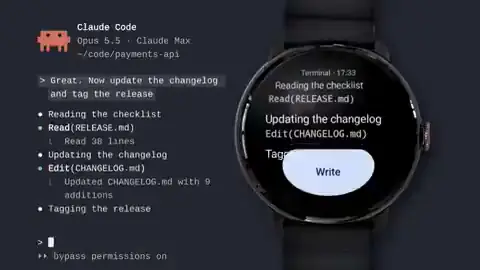
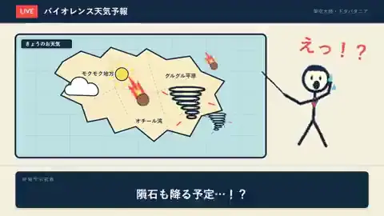

# 2026-09-27 新案例：制作输入、分工与可见证据

[English](new-cases-2026-09-27.md)

这是一组**独立增量案例**：原帖均发布于 2026-09-26 13:05 UTC（北京时间 21:05，即上次检索截止）之后，且不在 9 月 26 日冻结的 168 条深读案例中。它们**未计入**当次的 168 条案例、1,401 个不同 MP4 文件或 1,511 条候选帖。七例为有意挑选的不同制作路径，不能用于估计哪种路径更常见或成功率更高。

我们回读原作者帖子及其公开回复，取得帖子附带的 X 预览 MP4，使用 `ffprobe` 记录片长、帧率和音轨，并从每段视频均匀抽取九帧做画面检查。这里的“九帧可见”仅指预览片的抽样画面：它不能验证完整运动、声音质量、原始母版、模型调用、费用或作者的全部制作过程。下文只用每段 X 预览的一张低分辨率截图（双附件案例各一张）帮助辨认风格；点击截图可看原帖，原画面权利仍属于创作者。这里不转载视频、九帧拼图或第三方提示词全文。

## 现有作品和素材的重建、剪辑

### 手工发布片与 Opus 重建片同屏对照 — @JurgenPloeger

- [原帖](https://x.com/JurgenPloeger/status/2104131805175844923)，发表于 **2026-09-27 08:51:29 UTC**；另有作者发出的[单独重建版及修改说明](https://x.com/JurgenPloeger/status/2104132299222823272)。同屏对照 X 预览 **48.043 秒**、60 fps、含音轨；单独重建版也是 **48.043 秒**。
- **作者披露：**他把六个月前亲手制作的 [@getstream 原发布片](https://x.com/getstream_io/status/2036085833988780271)及 Figma 文件交给 Opus 5.5，要求用代码重建镜头并按音乐剪辑。作者随后明确说节奏仍偏快，自己给了几轮修改意见。
- **九帧可见：**同屏片以上下两层标注“Original made by hand”和“Remake Claude Opus 5.5”；两层出现相近的蓝色背景、标题、手机与应用界面构图。
- **未验证：**没有公开与这段重建片对应的源工程或完整会话；相近画面无法证明每个镜头都由代码重建，也不能仅凭九帧衡量转场与节奏质量。这是研究**有源参考、真实设计文件与人工节奏修改**的案例。

### 绿幕原片与剪后片成对发布 — @Gorden_Sun

| 剪辑版（附件 1） | 原始绿幕（附件 2） |
|:---:|:---:|
|  |  |

- [原帖](https://x.com/Gorden_Sun/status/2104009748874141941)，发表于 **2026-09-27 00:46:29 UTC**。同帖两个 X MP4 各 **15.104 秒**、24 fps，均含音轨。
- **作者披露：**视频 1 是 Opus 5.5 剪辑后的视频，视频 2 是 Grok 生成的原始视频；没有公开剪辑提示词或工程文件。
- **九帧可见：**第二段是绿色背景上的同一舞者；第一段保留舞者并加入舞台背景、标题字、色彩和多种图形层。两段预览片长相同。
- **未验证：**不能从九帧判定抠像、转场和音频的完成质量，也不能核实实际调用记录。此例清楚展示**已有视频作为输入，Opus 被用于后期组合**；不应称舞者画面由 Opus 从零生成。

### 真实产品素材加代码动效的混合案例 — @Fr_Sorrentino

- [原帖](https://x.com/Fr_Sorrentino/status/2103923067277733943)，发表于 **2026-09-26 19:02:02 UTC**。X 预览 **40.192 秒**、30 fps、含音轨。
- **作者披露：**为自己的开源 Wear OS 应用制作宣传片，使用 Claude Code 的 Opus 5.5、Fable 5.1 和 Remotion，加入真实手表照片与应用录屏，使用弹簧运动和抽样运动模糊；作者明确说经过迭代，并非一次提示词成片。
- **九帧可见：**手表与应用 UI、终端画面、标题卡和产品标识轮流出现，符合“真实产品素材＋动效包装”的描述。
- **未验证：**原帖未给出这支宣传片的源工程或各模型调用记录，不能把每个镜头的贡献单独归给 Opus。此例适合提醒读者记录**共同使用的模型、现有素材和人工迭代**。

## 复用工程与多工具制作

### 用开源动画底座讲个人故事 — @servasyy

- [原帖](https://x.com/servasyy/status/2104039075175182487)，发表于 **2026-09-27 02:43:01 UTC**；作者在[回复](https://x.com/servasyy/status/2104039275298001049)中链接 [ClaudeAnimationBase](https://github.com/JohnHeibel/ClaudeAnimationBase)。X 预览 **80.043 秒**、24 fps、含音轨。
- **作者披露：**给 Opus 5.5 提供自己的经历，使用上述开源底座画出带韭菜芽的黄色方块主角；称每个镜头做拼图自检、共渲染 1,920 帧，在 Mac 上耗时 22 分钟，未调用图像或视频模型。1,920 ÷ 24 = 80 秒，与预览片长相容。
- **九帧可见：**黄色方块角色跨室内、室外、游乐场和餐桌等多个场景，造型在抽样画面中延续。
- **未验证：**公开仓库是作者使用的**通用底座**，不是这支个人影片的完整工程；它不能验证作者的实际对话、无外部模型声明、自检次数或渲染耗时。此例展示开源角色与渲染工具如何成为后续故事的输入。

### 先有 Remotion 草稿，再加图片和配音 — @challenger_ND

| 人物动画（附件 1） | 简化图解（附件 2） |
|:---:|:---:|
|  |  |

- [原帖](https://x.com/challenger_ND/status/2104021764863078697)，发表于 **2026-09-27 01:34:14 UTC**。同帖两段 X 预览分别 **25.131 秒**和 **21.000 秒**，均为 30 fps；第一段有音轨，第二段未探测到音轨。
- **作者披露：**先用 Astra 做 Remotion 动画底稿，准备人物立绘与背景，再交给 Claude Code（Opus 5.5）；通过 MCP 生成表情、动作与补充背景，通过 ElevenLabs API 制作台词、音效与配乐。作者说没有使用视频生成模型；这不等于没有使用图像生成或语音模型。
- **九帧可见：**两段分别展示有角色的动画场景和较简化的地图、人物及事件示意，画面复杂度不同。
- **未验证：**帖子没有公开底稿、图像素材来源、MCP/ElevenLabs 调用记录或最终工程；不能单凭两段预览确定每个素材由哪一步生成。这是理解**现成底稿＋图像生成＋代码合成＋外部音频**分工的案例。

### 多模型动漫音乐视频与可复用插件 — @makevoid

- [原帖](https://x.com/makevoid/status/2103869704955900023)，发表于 **2026-09-26 15:30:00 UTC**；作者在[制作说明和提示词](https://x.com/makevoid/status/2103869706121970073)中列出工具，并随后公开[音乐视频插件](https://github.com/makevoid/motion-graphics-music-video-skill)。X 预览 **85.547 秒**、24 fps、含音轨。
- **作者披露：**歌曲本来已有；Opus 5.5 负责统筹 Node/p5.js 等流程，同时使用 MiniMax H3、GPT Image 2.5 Sunburst、Fal 的 Demucs 等工具生成或处理画面、嘴型及分离人声。他报出的总花费低于 30 美元。公开插件把相关流程抽成可复用工具，仓库列有这首歌的样片，但不等于公开了此帖每次生成的完整日志与素材。
- **九帧可见：**动漫角色、汽车、舞台、产品界面和大字卡交替出现；抽样画面与多段混合素材的描述相容。
- **未验证：**成本、每项服务的实际调用、声画同步及是否满足提示词的两帧嘴型检查，均没有独立收据。此例说明 Opus 可负责**策划与装配**，但不能把成片全部像素归因于 Opus。

## 数据驱动视频

### 把数值限制在数据槽里的代币短片 — @arambarnett

- [原帖](https://x.com/arambarnett/status/2104011150471917838)，发表于 **2026-09-27 00:52:03 UTC**；[作者制作说明](https://x.com/arambarnett/status/2104011475379515628)。X 预览 **20.053 秒**、30 fps、含音轨。
- **作者披露：**只给了 Opus 5.5 一个代币地址；模型取得链上数据、编排图表和旁白，再由无头浏览器逐帧录为 MP4。其产品代码据称禁止模型直接写数字，屏幕和旁白数字都从实时数据槽填入，违规就退回重做；四分钟制作、约 0.33 美元模型费用均是作者报告。
- **九帧可见：**竖版视频依次展示价格、交易额、持有人数和钱包集中度等数值卡片，页脚有数据来源与时间标注。
- **未验证：**未公开数据源快照、检查程序、完整工程或费用记录；抽帧只能证明**出现了数字和来源标注**，不能证明数值正确、实时、金融结论可靠，或每个数字真的经过数据槽。这个案例提供值得复用的**“变量与文案分离并自动拒绝硬编码数字”设计思路**，不是已审计的统计或投资资料。
