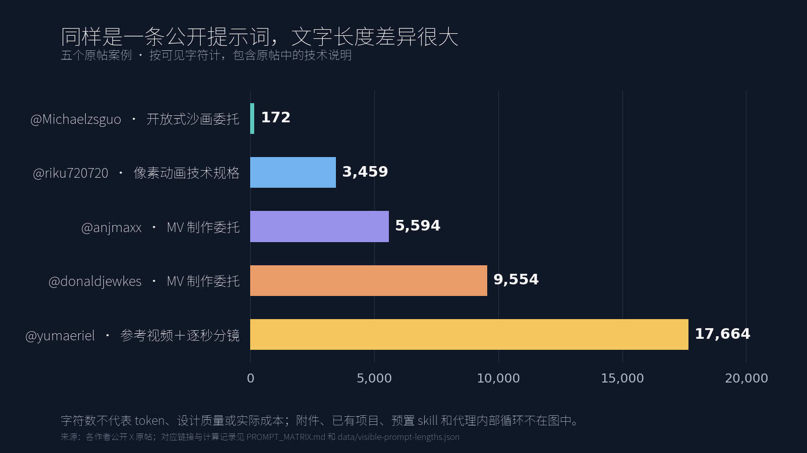

# Claude Opus 5.5 在 X 上的“视频生成”热潮：一份逐帖核查

> **首版数据截点：2026-09-25 06:22:26（北京时间）的最后一次 X 检索；首版媒体处理快照为 06:31。** 当时 43 组检索累计返回 1,463 行，去重与引用回溯后有 1,104 条候选帖、1,044 个 MP4 附件及 152 条深读案例。以下文章正文是已发布首版报告的复刻，不能与后来的目录更新数字混读。

> **仓库增量更新：** X 检索延至 2026-09-26 21:05（北京时间），文件快照整理在 21:53。共 56 条检索回执（55 次成功，1 次限流）；候选帖更新为 1,511 条，1,449 个 MP4 附件全部完成 Hypit 探测和九帧取样，SHA-256 去重后有 1,401 个文件，深读案例扩为 168 条。视觉分类器对 1,401 个文件给出 980 个“yes”、139 个“likely” Opus 相关标签；这些是分类器判断，不是逐项确认的作者或制作事实。当前计数请以[仓库首页](../README.md)和[冻结快照](../data/corpus-snapshot.json)为准；已公开的 X Article 保留原有首版截点。

## 先说最关键的一件事

[Anthropic 的 Opus 5.5 模型说明](https://platform.claude.com/docs/en/models/opus-5-5/overview)列出的输入是文字和图片、输出是文字，定位是长时间运行的编码与知识工作。因此 X 上的“Opus 5.5 做视频”，通常是**模型写程序画帧、搭建三维场景、调用视频／音频工具、或剪辑已有素材**的结果。视频文件是这些工具链的产物；不能仅凭成片外观推断模型本身原生输出了视频像素。这是模型规格与公开制作流程共同支持的判断，具体个案仍以创作者披露为准。

最容易误读的词是“一句话／one prompt”。例如 [@donaldjewkes 的热门 MV](https://x.com/donaldjewkes/status/2102801274173587569)确实称为一次提交、运行约 12 小时；其[公开完整提示词](https://x.com/donaldjewkes/status/2102801469976248500)却长约 9,500 字符，提供原视频、歌曲、代码和项目目录，要求研究视觉参考、利用图像与 Seedance 2.5 视频生成服务、考虑 ElevenLabs 音效、再用 JavaScript 覆画，并多轮检查效果。提示词证明了**要求使用哪些素材和服务**，不能单独证明执行日志里的每一步；但足以否定“只输一句短语、零素材、零工具”的传播版本。

## 怎么找、怎么验

- 主检索围绕 2026-09-22 模型发布前后至本次截点的 X 帖文；为核对引用与比较的来历，回溯纳入了少量更早原帖，当前最早为 2026-09-17 UTC，不能把它们误计成 Opus 5.5 发布后作品。用 X 已登录搜索的 Top 与 Latest，搜索模型全称、缩写、视频／动画、one shot、技术栈与中日英表达；保存查询和原始返回，避免把检索排名当作总量。
- 从 Grok 的建议中提取原帖链接，再读取原帖线程确认作者、媒体和上下文。Grok 的回答只作为找线索的入口，不直接当证据。
- 每个获得公开 MP4 地址的候选，下载文件后用 **Hypit 0.2.3** 执行 `media probe` 和九帧 `media tile`；保留时长、分辨率、音轨有无、SHA-256、失败状态及取样图。所有可取样视频的中间帧也汇成分页索引供人工扫视，重点案例再看完整九帧与原帖回复。九帧图仅能支持“取样画面长什么样”，不能证明整段流畅度、音质、事实准确性或模型使用记录。
- 本次 X 返回的 MP4 地址很多是 480×270 等预览分辨率。它们足以观察取样构图与类型，但不能据此评价作者上传的最高画质或精细纹理。首版快照的属性见下文；增量文件属性以[最新媒体概况](media-profile.zh-CN.md)为准。
- 按帖子 ID 与视频哈希去重；另分开原作者发布、转载、比较帖、宣传片、游戏／网页录屏和无关话题。未公开工程文件的“纯代码”“零修改”“耗时／费用”均记作创作者自述。
- 相同画面可能因 X 再压缩而有不同 SHA-256，因此又用九帧感知哈希生成**待人工核对**的相似候选。例如 [@addyosmani 的浏览器工作原理片](https://x.com/addyosmani/status/2103009037164110327)与[后发的转述](https://x.com/DataChaz/status/2103020750060028222)，以及 [@DotCSV 的神经网络片](https://x.com/DotCSV/status/2102737776219168939)与[后发的转述](https://x.com/SadraMajidi04/status/2103129831839867015)，都在逐格样张中显示相同镜头序列。我们把这些记为不同帖子，但不当成四个独立原创新片；感知相似表本身不能自动判定作者关系。
- 原始搜索会抓到借用 `#Opus55` 的无关视频、官方模型发布宣传、自动推广与第三方转述；它们保存在审计表里以示检索边界，却不进入“原作者视频案例”的论证。人工深读的案例另见 `data/curated-case-ledger.csv`。
- 本次采集把每次搜索的返回上限设为 50 条，且会遇到 HTTP 429。故本文是**有边界的公开样本审计，不声称抓到了 X 的字面意义上的全部帖子**。具体查询、截点和漏检风险见附录。

## 一个更准确的分类法

| 成片路径 | Opus 在其中做什么 | 能从作品中看到什么 | 代表证据与容易混淆之处 |
|---|---|---|---|
| **程序逐帧绘制** | 写 JS/Canvas/SVG/p5.js、生成时序、调用浏览器与 ffmpeg | 像素画、纸片／水墨／笔刷、图形叙事与音乐可视化；同一角色或图形元素跨镜头复用 | [@riku720720](https://x.com/riku720720/status/2102515055116063144)把 160×90 网格、配色、独立 HTML 和无外部素材都写进提示词；[@jurlycat](https://x.com/jurlycat/status/2102645793828036643)称单 HTML、后续又承认试跑及微调；[PDoomVideo 源码](https://github.com/JohnHeibel/PDoomVideo)展示 p5.brush、Chrome 逐帧绘制和 ffmpeg 合成。 |
| **代码图解／教学视频** | 组织讲稿、图解、时间轴、字幕、TTS，渲染 Manim/Remotion/Canvas | 公式、地图、信息图、板书、镜头随知识点切换 | [@LinearUncle](https://x.com/LinearUncle/status/2103128559174971663)明确要求 Manim + edge-tts；[@akokoi1](https://x.com/akokoi1/status/2102606609574941028)提供 TTS 文档／配置；[@Tz_2022](https://x.com/Tz_2022/status/2102838830285898214)发布密码与 passkey 视频，并说明代理只能核对音量和时间轴、没法亲耳试听。画面完成不等于知识和旁白已校对。 |
| **三维场景与实时图形** | 写 Three.js/WebGL、控制 Blender、Unreal 或游戏工具；设置材质／灯光／相机 | 空间、粒子、光照、镜头运动，有时是可以交互的环境 | [@superalesha](https://x.com/superalesha/status/2102779758408774104)明确是 Blender 粒子对撞场景；[@dotey](https://x.com/dotey/status/2102940980379017293)承认反复打磨并搜索免费 3D 模型。[@Acemation_](https://x.com/Acemation_/status/2103150350211354966)展示的岛屿是交互场景录屏，不能和离线短片按同一标准比较。 |
| **原片／素材改编与编辑** | 理解已有视频、图片、音轨、产品界面或代码库，并重做画面／剪辑 | 口播 B-roll、截图驱动广告、参考视频重绘、动画二次加工 | [@AxtonLiu](https://x.com/AxtonLiu/status/2102827887732932956)给了 83 秒真人口播，保留原声字幕和时长，改为线稿画面；[@freeman1266](https://x.com/freeman1266/status/2103144062467596689)给了四张截图和代码目录；[@ring_hyacinth](https://x.com/ring_hyacinth/status/2102865595675050010)复用一年前的像素短片场景。输入素材对成片具有决定性影响。 |
| **外部生成视频的策划／编排** | Opus 写脚本、分镜、提示词、选素材或调度服务；另一个模型负责生成视频片段 | 写实镜头、动画片段、角色与环境的连续镜头 | [@abxxai](https://x.com/abxxai/status/2102775755646337530)明确标出 Opus + Seedance 2.5；[@Medeo_AI](https://x.com/Medeo_AI/status/2102463091959288264)明确对比的两边都用 Seedance 2.5；[@AnduArtist](https://x.com/AnduArtist/status/2102548178646016377)用 H3 Max 旋转杯底片，再让 Opus 画杯面线条；[@KanaWorks_AI](https://x.com/KanaWorks_AI/status/2102684116525437206)把游戏代码归于 Opus、宣传片归于 Seedance/MiniMax/CapCut。不能把片段的图像生成归功于文本模型独自完成。 |
| **应用／游戏录屏** | Opus 开发交互程序，再有人或代理录屏 | UI、HUD、玩家操作、物理模拟、游戏镜头 | [@The_Alex](https://x.com/The_Alex/status/2102440678282412195)、[@BubuStd](https://x.com/BubuStd/status/2102991290568954264)、[@NiloTechInc](https://x.com/NiloTechInc/status/2102741813719138661)。这证明程序构建能力，但与“给出一个完整电影”的任务不同；Nilo 案例还披露人工制作的角色／动画／服饰资产。 |

[@masaya_1980 的捡罐比赛](https://x.com/masaya_1980/status/2103115017755500561)提供了少见的[在线演示页](https://www.kakeru-d.jp/lab/akikan/)与[制作博客](https://www.kakeru-d.jp/blog/claude-animation-akikan/)：网页源码有内联 JavaScript、罐位数据和规则／速度按钮，X 的 32 秒 MP4 是逐帧导出的展示。作者记录的流程是短句起题→静态设计稿让人确认→网页出现文字排版问题后要求修复→导出视频。它为浏览器程序路径提供了源文件佐证，虽然本次没有逐项测试网页交互；也说明“初始一句话”之后仍有人类审稿和返工。

[@hanifproduktif 的蚂蚁群落短片](https://x.com/hanifproduktif/status/2102742924148830211)提供了另一种强证据：原帖直链作者的[开源动画 skill](https://github.com/buildwithhanif/claude-animation-skill)，其中 `examples/ant-colony/film.mjs` 与 X 片的蚂蚁从草图到上色、搬叶进入地下、片尾“Every frame is code”一致；源码写明 32 秒／24fps，Hypit MP4 为 32.043 秒／24fps。[首次仓库提交](https://github.com/buildwithhanif/claude-animation-skill/commit/632bb0192ffd4aeca101a62c78e1a04c130127c1)已包含该示例，时间早于 X 帖约 1 小时 18 分。仓库还列出风格字典、角色 rig、Node Canvas 与 ffmpeg、声音脚本、静帧／连帧抽查和确定性验证。它能佐证此片确有程序绘制管线，但不等于公开了 Claude 当次会话或证明每行代码的作者。更重要的是，**一个提示词方法被封装成可复用的制作系统**，以后只看触发句会越来越难判断预置工作量。

另一个[作者 @makwired 的约 20 秒夜景动画](https://x.com/makwired/status/2103008945220567166)也直链[开源制作 skill](https://github.com/klsoen/opus-js-animations)。仓库 Shaml 示例描述的金色纸雕圆饰、夜城、阿英双语字幕和 20.4 秒长度，与 Hypit 抽到的 20.457 秒 X 片相合；[首次提交](https://github.com/klsoen/opus-js-animations/commit/49776cedf621ada03661b6615bdd09d1763730fa)已包含 Shaml 工程，仓库提交时间比 X 帖早约 19 秒。同一份 `FILM.md` 明确**音轨沿用已有宗教朗读录音**，并记录从三维试作改成二维、用户多轮要求修改散片和英文字幕。仓库规定先问音源、听音、出分镜、等人批准，再写代码与抽帧修片。可见的“代码画每帧”与“既有音频＋人类审稿”完全可以同时成立。

**片长不是制作链的证明。** [@Aadidev0 的 164 秒 Clawd 歌曲](https://x.com/Aadidev0/status/2102692569792835994)有少见的[逐步作者回复](https://x.com/Aadidev0/status/2102693243662024855)：先看现成 MV 仓库，再用 Canvas 写 39 个场景、Node.js 合成音乐、浏览器逐帧渲 3,936 帧、ffmpeg 合片。Hypit 的 X 文件时长 164.0 秒，与 3,936/24 相符；代码行数、声音及约一小时耗时仍是作者自述。另一支[@cube__lol 的 Tool 音乐长片](https://x.com/cube__lol/status/2102879729594343605)确有 833.1 秒 X MP4。除标准九帧外，我还用 Hypit 每 30 秒抽一帧，能看到抽象图形、蓝色面孔和机械场景交替出现；作者没有公开提示词、源码或歌曲输入清单，不能因片长就赋予相同的程序证据级别。

**“没有视频模型”也未必是“只有一个模型”。** [@Akash_Bang 的 AI 2027 解说](https://x.com/Akash_Bang/status/2103108964821107104)把一篇现有论文改编为约 9 分钟片，作者明确说 Gemini 生成静图和音频、Opus 写代码做动画；九帧看到插图、场景和图解，未审论文事实和完整调用记录。[@deweytn 的 Quick Elements 广告](https://x.com/deweytn/status/2102787822855893072)则把 Opus 放在 VidTL 编辑环境里，公开短委托与约 1.5 小时作者自述，25.6 秒视频展示产品模板和品牌。它们分别属于长文混合制作与现有编辑环境广告，不能因同称“一条提示词”就合成一个技术类别。

这些路径经常组合：例如教育片可以既用 Canvas 画图又接 TTS；MV 可以用已有歌曲、生成视频作底，再以代码覆画。分类时先说明**素材来自哪里、实际由谁渲染、模型控制了哪一步**，再谈外观。

从样本的可见画面与公开制作流程看，各路径的**适用性和验收风险**也不同，这是归纳判断而非对所有作品的性能排名：代码逐帧适合字体、图形、品牌动效与固定角色复用，复杂自然动作仍需逐镜检查；教育片容易组织结构，事实和朗读却要另审；三维／实时图形能做空间与光照，也要核渲染时长、资产和穿模；现有素材改编能保持产品与真人表演的连续性，必须保留原素材贡献；外部视频模型能给写实镜头，应追查分镜、挑片和模型分工；游戏／应用录屏有交互价值，不能仅凭录屏长度评价线性叙事。

同一支片至少还有七个彼此独立的记录维度，适合公开时随案例填写，而非强塞进一个“AI 视频”标签：

| 维度 | 具体要问 | 容易误读的宣传语 |
|---|---|---|
| 初始输入 | 文字以外给过论文、参考片、照片、歌曲、代码库或 skill 吗？ | “只说了一句话” |
| 视觉渲染 | Canvas／WebGL／Manim／Blender／视频模型，谁实际产出像素？ | “Opus 生成视频” |
| 音轨 | 音乐、旁白、音效分别来自代码、旧歌、TTS 还是服务？ | “全部纯代码” |
| 交互轮数 | 人类发了几轮指令、有没有中途批准设计稿？ | “one shot” |
| 内部流程 | 代理用了参考仓库、子代理、预览、自检与返工吗？ | “一键完成” |
| 交付物 | MP4、可编辑工程、网页程序、游戏录屏各是什么？ | “做了一支电影” |
| 证据 | 是九帧实测、作者披露、公开源码，还是推断？ | “已验证零素材／零修改” |

“写实外观就是视频生成模型”也不成立。[@Aurelien_Gz 公开的 Clearwater](https://x.com/Aurelien_Gz/status/2102786378282987591)看起来像实拍浅水，但[源码](https://github.com/Aureliengmz/clearwater)展示的是实时 WebGL2 波浪、折射焦散和着色器，另有内嵌的生成纹理；X 上的 MP4 是交互图形的录屏。外观只是线索，公开工程文件能把渲染路径说清。

新收的[@AxtonLiu 鹈鹕骑车剧场版](https://x.com/AxtonLiu/status/2103119648271290566)在夕阳栈桥上呈现近似摄影的三维光感；作者说 Opus 写了 GPU 光线步进渲染器，不借外部模型、贴图或音频，1140 帧各采样 40 次。X MP4 实测 38.059 秒／30 fps，与 1140 帧的时长一致，但未见源码，不能据此核验光线步进实现、采样数或绝对零素材。它和 Clearwater 一起表明，**“看起来像扩散视频”与“实际由代码渲染”可以并存**，但每个案例的代码证据强弱不同。

外部依赖也不只有视频模型。[@manaimovie](https://x.com/manaimovie/status/2103138089790996843)明确说明短片是 Tripo 生成／辅助的三维角色与 Opus 操作 Blender 的组合，而非视频模型直接出画面；作者没有亲手操作 Blender，但外部 3D 资产仍是制作链的一环。

[@zdkiel_labs 的单图建筑爆炸图](https://x.com/zdkiel_labs/status/2102722754172850310)强调了资产和对话的另一种关系：用户给一张 AI 效果图，作者[随后披露](https://x.com/zdkiel_labs/status/2102724195549659613) Opus 先向人提六个问题，再经 Higgsfield Blender bridge/MCP 做可编辑场景，估相机角点、拆 272 个对象、修碰撞轨迹、估材料用量。13.7 秒视频可见建筑爆开与合拢，但对象数量、误差和零相交都是作者自报。用户虽“只给一张图”，依然经历了六个回答；零 Higgsfield credits 也不等于零 Claude 订阅用量。

[@koldo2k 的无限放大拼贴](https://x.com/koldo2k/status/2103129343253778767)外观接近模型生成的写实拼贴，作者的[完整公开提示词](https://x.com/koldo2k/status/2103129347791986942)也明确了分工：Magnific MCP 统筹 Seedream 5 Pro 风景、GPT 2.5 透明剪纸、Kling 2.5 人物／鲸鱼动画、Lyria 3 音乐；Opus 负责景别、门户转场、深度图视差和导出要求。X 的 MP4 实测约 20.1 秒，吻合提示词的 20 秒目标，但 X 预览无法证明 1080p 母版或无缝循环。[作者另称](https://x.com/koldo2k/status/2103155960688627834)用了 1500 credits，这个口径未核实。此例比从画面猜渲染器更有力：**提示词直接写出了外部视觉模型和音乐模型的角色**。

[@OriSilver 的分屏作品](https://x.com/OriSilver/status/2102817977812824335)进一步展示三层参考：已有视频提供镜头语言，Opus/Blender 重建对应的低模机位与走位，再把草模送给 Seedance 2.5 制作最终画面。X 上 27.6 秒方形合辑的上半是真实感人物，下半是匹配的低模角色；这个直接可见的配对，与创作者文字一起支持“Blender 作控制草图、Seedance 出最终镜头”的判断。作者另称生成过约 30 秒的草模 MP4，那是不同于公开合辑的母版时长，不能从 X 文件独立验出。

自己的产品视频也值得用同一标准交代输入。[页读／Thusfar 帖串](https://x.com/WangYeruo/status/2103108551799632050)有核心理念、功能、技术、竖版预告四主题，各附中英两版；我们对**八个独立 X MP4 附件**均做了 Hypit 探测与九帧取样。作者[公开的制作说明](https://x.com/WangYeruo/status/2103110282444771733)称 Opus 5.5 读取已有应用代码库，以 Remotion 写画面、转场、配乐和音效，Gemini 3.8 Flash TTS 做旁白；返工三四轮，用掉 $20/月订阅周额度的 22%。既有代码库与产品内容是输入，旁白来自外部服务；工程与额度统计尚未独立审计。X 的八个预览片时长为 15.5–94.2 秒，六个横屏预览是 480×270、两条竖屏预览是 320×568；这只是 X 可获取附件的属性，并不代表上传母版的画质。

[@ring_hyacinth 的中秋拼贴片](https://x.com/ring_hyacinth/status/2102986085328716066)把素材分工说得很具体：作者提供脚本和音乐，Opus 用 p5.js/p5.brush 写逐帧动画，Nano Banana Pro 生成背景底稿与纸张材质，Node.js 合成音效。[@NoFollowers2023 的 Bellard MV](https://x.com/NoFollowers2023/status/2102787420399825023)则把画面、音乐和歌词分别归于 Opus/p5.js、Google Lyria 3.5 与 Grok 4.7。两例都把“代码画帧”和“外部模型提供美术或声音”组合起来，说明不能只按画面的绘制工具归纳整片的生成过程。

[@leodev 的 Social SDK 发布片](https://x.com/leodev/status/2102781872107659270)根帖只介绍产品；[随后引用自己的视频写出的七点经验](https://x.com/leodev/status/2102897952587133299)才交代了真实协作条件：先试 Remotion 后转 HyperFrames，Opus 5.5 主做、Fable 5.1 协助难段；人类自己指定每段内容，提供产品代码库、动画组件库、落地页和品牌系统，并反复调整。九帧样张可见 56.4 秒深色产品广告，不能独立核对后端工具调用。这个案例尤其说明：**原视频帖不讲流程时，应沿同作者的后续说明追查**。

一位从业者还公开了[同一分镜的三种制作结果](https://x.com/throughiris_/status/2102911229937529201)：MiniMax H3、GPT-6 Astra 控制 After Effects、Opus 5.5 控制 After Effects。Hypit 分别取样了三条公开 MP4；[Opus 版本的作者回复](https://x.com/throughiris_/status/2102911234526048706)说做了 3–4 轮，并且**沿用 GPT 那轮已拆好的图层底稿**。因此这是很好的工作流比较，却不是三个模型从同一空白起点、同一预算独立竞赛的证据。写“Opus+AE 做出了这版片”可以，写“零素材全自动生成”不准确。

最终时间窗又补出两种编辑工作。[@gregpr07 的 18 秒口播广告](https://x.com/gregpr07/status/2102984873351037161)据作者说输入了同一句话的 13 条真人 take，由 Opus＋video-use 读转写、选片、调色、改字幕；九帧确实出现候选镜头网格与真人成片，但无法核验原素材数、两分钟耗时和 0.90 美元费用。[@araminta_k 的 24.7 秒线稿预览](https://x.com/araminta_k/status/2103244081388503196)则自述在 After Effects 里让代理处理 x-sheet 曝光节奏与分层合成，再由人指导动作，后续尚待上色。它们分别是**选择已有表演**和**辅助未完成的动画工序**，不应笼统写为模型从零完成电影。

## 原帖揭示的提示词类型

1. **开放式创意委托。** [@Michaelzsguo](https://x.com/Michaelzsguo/status/2102592355165782312)给出美国历史沙画片的时长、语气和音效方向，其他制作选择交给代理；[@deedydas](https://x.com/deedydas/status/2102787937482252537)要求做推理初创公司广告。短提示词带来更高的代理自由度，也降低结果可复现性。
2. **严格的制作规格。** [@riku720720](https://x.com/riku720720/status/2102515058010132554)指定一个 HTML、Canvas、160×90 整数像素网格、固定色板和禁止外部资源；[@LCSlates](https://x.com/LCSlates/status/2102503028859211905)指定 WebGL2、时长、画幅、材质运动及故事节奏。所谓“单提示词”也可能是一份详尽设计文档。
3. **从参考片／素材出发。** [@AxtonLiu](https://x.com/AxtonLiu/status/2102827887732932956)提供原口播；[@dhruvalgolakiya](https://x.com/dhruvalgolakiya/status/2102733714845491558)承认三次提示、另一个视频作参考、6–7 个子代理和 ElevenLabs；[@donaldjewkes](https://x.com/donaldjewkes/status/2102801469976248500)的长提示词提供 MP4、歌曲、源代码与若干服务的使用说明。其效果不应拿来代表零素材起步。
   甚至很短的“one shot”也有隐藏输入：[@cherry_mx_reds 的提示词截图](https://x.com/cherry_mx_reds/status/2102493305992880314)引用了上传的角色图片，要求在磁盘上找音频采样用于 30 秒动画。成片的输入应按实际素材清单描述，而非按提示词字数描述。
4. **明确的工具链交接。** [@LinearUncle](https://x.com/LinearUncle/status/2103128559174971663)点名 Manim／edge-tts；[@hyuki](https://x.com/hyuki/status/2102899830951731601)把 Opus 制作的无声视频交给另一模型配旁白；[@aicreataro](https://x.com/aicreataro/status/2103121759096668418)把 MiniMax 原视频交给 Opus 控制 Blender 做立方体景深处理。
5. **循环试片和修订。** [@LCSlates](https://x.com/LCSlates/status/2102503030469833168)记载逐帧修改；[@jurlycat](https://x.com/jurlycat/status/2102990860342440168)说自己运行并微调了页面；[@Yakinik](https://x.com/Yakinik/status/2102907094123037079)之后加入节奏调整和流程技能。一次启动指令并不排斥代理内部的大量试错，也不排斥后续人工修改。
   [@akokoi1 的一分钟打斗片](https://x.com/akokoi1/status/2103149275945517546)尤其清楚：作者[补充的三步流程](https://x.com/akokoi1/status/2103149539880562718)先让 Three.js 人物建模并调到满意，再用该模型做 60 秒战斗，最后配音效导出。根帖只看成片和代码行数，会漏掉前面的造型选择。

   [@pivi___ 详细披露的 Dictus 广告流程](https://x.com/pivi___/status/2103110409397952580)更像小型制作间：代理先下载另一位作者的参考片、用 ffmpeg 拆成画面板，提取产品仓库的 logo／颜色／文案，写六场 Remotion，再每场抽 4–7 个关键帧做检查网格，识别并修正重复人物和错位气泡，最后用 Node 脚本生成同步音效。作者明说后来才接触 Anidoodle，**本片没有用它**。这里的“一次会话”包含参考分析、工程资产、渲染、自检和修订。

   [@Voxyz_ai 的引力透镜实验室](https://x.com/Voxyz_ai/status/2103117246860345550)把“第一次只给一条提示”与“最终版本”之间的差别说得更细：首版之后自动跑三轮，每轮两名审查代理给问题标优先级、一名修改；还做备份、截图检查和回滚。作者给出 5 小时 28 分与约 90 美元 API 等价的自述。这是**交互程序录屏**，不是线性电影；同一条提示词触发的迭代机制，仍然会影响最终质量和成本。

   另一种长时间自主工作是“让模型给自己的场景打分，再持续修改”：[@MengTo 的三维帆船](https://x.com/MengTo/status/2103122947133309311)就是给船体、水面、建筑等分别打分，目标是 8/10，并表示人仍需适时校准方向。这里的 8/10 是工作流中的**模型自评分数**，不是第三方验证的画质标准。

同样写着“一个 prompt”，原帖里公开的文字跨度极大：[沙画历史片](https://x.com/Michaelzsguo/status/2102593579604377636)的英文委托约 172 个字符；[像素跑酷片](https://x.com/riku720720/status/2102515058010132554)的日文规格贴约 3,459 个字符；[12 小时 MV 的委托](https://x.com/donaldjewkes/status/2102801469976248500)约 9,554 个字符并引用现有资产。这里按帖子文本计字符，不能直接推断实际思考量或成片质量，但足以说明“单轮输入”的信息量没有固定尺度。

一个相反端点是[@ishuagra02 的动漫式对战预告](https://x.com/ishuagra02/status/2103247844542922825)：[作者回复的完整人类提示](https://x.com/ishuagra02/status/2103247960272433307)确实较短，只交代角色、故事动感、动漫风格及声画效果。Hypit 得到 100.8 秒 MP4，九帧见战斗、标题和卡通结尾；作者称代理下载字体、用 JavaScript 画帧并做音轨，耗 1.5 小时和 $28 API 用量，这些制作与账单细节未见源码核对。**短提示词也能有长成片**，但一个短输入不能让隐藏执行步骤自动可见。另一例 [@jake11moran 的 `/session-story`](https://x.com/jake11moran/status/2103247490237825416)只用短触发词启动预置 skill，据作者说读取本地 Claude Code 会话史并通过 HyperFrames 动画化；52.7 秒卡通片可见，预置系统和个人消息本身却是输入。

新发现的一端更极端：[@yumaeriel 公开的 30 秒手绘片提示词](https://x.com/yumaeriel/status/2103053172235264150)约 **17,664 个英文字符**，把“随附的视频”设成严格视觉参考，逐条规定刷痕的形状和方向、蓝橙色域、12–15 fps 的笔触更新、逐秒分镜和不许出现的矢量／粒子视觉。Hypit 取得的[成片](https://x.com/yumaeriel/status/2103053166006657284)正好 30 秒，九帧能看到规定的光束、笔触和场景顺序；参考原片与代码都未公开，所以不能从取样判断它是否真的按 p5.js 实现或与参考片逐帧一致。另一端的[@rainwishyt 光合作用片](https://x.com/rainwishyt/status/2102605921025462283)只有简短的儿童教学委托，作者随后称代理自行选用 HyperFrames、Kokoro TTS、字体和 ffmpeg。这里的差别是**设计约束给谁写、由谁做工具选择**，不只是字数。

[@leo_xiaolei 的中文参考片提示词](https://x.com/leo_xiaolei/status/2102724347446305104)约 4,766 个字符，把橙色角色、神经网络、棱镜、向日葵、星系、黑洞和地球的逐段时间、形变方式与技术栈都写进单次提交。Hypit 得到约 28 秒的 X 片段，九帧可见该场景顺序；未见参考片原文件和工程。这个案例强调了另一个维度：**“一次提交”可以承载完整分镜与参考视频**，不能仅按提交次数讨论模型独立创意量。

日语样本里也有清楚的对照：[@onofumi_AI 的猫与星星](https://x.com/onofumi_AI/status/2102535945333657960)称 JS 同时生成画面和声音，没有外部图片／音频；[@so_ainsight 的纸张拼贴解说](https://x.com/so_ainsight/status/2103117547776163845)却[在公开任务中](https://x.com/so_ainsight/status/2103119227192225926)允许 gpt-image-2.5 与 Gemini TTS，作者称实际用了 11 张生成静图、四段配音和逐帧 HTML/JS 动画。可见画风相近，**输入美术与音频链仍要分别核实**。[@ctgptlb](https://x.com/ctgptlb/status/2102726428991373480)还明说一分多钟代码短片用了六条人类指令，不属于单轮案例。

“几轮”也要看工作区起点。[@aj_dev_smith 的三分多钟说唱 MV](https://x.com/aj_dev_smith/status/2102803889183736141)被作者描述为 Opus 写 JavaScript 同时做画面和声音；[随后回复](https://x.com/aj_dev_smith/status/2102888015903474051)明确说歌曲和视频各用一条提示词，约两小时、一个 Claude Code 会话，并借用了此前 EDM／pop-punk 项目的基础。这支片的九帧样张能看到角色与歌词的连续视觉设计，但不能替代音乐试听或代码审计。[@joaoli13 的上下文窗口图解](https://x.com/joaoli13/status/2102805381542220038)则把“先用 JavaScript 做动画”和“再导出 MP4”公开为两条指令，说明编码交接本身也可能占一轮。

[@twoclipping 的 Hooklab 广告提示词](https://x.com/twoclipping/status/2102554209166000267)把素材需求写得更明白：先索取 10–20 段自有实拍、产品 UI、授权音乐，再规定十小节逐拍分镜、ffmpeg 拆帧、HTML／Playwright 渲染、音效峰值对齐和至少 20 帧预检。X MP4 20.1 秒，九帧可见真人素材、界面、数字与品牌镜头；“整支视频是代码”应理解为程序合成而非零现成图像素材，实际素材授权和代码未独立审核。

[@yaakuups 的土耳其语提示词图片](https://x.com/yaakuups/status/2103084414636892635)则说明字数之外还有**验收约束**：孩子找到遗失物主人，无对白字幕，要有情绪高潮，不能用几件物品做幻灯片。约 138 秒 X 视频呈现雪夜、孩子、红手套和列车人物；作者称没有第二条修订提示，但仍没有公开内部渲染与审片日志。

提示词本身也会传播。[@anjmaxx 的 20 秒 MV](https://x.com/anjmaxx/status/2103173729656459455)称一次提交，[公开的完整提示词](https://x.com/anjmaxx/status/2103174007319413155)却长约 5,594 字符，要求参考图、角色表、歌词动效、可选 Seedance 底片和多次审片；Hypit 九帧中能看到两名像素角色与拼贴字体。把这份公开文字与较早的 [@donaldjewkes 提示词](https://x.com/donaldjewkes/status/2102801469976248500)逐词比较，后者覆盖前者 **87.0% 的不同五连词片段**（英文字母转小写、忽略标点；[可复算指标](../data/prompt-overlap.json)）。这是措辞高度重合的事实，不足以断言作者之间的直接借用关系，也不能说明实际调用了哪些服务。它提示了另一种解释：公开的长提示词正在成为可复用的制作配方。

更直接的传播证据来自[@pleometric 的后续 MV](https://x.com/pleometric/status/2103082510607610023)：作者公开说自己受到前述作品启发，沿用了 Donald 所描述的一般工作流；成片样张可见另一套游戏／动漫视觉设计。这个承认说明**方法在流转**，但作者没有公开完整提示词和调用日志，不能据此认定文字逐段复制或某个特定服务实际参与。

一个长视频例子能看出这些条件如何叠加：[@0x0funky](https://x.com/0x0funky/status/2102736587708854585)的六分钟教学片被称为一次生成；作者在回复中补充，课程内容已经整理好，画面由 Remotion 与 React/SVG/HTML/CSS 构成，配音用本地 CosyVoice，制作约 45 分钟。这里的“one shot”描述的是提问轮数，制作仍依赖已有知识材料与成熟工具链。

[@ng169onX 的 VAE 数学片](https://x.com/ng169onX/status/2103183904563998809)提供了更复杂的教育链：作者称单条简短任务后，代理用 Manim 作动画、实际训练 MNIST 模型、用 MLX 上的 Qwen3-TTS 克隆人声并配原创音乐。X MP4 实测约五分半，九帧确实有多个 VAE 公式、图解和字幕，但训练记录、语音授权、知识准确性与声音质量都不能由这些样张验证。这是“成片可见”与“教学／实验可信”之间必须保留的边界。

新增两条教育片把“提示轮数”和“事实验收”拆得更清楚：[@Bishal_Ramdam1 的赛艇教程](https://x.com/Bishal_Ramdam1/status/2103192634395361596)明确分两条提示词做画面与声音，60.1 秒片可见动作图解，但划船动作是否正确、声音是否真由代码合成仍未审；[@eztati 的 MED13 疾病故事](https://x.com/eztati/status/2103202431224119500)把基金会网站转成 162.0 秒身体—细胞—DNA 动画，九帧不能验证医学内容。尤其涉及疾病，发布者需要另外做专业事实核查。

更长的[@N8Programs 约十分钟动画](https://x.com/N8Programs/status/2103154189064876406)在根帖明确给出[源文本](https://cyborgism.wiki/hypha/gpt-4_gorm_fluid)：一篇循环、重复的 GPT 寓言。九帧样张可见角色与黑板文字，但提示词、工程和完整配音未公开。因此它首先是**长篇现成文本的视听改编**，不能以片长推断十分钟故事完全由一次即兴提示创作。

有时短提示词连现有资产都不需要逐一写出。[@0xpai_eth 的通胀科普](https://x.com/0xpai_eth/status/2103166575071330778)只给了主题、线稿风格、语气和音乐方向；作者说代理自己翻查本地项目，找到作者的声音、字幕规范、署名及既有《小岛经济学》系列，然后生成视频和封面。九帧样张能看到统一的课程角色与版式；具体文件访问仍是作者自述。这个例子提醒读者：**项目目录也是输入**。

[@shribuilds 的一行 Wrapscribe 广告委托](https://x.com/shribuilds/status/2102827288190689364)显式要求先检查现有项目以了解功能，41 秒 X 视频呈现会议记录、语音编辑和翻译界面。[@yangfei33113 的雨夜](https://x.com/yangfei33113/status/2102611841122017632)则据作者说是先找真实街景照片，再用代码叠雨、倒影、光影和声音，未用视频模型。**产品工程和街景照片仍是重要输入**；“不用视频模型”不等于“没有外部图像素材”。

晚一轮 Latest 搜索补出几种“短句＋前置工作”的跨语言案例。[@oscarmartin 的西语 SEO/GEO 解说](https://x.com/oscarmartin/status/2102731669853573582)作者明列三条简单指令，还承认有另一视频作灵感；32.7 秒片里是搜索结果与 AI 回答对比。[@elianiva_ 的黑白日文动效](https://x.com/elianiva_/status/2103003425915195750)前四秒是作者多年前亲手写的旧作，Opus 补完后又与人往返数轮，26.1 秒 X 片的美术基调明显延续既有黑白设计。[@Luchigatica 的球员推荐短片](https://x.com/Luchigatica/status/2102853289259729328)据作者说由一条触发词启动：从原 YouTube 解说转写找五名球员，交叉已有数据，再合成照片和队徽；39.2 秒片可见真人照片与统计卡，抽取准确性和授权未审。这三例不能只按“prompt 数”排序自动化程度。

还有更系统的预置环境。[@Lucas_IA_ 的广告制作线程](https://x.com/Lucas_IA_/status/2103152093733253544)先描述一个未公开全文的付费 skill：内含画图引擎、脚本、声音时间轴、检查和渲染规则；之后[实际触发句](https://x.com/Lucas_IA_/status/2103152108224573507)只需品牌与预写脚本。作者列出的链条是 JavaScript 逐帧画、HyperFrames 转 MP4、ElevenLabs 配音、Whisper 逐字对齐、ffmpeg 混音，Suno 可选。这样的视频没有付视频模型按秒生成的费用，也仍有 Claude 和语音等成本；“一句话”只是启动一套早已搭好的制作系统。与之相反，[@minosdevs 的巴黎夜景](https://x.com/minosdevs/status/2103112948478570675)在公开提示词里写得非常细，要求 240 秒确定性循环与 1080p/60fps 导出，但 X 上可取得的 MP4 只有约 6 秒；**提示词里的目标不是交付验收结果**。

## 可复用的实验提示词骨架

以下是从原帖常见约束提炼的**新模板**，并非复制某位作者的原文；实际运行时应先选定有权使用的素材与工具：

> 为〔受众〕制作一段〔时长〕、〔画幅〕的〔主题〕视频。先写三幕或逐镜分镜：每镜说明画面、字幕、声音和转场。画面用〔Canvas/SVG/Manim/Three.js/Blender/指定视频模型〕制作；外部素材仅限〔清单〕。请明确哪些镜头需要已有素材，哪些由代码生成，哪些交给外部模型。先做 5 秒样片，检查文字、叙事和声音，再完成整片。导出 MP4，同时交付源文件、素材与服务使用清单、耗时与实际费用记录。最后抽查开头、中段、结尾以及所有字幕／旁白对齐；不能验证的内容单独列出。

这份骨架的价值在于**把隐含制作条件写明**：画幅／时长、素材和版权边界、渲染器、配音、验收方法及可追溯文件。公开作品时，最好随视频公布至少这些事实，而不是只说“一句话生成”。

## 公开时值得讲清的几个反直觉观察

- **最高传播的例子不等于最简单的例子。** 12 小时 MV 的完整提示词是一个有资产、服务和检查流程的制作委托。[原帖](https://x.com/donaldjewkes/status/2102801469976248500)
- **“代码画每帧”与“没有人类素材”不是同义。** [PDoomVideo](https://github.com/JohnHeibel/PDoomVideo)公开代码、九章分镜和渲染流程，同时也说明歌曲早已存在；[@AxtonLiu](https://x.com/AxtonLiu/status/2102827887732932956)则保留真人原声。
- **长片的难点是质量控制。** 短广告、科普长片、游戏录屏在制作及验收上不是一个量级。九帧取样能看结构，无法证实知识没有错误、声音悦耳或连续镜头稳定；[@Tz_2022](https://x.com/Tz_2022/status/2102838830285898214)的音频说明正好暴露这一边界。
- **成本说法不能横向直接排名。** [@deedydas](https://x.com/deedydas/status/2102787937482252537)自述约 1 分钟／2 美元；[@dhruvalgolakiya](https://x.com/dhruvalgolakiya/status/2102733714845491558)自述 2 小时／约 68 美元 API 等价；[@Acemation_](https://x.com/Acemation_/status/2103150350211354966)自述大型交互世界消耗约 1,874 美元等价 token、约 8 小时墙上时间。套餐折算、缓存、子代理、第三方服务与作品类型均不同。
- **同一任务的模型对照也要拆指标。** [@Stefan_3D_AI 的 Blender 对照](https://x.com/Stefan_3D_AI/status/2102471841046786153)给了共用的 10 秒程序化任务，作者称 Opus 花 35 分钟／19.96 万输出 token／约 13.3 美元 API 等价，Astra 花 28 分钟／5.66 万输出 token／约 14.5 美元 API 等价。Hypit 看到的是 46.3 秒对照合辑，含最终镜头与建造缩时。单个例子的 token、时间和费用口径不同；不能只用其中一项宣称通用胜负。
- **单 token 便宜不保证单任务省钱。** [@leogao25 的同题物理机关对照](https://x.com/leogao25/status/2102544078927741369)自报 Opus 62 分钟／$14.28，Astra 11 分钟／$2.20，同时声称 Opus 每 token 单价低。Hypit 取得的是 16.9 秒的分屏比较片与费用表；未审账单和独立运行日志。这与上一个例子的费用方向不同，更说明要连同总调用量、耗时和任务成果一起看。
- **公开的质量问题能帮助界定能力。** [@ExistentialEnso 的五分多钟 MV](https://x.com/ExistentialEnso/status/2102599211212554616)以此前用 Suno 做的歌曲为输入，作者主动指出后段字幕错位；[@bradmillscan](https://x.com/bradmillscan/status/2103108967194833310)让代理读取自己的 wiki 后做三分多钟 MV，又要求两轮修订以改善人物形态和画面。九帧能看到两个作品的场景变化，但不能独立测量字幕同步或还原每轮修改。可靠的公开表述应同时记录输入、失败和返工。
- **有 MP4 不等于创作者认为成片完成。** [@pradeepXkapoor 的 90 秒水墨武士片](https://x.com/pradeepXkapoor/status/2102782449478668290)明确标作“未完成”：Three.js/WebGPU 和程序化音效已经输出片长，但作者决定不再消耗 token 继续修。九帧可见完整风格与镜头，也不能反驳作者对交付质量的判断。
- **后期编辑是单独的能力。** [@aicreataro](https://x.com/aicreataro/status/2102656273112326609)公开了 MiniMax H3 原片与 Opus 控制 After Effects 调节剪辑节奏、添加效果的分屏示例；还留有可继续修改的 `.aep` 工程。它的价值在可编辑的后期流程，原始视频像素仍由 MiniMax 生成。
- **巨大的 token 数字也需要拆开。** [@JustinPerea](https://x.com/JustinPerea/status/2102893186330841502)发布约 43 秒的单 HTML demoscene，标称处理 6.97 亿 token；[作者随后说明](https://x.com/JustinPerea/status/2103118512315097398)其中 98.1% 是缓存读取、输出为 56.6 万 token，且在 5 小时会话限制后发送过“继续”。这个数字不能直接乘模型输出单价，也不能理解为一次连续、无上下文的短指令。
  [@RyanSael 的数据中心模拟器](https://x.com/RyanSael/status/2102740041621762166)还披露了另一个口径：自述 202 次调用／1.19 亿输入 token 中 99% 命中缓存，账面约 38.99 美元 API 等价；若没有缓存的 486 美元只是反事实估算。作者还说代理翻查了以前的项目以延续风格，因此“一条指令”与“一个空白上下文的调用”更不能画等号。

## 附录：公开数据与检查边界

- [168 条深读案例表](../data/cases.csv)含原帖链接、主分类、作者披露、Hypit 观察与局限；[字段说明](case-index-guide.zh-CN.md)解释每列含义。完整检索原始返回、第三方 MP4 和九帧样张保留在内部审计档案，不随本仓库分发。
- [调查方法](methodology.zh-CN.md)、[56 条查询回执](search-coverage.zh-CN.md)和[最新 MP4 文件属性](media-profile.zh-CN.md)说明收集、去重与证据边界。[冻结快照](../data/corpus-snapshot.json)给出当前计数。
- 最后一次 Latest 检索于 2026-09-24 22:22:26 UTC 返回 50 条，包含一部分此前未进入样本的当日新帖。每次最多返回 50 条，采集期间曾遇 HTTP 429；搜索排序、账号可见性、语言与关键词都会造成漏检。**本版不声称覆盖 X 全站或统计了独立原创作品数。**
