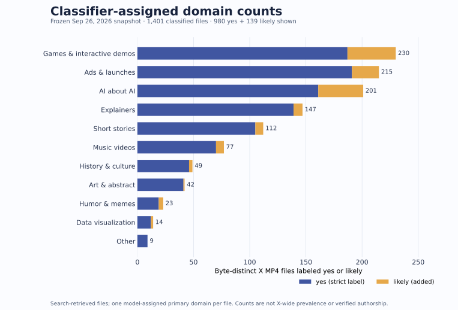
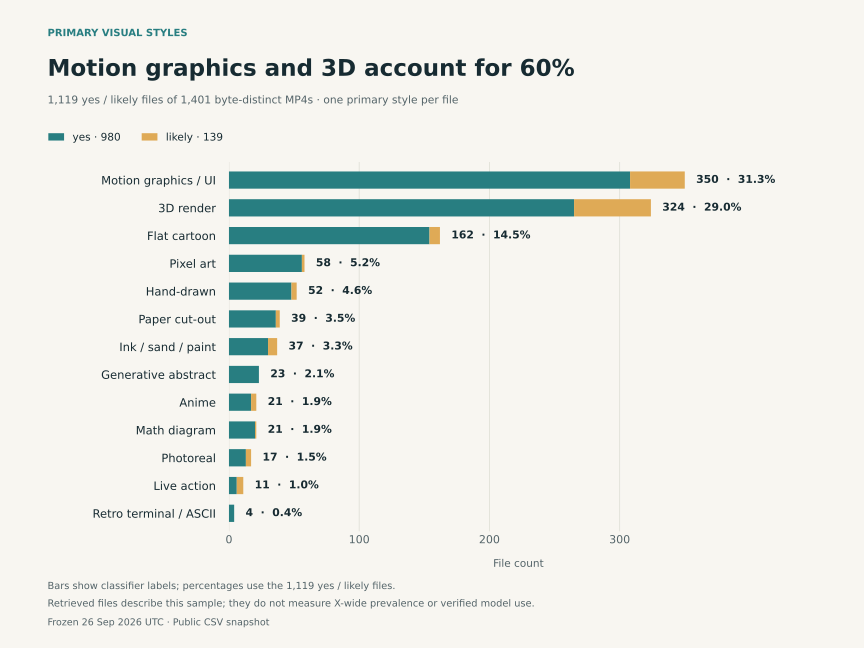
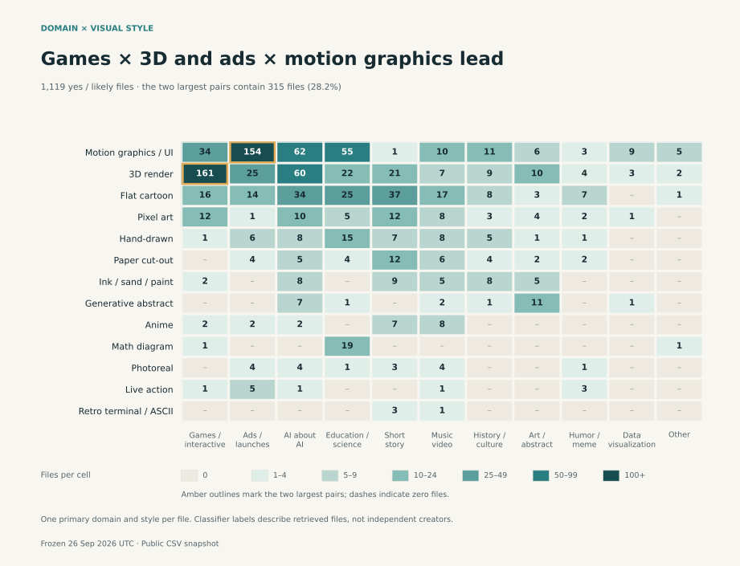
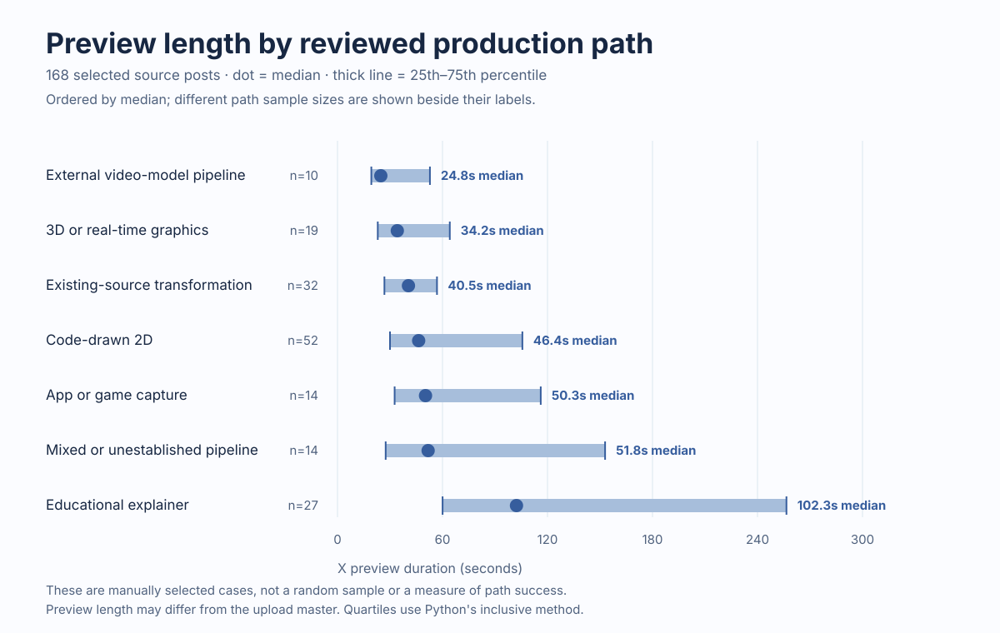
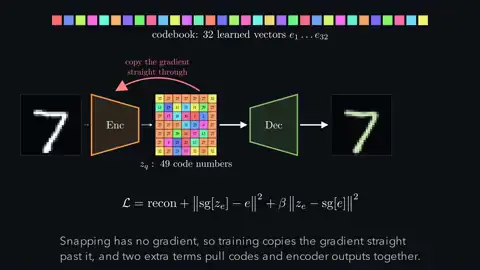
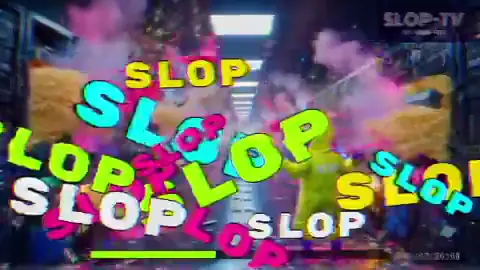
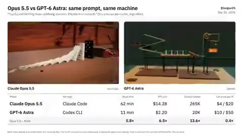

# 统计快照：单位、分母与敏感性

[English](statistics.md) · 此页由 [`scripts/generate_statistics.py`](../scripts/generate_statistics.py) 从公开 CSV 和[冻结快照](../data/corpus-snapshot.json)生成。运行 `python3 scripts/generate_statistics.py --check` 可检查页面是否与数据一致。

数据截点：2026-09-26T13:53:20.929497+00:00。以下是**检索样本的描述统计**，不是 X 全站作品普查、质量评分或模型成功率。

图表由 [`scripts/generate_stat_charts.py`](../scripts/generate_stat_charts.py) 从相同公开数据生成；运行 `python3 scripts/generate_stat_charts.py --check` 可检查图表是否过期。

## 先分清统计单位

| 数字 | 单位 | 公开文件能否复算 |
|---|---|---|
| 56；其中成功或命中缓存 55 | 保存的检索查询 | 仅有汇总和[查询覆盖说明](search-coverage.zh-CN.md)，原始回执未公开。查询成功不等于覆盖全部作品。 |
| 1,511 | 去重候选帖子 | 仅由冻结快照记录；候选原始表未公开。 |
| 1,419 | 有 MP4 的候选帖子 | 仅由冻结快照记录。 |
| 1,449 | 取得并完成九帧抽样的 MP4 附件 | 仅由冻结快照记录；一个帖子可以有多个附件。 |
| 1,401 | 声称按 SHA-256 去重的 MP4 文件 | [分类 CSV](../data/domain-style.csv)可核对有 1,401 行；未公开文件哈希或逐附件 ID，无法独立复算去重。 |
| 168 | 人工整理的原帖案例 | [案例 CSV](../data/cases.csv)可核对 168 个唯一原帖 ID，均标为九帧抽样完成。 |

冻结快照还报告 39 个完全相同文件组、48 个组内额外附件；1,401 + 48 = 1,449。这项算术可核对，文件哈希本身不能从公开 CSV 重算。

## 分类阈值会改变第一名

视觉分类器根据帖文和九帧，为每个文件给出一个 `opus_made` 标签、一个主领域和一个主画风。这是模型判断，不是作者身份、模型调用或完整成片的独立验证。

| 纳入口径 | 文件分母 | 游戏／交互 | 广告／发布片 | 第一名 |
|---|---:|---:|---:|---|
| 只计 `yes` | 980 | 187 (19.1%) | 191 (19.5%) | 广告／发布片 |
| 计 `yes` 和 `likely` | 1,119 | 230 (20.6%) | 215 (19.2%) | 游戏／交互 |

全部 1,401 个分类文件中：`yes` 980，`likely` 139，`no` 282。严格与宽松口径分别占本次分类文件的 70.0% 和 79.9%；**这两个百分数不是实际使用 Opus 的上下界**。第一名从广告变成游戏，表明领域排名对是否纳入 `likely` 敏感。主画风前两名在两种口径下仍是动态图形／界面（308 → 350）与三维渲染（265 → 324）。

下面的画风图同样以**去重文件**为单位，将 `yes` 和新增的 `likely` 分段显示。

## 领域 × 主画风：前十个组合

下表只统计 `yes`＋`likely` 的 1,119 个**文件**；每个文件只进入一个组合。百分比以该口径文件数为分母，表中仅列前十项，不能将十项相加当作总数。

| 领域 | 主画风 | 文件数 | 占该口径 |
|---|---|---:|---:|
| 游戏／交互 | 三维渲染 | 161 | 14.4% |
| 广告／发布片 | 动态图形／界面 | 154 | 13.8% |
| AI 讲 AI | 动态图形／界面 | 62 | 5.5% |
| AI 讲 AI | 三维渲染 | 60 | 5.4% |
| 科普／教育 | 动态图形／界面 | 55 | 4.9% |
| 故事短片 | 扁平卡通 | 37 | 3.3% |
| AI 讲 AI | 扁平卡通 | 34 | 3.0% |
| 游戏／交互 | 动态图形／界面 | 34 | 3.0% |
| 科普／教育 | 扁平卡通 | 25 | 2.2% |
| 广告／发布片 | 三维渲染 | 25 | 2.2% |

分类 CSV 对应 1,371 个不同原帖 ID，而不是 1,401 个不同帖子。其中 23 帖有多个分类文件，共 53 行；7 帖的多个附件甚至有不同 `opus_made` 标签。可选的第二画风 `style2` 有 442 行留空，本表不使用它。同一作品经重新编码仍可能保留为多个不同文件，因此这些行不能当作独立创作者。

## 人工案例的片长分布

片长来自可取得的 X 预览 MP4，不保证是上传母版；少数旧观察文字与数值列的片长尚未逐项核对。下表用中位数和第 25–75 百分位描述右偏分布。四分位采用 Python `statistics.quantiles(n=4, method='inclusive')`；只描述被选入的案例，不能比较路径成功率。

| 单位 | n | 中位数（秒） | 第 25–75 百分位（秒） |
|---|---:|---:|---:|
| 分类文件 | 1,401 | 39.20 | 21.91–77.07 |
| 人工案例主帖 MP4 | 168 | 52.37 | 29.76–117.04 |

两行的抽样与单位不同；差异不能归因于某条制作路径或模型性能。

| 人工案例的主制作路径 | 案例数 | 中位数（秒） | 第 25–75 百分位（秒） |
|---|---:|---:|---:|
| 程序二维逐帧绘图 | 52 | 46.38 | 30.00–105.64 |
| 知识讲解 | 27 | 102.28 | 60.05–256.54 |
| 三维或实时图形 | 19 | 34.18 | 23.02–64.17 |
| 现有素材改编 | 32 | 40.54 | 26.81–56.85 |
| 外部视频模型编排 | 10 | 24.76 | 19.33–52.82 |
| 应用或游戏录屏 | 14 | 50.30 | 32.65–116.13 |
| 混合或流程未确定 | 14 | 51.79 | 27.53–152.91 |

## 为什么人工案例不等于分类真值

按原帖 ID 加预览片长（误差 ≤0.05 秒）与分类 CSV 对应后，168 条案例中分类器为 `yes` 152、`likely` 5、`no` 11。`no` 不能直接称为“模型误判”，案例入选也不能称为“人工证实 Opus 调用”。例如[双模型对照](https://x.com/leogao25/status/2102544078927741369)是比较片，[游戏录屏](https://x.com/The_Alex/status/2102440678282412195)的交付物是游戏，[Social SDK 广告](https://x.com/leodev/status/2102781872107659270)的模型分工在作者后续帖里说明。这些都是研究路径与证据范围问题，需要逐案读原帖和披露。

## 用原帖检验数字的含义

以下例子是有意挑选的证据对照，**不是**从任何统计单元随机抽出的代表作。

| 原帖 | 它说明的证据边界 |
|---|---|
|  @Aurelien_Gz · Clearwater 水面 | 匹配的公开 WebGL 工程可佐证渲染路径；X 预览不能还原完整模型对话。 |
|  @ng169onX · VAE 数学讲解 | 九帧可见图解；训练过程、数学准确性和声音仍需另行核验。 |
|  @jantijssen · 外部工具制作的音乐视频 | 作者把歌曲、视频片段和剪辑交给不同工具；分类器标为 `no`，应分别看模型分工与标签。 |
|  @leogao25 · 双模型对照片 | 帖子 MP4 并列展示两种输出，不等于验收任一模型的完整生产过程。 |
|  @pradeepXkapoor · 未完成的水墨短片 | 作者明确标为未完成，尽管有可见 MP4；有附件不等于成功交付。 |

## 可以与不可以推断什么

X 搜索受关键词、语言、排序、每次返回上限、账号可见性与限流影响；案例又按路径和证据条件人工挑选。因此这里不给 X 全站的工艺比例、趋势、总体置信区间或 p 值，也不以播放片长推断成本、质量、独立创意量或模型优劣。九帧不能验收连续动作、音频、事实正确性或隐藏工具调用。详情见[调查方法](methodology.zh-CN.md)与[字段说明](case-index-guide.zh-CN.md)。

[AAPOR 的透明度倡议](https://aapor.org/standards-and-ethics/transparency-initiative/)强调公开研究方法本身不等于方法质量认证；此页按同一透明原则说明统计边界。
